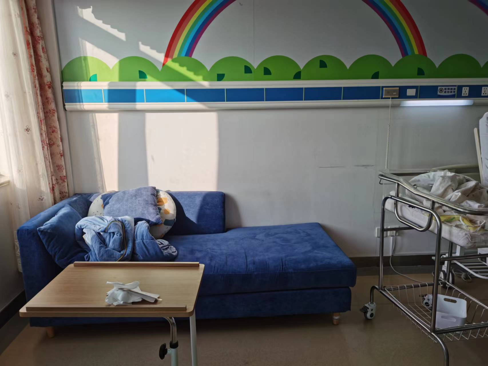
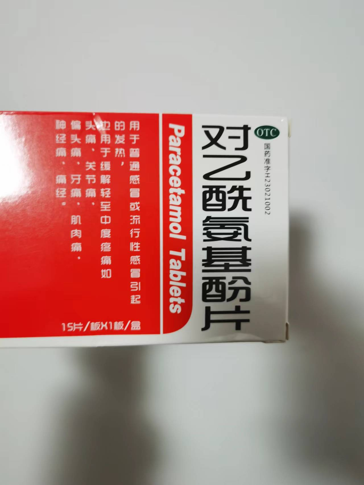
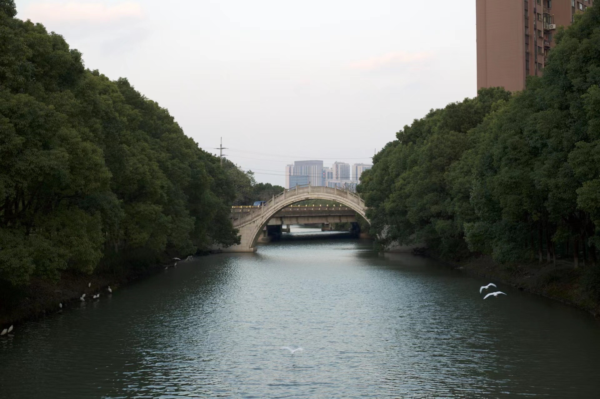

> This article is dedicated to my baby and all those who love him

## Hospital Admission

On December 25, 2022, at 10:05 AM, a couple arrived at the hospital ready for delivery, both with positive COVID-19 nucleic acid test reports from within 24 hours.

With great anxiety, the husband asked every doctor and nurse in the hospital:

**What if the baby gets infected with COVID-19?**

The responses he got were:

We're not sure either;
We haven't encountered this before, no experience in this area;
It's hard to say about this situation;

I didn't want to trouble the medical staff, and I actually knew roughly what would happen. If there were COVID symptoms, the baby might be sent directly to neonatal intensive care like babies with congenital defects. This was the worst-case scenario!

Yes, this anxious husband was me. Before this, I had been anxious for half a month, yet the situation was becoming increasingly severe. If I had to describe it with an idiom: **surrounded by enemies, stretched thin**.

## The Opening

On December 7, 2022, the State Council's Joint Prevention and Control Mechanism Comprehensive Group announced the "New Ten Measures," opening up COVID control.

Everyone knew that opening up would happen sooner or later, but I didn't expect it to be so urgent and so complete. This wasn't a 90-degree sharp turn, it was a 360-degree turnaround, catching everyone off guard.

Moreover, placed 10 months earlier, I couldn't have predicted that the three-year pandemic control would be lifted today, when my baby's due date was approaching.

**If we had the ability to predict the future, we would never have taken this risk or suffered this ordeal**.

On December 13, colleagues around me started getting infected. I happened to think I was feeling a bit dizzy too, and to avoid infecting my family, I dared not go home all night before the nucleic acid results came out. Fortunately, I didn't get infected.

But it was impossible to guard against everything. When the infection peak came, despite our family's efforts to avoid contact with the outside world, we still got infected, and the source remains unknown to this day.

We only went out to pick up packages, get vegetables, and throw away trash. I even used all my annual leave just to work from home. But the hospital notified us in advance that regardless of negative or positive results, hospitalization required a 24-hour nucleic acid report, so we had to queue up daily for testing.

## Surrounded by Enemies

On the afternoon of December 20, my mother and wife fell ill simultaneously, with fever and fatigue, only able to lie in bed. Only I was left at home who could work, which is what the internet jokingly called "Omicron will leave one cook in every household."

COVID mainly relies on self-healing, treatment can only relieve symptoms. For low fever, sweat it out under covers; for high fever, prioritize physical cooling. We also needed to help patients improve their resistance by providing eggs, milk, oranges, etc., supplementing protein, vitamin C, and other nutrients.

Pregnant women approaching delivery are already suffering, with additional COVID infection symptoms, tossing and turning countless times throughout the night.

Besides being the "chosen household worker," I was also the "chosen office worker." From the 19th to the 23rd, five days in total, I needed to launch 2 projects with a tight schedule. Many people were looking for me daily, so I could only prioritize urgency and importance.

Just when I thought I was the "chosen one" (the legendary asymptomatic infected person), I also developed symptoms, one day later than them.

Late on the 20th, initially my symptoms were mild—my mouth was very dry, I drank water frequently but still felt thirsty, but it didn't affect my work. By late on the 21st, I started having fever, and the back and leg pain intensified. I could only rely on groaning to relieve it, but I persisted and launched the project.

That evening, I felt fatigued much earlier than usual. After taking care of everything, I crawled into bed, sweated it out, and woke up the next morning fully recovered. Although I wasn't the "chosen one," the title of "chosen household worker" was well-deserved—I could seamlessly continue even with symptoms.

The fever subsided after one or two days, but COVID is very cunning. You think you've recovered, but it's just the beginning. It silently infects the lungs, then causes persistent coughing.

## Stretched Thin

On the evening of the 22nd, I was supposed to work overtime launching the second project, but my wife showed signs of labor, and we had to go to the hospital immediately. I could only transfer the work to my brothers.

After a series of examinations, the doctor thought the signs were irregular—either be admitted for delivery or go home first. Considering that family members weren't allowed to accompany patients during admission, but pregnant women needed care, we could only go home and endure.

At this point, I was still glad the baby hadn't been born because everyone at home had tested positive, and I was afraid of infecting the baby. It would be best if the baby was born after we all turned negative, but this was obviously beyond our control.

On the 23rd, the labor signs were still irregular. At the same time, my mother's cough worsened. Moreover, her symptoms were different from ours. We could cough up thick phlegm after coughing for a while and then feel comfortable, but she had a persistent dry cough, unable to cough anything up, so the coughing never stopped. Based on my limited knowledge, this indicated inflammation deep in the lungs.

On the morning of the 24th, I had two things to do: take my mother to the hospital for her cough; take my wife for nucleic acid testing.

Nucleic acid sampling points shortened their working hours after the opening, ending at 11 AM, but today my wife was in too much pain to walk.

I hoped for door-to-door nucleic acid testing or to bring test tubes home for sampling. When I asked the sampling point, they said they were social workers, not community staff, and suggested I contact the community. Because it was too early, the community wasn't open yet. When I finally found someone, they told me the door-to-door nucleic acid service was cancelled after opening, and said hospitals no longer required nucleic acid reports after opening.

I said the hospital clearly required a 24-hour nucleic acid report for hospitalization regardless of negative or positive results, and the pregnant woman couldn't walk, which is why I was seeking door-to-door testing—why else would I bother? The community's final suggestion was to lend us a wheelchair.

On the other hand, the hospital appointment time was approaching, and I couldn't get away, so I could only let my mother go first and stay in contact by phone. When I finished my business and ran to the hospital, I found she had mistaken triage for registration and then waited in the respiratory department for an hour.

It turned out that after opening up, the hospital had modified the registration process. First, temperature check and triage, then respiratory department could only queue at the manual window for registration—internet channels and in-hospital electronic devices couldn't register for respiratory department. Recently, the hospital was packed, almost everyone coughing, and the respiratory department registration window had a long line.

After completing the lung CT scan, while waiting for the report, I found I couldn't contact my wife—4-5 calls went unanswered. This made me extremely anxious. Without waiting to see the doctor for the report, I rushed home directly, but fortunately nothing was wrong—she just didn't answer the phone.

However, at the hospital, my mother was diagnosed by the doctor with viral pneumonia—no need to guess which virus! On the phone, my mother called me back in a low voice to accompany her to continue seeing the doctor. Before the diagnosis came out, her attitude was "I'm fine, no need to go to the hospital," and I had to strongly insist before she would go.

After agreeing on a regular reporting mechanism with my wife, I rushed back to the hospital. The doctor spoke to me privately, saying they'd try IV drips for a few days to see the effect. If the condition continued to worsen, it could be life-threatening, and they'd have to transfer her to Ruijin Hospital—they were powerless here!

On one side was possible delivery at any moment, on the other was viral pneumonia that could be life-threatening. This reminded me of a classic topic: If your mother and wife both fell into water, who would you save first?

**As long as there's any hope, I want to save both!**

## Thousand-Mile Reinforcement

IV treatment required going to emergency registration, but emergency was even more packed, with ambulances arriving from time to time. After completing all procedures, when the IV drip finally started, it was already 2 PM.

Considering the current situation, I could only urgently call for help from my father thousands of miles away, hoping he'd rush over to take care of my mother. He had also been infected with COVID last week and was just recovering when he came to support us.

Later it proved this call for help almost came too late. The next day, the 25th, early in the morning, my father took the earliest high-speed train and arrived in Shanghai at 13:59, while I entered the hospital at 11:31 that day. There was about 5 hours in between, during which my mother was unattended except for lunch.

## Delivery

After several days of ordeal, the doctor thought this time she might really give birth and had us go through admission procedures for delivery.

The hospital's delivery room was large, the bed's lifting function was powerful, instruments continuously monitored everything. Initially, my wife was quite comfortable, but by late night when labor pains intensified, coughing became uncontrollable.

Before this, she had tried to avoid coughing because coughing causes violent abdominal vibrations, which could affect the fetus. Pregnant women can't take medicine, only drink hot water to soothe the throat and stop itching, which worked well with very little coughing.

Now the above method had failed, and we were at our wit's end. In the following hours, pain persisted and coughing continued, even compressing the fetus twice, causing the fetal heart rate to plummet, which scared the doctors.

The doctor suggested we switch from vaginal to cesarean delivery. Actually, before confirming and signing, the doctor had already manually ruptured the amniotic sac, which meant delivery was inevitable. Since vaginal delivery conditions weren't met, only cesarean section was possible, leaving me with only one option.

At the time, I thought they were doing an examination, then my wife told me the doctor had ruptured the amniotic sac. I didn't know why they operated this way—I didn't understand at all. I could only trust and rely on them. Perhaps there was a crisis that necessitated emergency rupture of the amniotic sac, I thought, and after getting my wife's confirming nod, I signed the documents.

In the following hours, I went to the inpatient department to handle procedures, alone in the ward waiting.

## Hospitalization

I arrived at the inpatient department, and the nurse asked me to show the nucleic acid report. I showed it to her, and she sighed, instructing me not to wander around outside the room after entering.

I entered the ward with luggage, and the nurse had me unpack to prepare for welcoming mom and baby. I was restless there, pacing back and forth, at a loss, still thinking about what to do if the baby tested positive.

I could always adjust my state quickly. I went to the bathroom to wash my hands, repeatedly washing with quite hot water, hoping to clear viruses from my hands. Only when my hands were red from the hot water was I willing to believe they were clean.

Then I started unpacking luggage, disinfecting everything I took out with alcohol, then washing my hands, as if obsessed with clearing viruses.

At this moment, I was willing to believe that the more I did, the more viruses I cleared, the less likely the baby would be infected after birth. As long as I did enough, the baby would be fine!

At about 2 AM on the 26th, my wife was wheeled into the ward. The nurse said mother and child were safe. I began caring for my wife according to medical orders, but according to instructions, she couldn't eat, drink, or move for the first 6 hours—she had to endure until 8:50 AM.

At 4 AM, led by the nurse, I pushed the cart to pick up the baby. On the way there, I remembered the bumpy spots to make the return trip smoother with the baby.

Fortunately, the baby was healthy—no fever or cough, and never got infected later. He should have developed antibodies while in his mother's womb. A huge weight was finally lifted from my heart.

## New Dad

Before the baby was born, I worried about not taking good care of him—making him cold, hungry, or hurting him. But when the baby appeared before me and cried, all I could think about was how to solve the problem. No fear existed anymore.

You're being a baby for the first time, and I'm being a father for the first time. We can't count on others here—you're here for me to practice on. Please bear with any inadequate care; I'll definitely learn from mistakes.

Newborn babies are relatively simple—feed every three hours. Crying means hungry, soiled, or uncomfortable. Temperature depends entirely on air conditioning. When all needs are met, they're very well-behaved and adorable. The new dad adapted quickly and was already handling everything with ease.

However, the new mom's cough was still troublesome. The wound was still healing, and we worried it might burst open—wanting to cough but not daring to. Fortunately, after the doctor's examination, the wound was confirmed to be secure, and coughing wouldn't affect it. If really worried, just press the abdomen. Coughing also caused breathing difficulties. When blood oxygen levels dropped, oxygen supply was needed through a ventilator.

I was also coughing and sweating. I'd sweat wearing a jacket but feel cold without it, not knowing whether I was cold or hot. Besides taking good care of them, I had to take care of myself—drink lots of hot water and seize every moment to rest.

The first afternoon, I was in a daze the whole time. People asked me to handle birth medical certificates and vaccination certificates. I just noted them down and ignored them for now, delaying what could be delayed, focusing my energy on the three of us.

At night, when the nurse saw me sleeping on the sofa without a blanket, she reminded me that one of the pillows could be opened as a blanket and encouraged me never to fall down. I'm really grateful for the guidance and encouragement from these angels.

## Aftermath

Since the baby's birth, everything has been developing in a positive direction.

The baby is healthy, drinking milk and defecating normally, not even jaundiced;

My wife's body is recovering as expected. Although accompanied by pain, the improvement trend is stable;

My mother's cough has also eased. Conventional treatment is effective and won't be life-threatening;

During these five days in the hospital, everyone in the family turned negative for COVID, with almost no coughing, just in time to disinfect the home before discharge;

This ordeal was truly thrilling but safe. I dare not say the baby is a lucky star descending, but at least he's the common faith of all of us. Welcome to this world!

## Love

Shanghai's infection peak came relatively late, but scarce supplies and medicines were still difficult to obtain, especially fever reducers suitable for pregnant women and babies.

Just when we were worried about not being able to buy fever medicine for pregnant women, on the evening of the 23rd, a family proactively contacted us, asking if we had pregnant women, and delivered several precious tablets of acetaminophen to us.

I'm not good with words. After receiving the medicine, I could only keep saying thank you and then watched this family leave. The big brother's wife had their daughter wave goodbye to me—their eyes were full of tenderness and kindness.

Watching this family's departing figures, I'll never forget it!

## Timeline

12.07 State Council's Joint Prevention and Control Mechanism Comprehensive Group announces "New Ten Measures," lifts control
12.20 Afternoon Mother and wife fall ill, fever and fatigue
12.20 22:38 I develop mild symptoms, dry mouth, leg pain
12.21 21:27 I develop obvious symptoms, fever, back pain, leg pain
12.22 20:51 Go to hospital for labor, doctor thinks signs irregular
12.24 11:22 Mother's cough worsens, diagnosed with viral pneumonia
12.25 11:31 Wife handles hospital admission procedures for delivery
12.25 13:59 Father's reinforcement, high-speed train arrives in Shanghai
12.26 Around 0:00 Coughing compresses fetus twice, doctor suggests switching to cesarean
12.26 01:30 Baby is born
12.26 02:46 Wife wheeled into ward, nurse says mother and child safe
12.26 04:00 Pick up baby to ward
12.28 14:29 Handle vaccination certificate
12.29 14:43 Handle birth medical certificate
12.30 16:11 Apply for natural birth guide refund
12.31 09:07 Handle discharge procedures, go home

