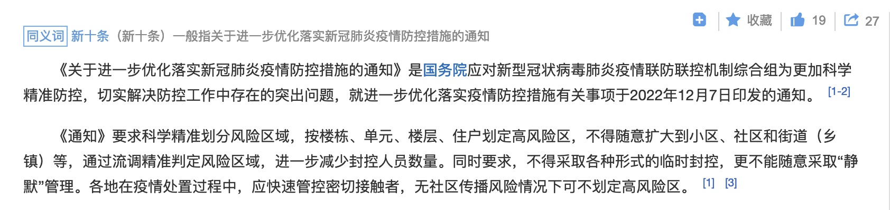
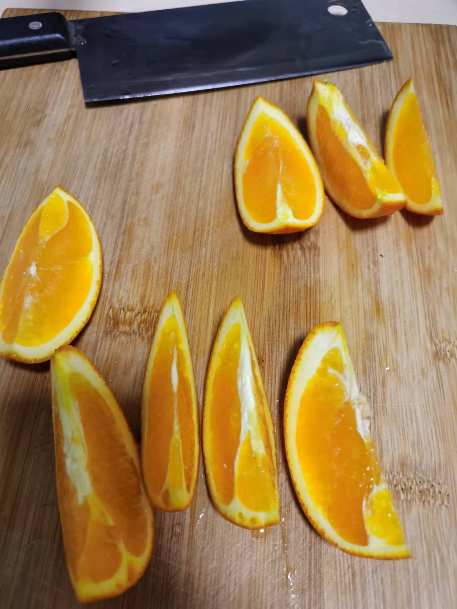
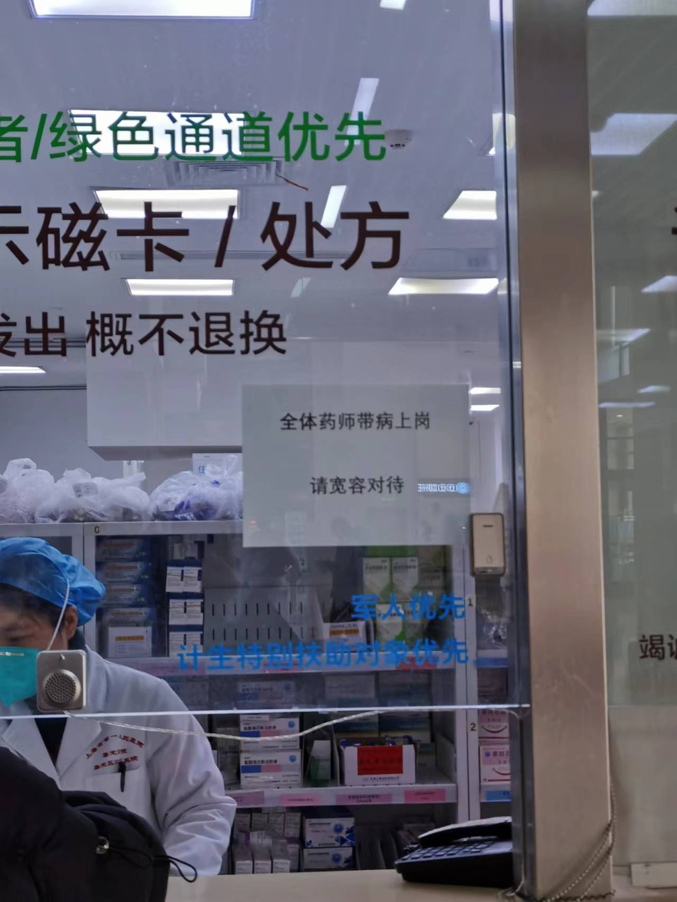
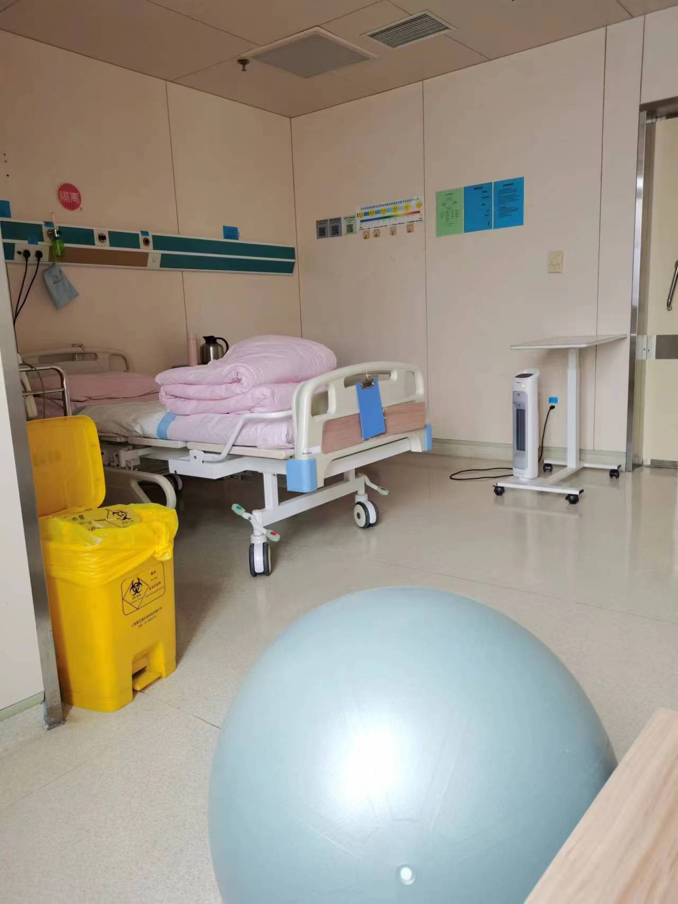
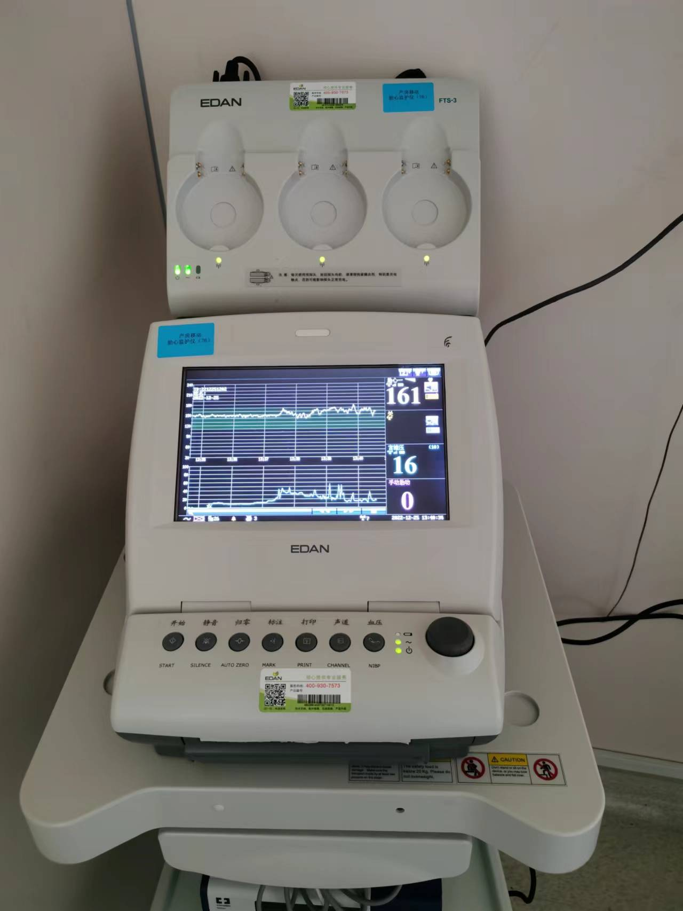
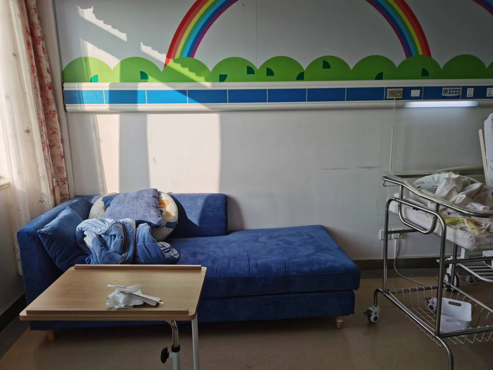
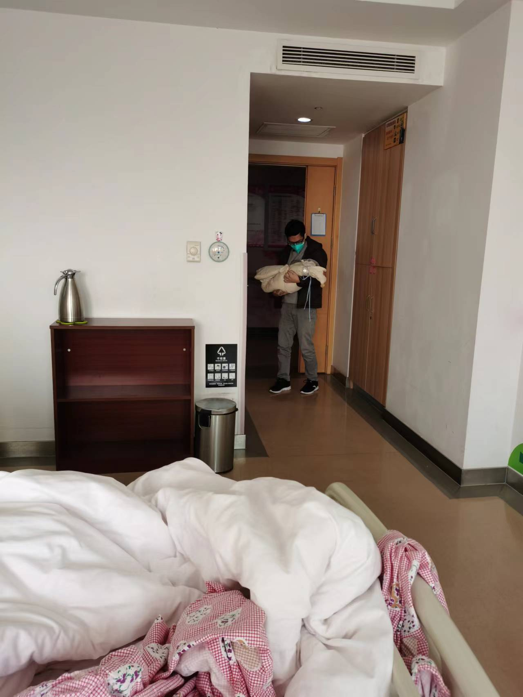
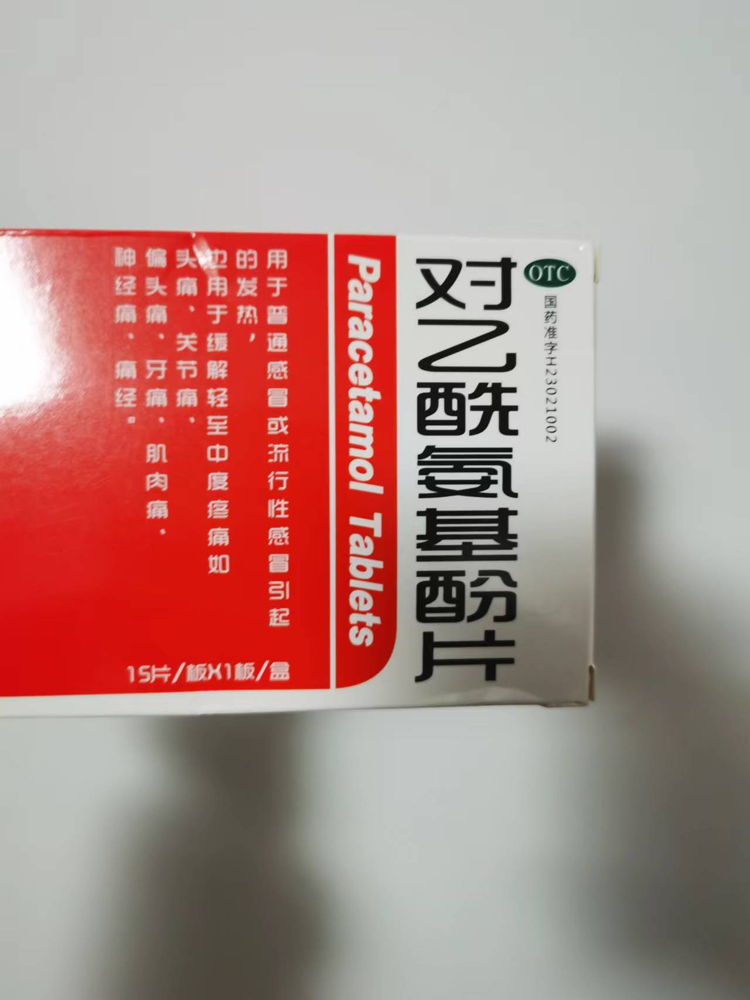
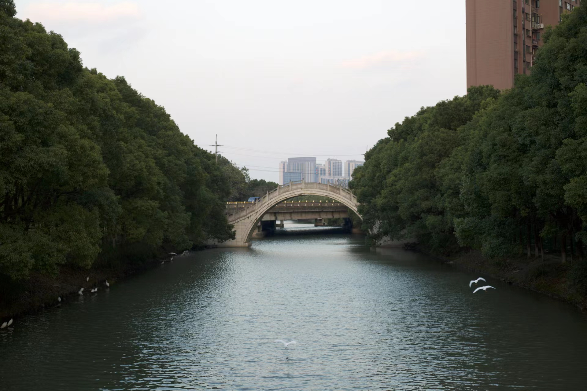

> 谨以此文献给我的宝宝和所有爱他的人

## 入院

2022 年 12 月 25 日 10 点 05 分，一对夫妇抵达医院准备生产，两人的 24 小时内新冠核酸检测报告都是阳性。

怀着无比忐忑的心情，这位丈夫把医院的医生护士问了个遍：

**如果宝宝也感染了新冠该怎么办？**

得到的答复有：

1. 我们也不清楚；
2. 目前没有遇到，没有这方面的经验；
3. 这个情况不好说；

我不想为难医护人员，我心里其实知道个大概。如果有新冠症状，新生儿肯定扛不住，可能会像有先天缺陷的宝宝一样直接送到新生儿科抢救。这是最坏的情况！

是的，这位焦虑的丈夫就是我。在此之前，我已经焦虑了半个月，情况却愈发严峻。如果用成语形容：**四面楚歌，分身乏术**。

## 放开

2022 年 12 月 07 日，国务院联防联控机制综合组公布“新十条”，放开新冠管控。

大家都知道迟早要放开，但是我没想到会这么急，这么彻底。这不是 90 度急转弯，这是 360 度原地调头，让人措手不及。

而且，放在 10 个月前，我根本预料不到持续三年的疫情防控会在今天放开，在我宝宝预产期临近之时。

**如果有预测未来的能力，我们根本不会冒这个险、受这个罪**。

12 月 13 日，我周边同事开始出现感染，我也感觉自己有点头晕，为了避免传染给家人，在最新的核酸检测结果未出之前整晚都不敢回家，还好没有中招。

但是防不胜防，当感染高峰期到来时，尽管我们一家人极力避免跟外界接触，我们还是感染了，源头不明。

我们只在拿快递、拿菜、扔垃圾时出门，我甚至把年假全用了只为居家办公。但是妇幼医院提前告知，不论阴性阳性，住院需要 24 小时核酸检测报告，为了做好住院准备我们不得不每天排队做核酸。

## 四面楚歌

12 月 20 日下午，我妈和老婆同时病倒，发烧、乏力，只能在床上躺着，家里只剩下我还能干活，也就是网上戏称的“奥密克戎会给每家留个做饭人”。

新冠主要靠自愈，治疗只能缓解症状，低烧捂着出汗，高烧优先考虑物理降温。还需要帮病人补充蛋白质和维C提升抵抗力，提供鸡蛋、牛奶、橙子等食品。

孕妇临产本来就很痛苦，还附加上新冠感染的症状，一夜不知道要折腾多少次。

除了“天选家务人”，我还是“天选打工人”，19 号到 23 号五天时间需要上线 2 个项目，进度很赶，居家办公每天被一堆人找，只能分个轻重缓急。

我还以为自己是传说中的“天选之人”（无症状感染者），结果21号深夜我也病倒了，比她们晚一天。

20 号深夜，一开始我的症状很轻微，嘴很干，频繁喝水还是感到渴，但是不影响干活。到了 21 号深夜，我开始发烧，腰酸腿酸的程度加重，只能靠哼哼唧唧舒缓一下，坚持把项目上线了。

当天晚上，我比平时早很多感到疲劳，打理好一切之后我钻进被窝捂出一身汗，另一天早上满血复活继续干活。虽然不是“天选之人”，但是我的劳碌命还是名副其实的，即使出现症状也能做到无缝衔接。

发烧在一两天之后都退了，但是新冠非常狡猾，你以为好了，其实才刚刚开始。它悄无声息地感染了肺部，然后持续咳嗽。

## 分身乏术

22 号晚上，我本来应该加班上线第二个项目，但是老婆出现了临产征兆，必须立刻去医院，工作只能移交给兄弟们。

经过一系列检查，医生认为征兆不规律，要么入院待产、要么先回家，考虑到入院不允许家属陪伴，但是孕妇需要人照顾，只能回家继续熬着。

这个时候我还庆幸宝宝没有出生，因为家里所有人都阳了，很怕会传染给宝宝，最好等我们都转阴了再出生，但是这显然由不得我们。

23 号临产征兆依然不规律，同时我妈咳嗽加重，而且她的症状和我们不一样，我们咳久了能咳出浓痰，至少能舒服点，她是一直干咳、什么都咳不出来，因此咳嗽不停。以我有限的医学认知，这是炎症在肺部深处的表现。

24 号早上，我有两件事情：
1. 送我妈去医院治咳嗽；
2. 带我老婆做核酸。

核酸采样点在管控放开之后缩短了工作时间，上午 11 点就结束了，但是今天我老婆身上太痛了，跟本走不动路。

我希望有人能上门做核酸或者把试管带回家采样，问采样点，他们表示他们是社会人员，不是社区工作人员，建议我找社区。

因为时间太早，社区还没上班，好不容易找到了人，结果告诉我管控放开之后上门做核酸的服务取消了，并且表示放开之后医院不需要核酸报告了。

我强调妇幼医院明确要求住院必须持有 24 小时核酸报告、不论阴性阳性，孕妇走不动路才找你们上门做核酸，不然我何苦呢？社区最终的建议是借轮椅给我们。

另一边，我妈治咳嗽的医院预约时间快到了，我脱不开身，只能让我妈先去，随时电话联系。等我忙完跑到医院一看，她把分诊误认为是已挂号，然后到呼吸科白等了一个小时。

原来自从管控放开之后，医院修改了挂号流程，先测温分诊，呼吸科只能去人工窗口排队挂号，互联网渠道、院内电子设备通通不能挂呼吸科。

近期医院人满为患，几乎全是咳嗽的，呼吸科挂号窗口排起了长龙。

我妈做完肺部 CT 扫描，等报告的时候发现老婆那边联系不上，4-5 个电话都打不通。这下给我急坏了，我等不了回诊看报告直接飞奔回家，还好她没事，只是没接到电话。

后来跟我妈通电话，她说她被确诊为病毒性肺炎，这个病毒不用想就是新冠！她用低沉微弱到几乎哭泣的声音叫我回去陪她继续看病。在诊断结果出来之前，她的态度是“我没事，不用去医院”，是我强烈要求才同意去看病。

和老婆约定了定时报告机制后，我又火速跑回医院。

医生单独跟我说，先打几天吊瓶看看效果，如果病情继续加重可能会有生命危险，那就只能转去瑞金医院，这里无能为力！

一边是随时可能生产，一边是可能危及生命的病毒性肺炎，这让我想起了一个经典话题：如果你妈和你老婆同时掉进水里，你先救谁？

**但凡有一点希望，我两个都想救！**

## 千里驰援

输液需要去急诊挂号，然而急诊更是堵的水泄不通，时不时还送来几个急救病人。等走完所有流程，终于打上吊瓶，已经是下午两点。

考虑到现在的情况，我只能向千里之外的父亲紧急求援，希望他火速赶来照顾我妈。他上周也感染了新冠，这才刚好就要来支援我们。

后来证明，这次求援差点就来不及了。第二天 25 号一早，我爸坐上最早的一趟高铁于 13 时 59 分抵达上海，而我是在当天 11 点 31 分进入医院，中间大概有 5 个小时、一顿午饭，我妈无人照顾。

## 生产

经过前几天的煎熬，医生认为这次可能真的要生了，让我们办理入院待产手续。

医院的待产室很大，病床的升降功能很强大，仪器持续监测着，一开始我老婆住的挺舒服，但是到了深夜临产疼痛加剧，咳嗽开始控制不住。

在此之前，她一直尽量避免咳嗽，因为咳嗽时腹部会剧烈震动，怕影响胎儿。孕妇不能吃药，只能喝热水润喉止痒，效果很好，咳的很少。

此时上面的方法已经失效，现在我们无计可施。在后来的几个小时内，疼痛不止、咳嗽不断，甚至两度压迫到胎儿，胎心骤降，把医生给吓到了。

医生建议我们顺转剖，实际上在确认签字之前，医生已经人工把羊水刺破了，这就必须得生了，顺产条件还没达到只能剖腹产，留给我的只有一种选项。

当时我以为是在做检查，然后老婆告诉我医生把羊水刺破了。我不知道为什么这样操作，我完全不懂，我只能相信他们，依靠他们。可能是出现了危机不得不紧急刺破羊水吧，我这样想，然后也得到了老婆的点头确认，在文件上签了字。

之后的几个小时，我去住院部办理手续，独自一个人在病房里等待。

## 住院

我来到住院部，护士要求我出示核酸报告，我给她看了，她叹了声气嘱咐我进来后别在房间外到处乱走。

我拿着行李进入病房，护士让我展开行李，做好迎接妈妈和宝宝的准备。我在那里心神不宁、来回踱步、不知所措，心里还在想着如果宝宝阳了该怎么办。

我总能快速调整状态，走到卫生间去洗手，用较烫的水反复洗，希望把手上的病毒清除，直到我的手已经烫红了，我才愿意相信手洗干净了。

然后我开始展开行李，每拿出一件东西都用酒精消毒，然后去洗手，像魔怔了似地想把病毒清除。

此时的我就是愿意相信，我多做一点事情，多清除一些病毒，宝宝出生后感染的可能性就会少一分，只要我做的足够多了，宝宝就会没事！

26 号凌晨 2 点多，老婆被推进病房，护士说母子平安，我开始遵照医嘱照顾老婆，但是按照医嘱前 6 个小时她不能吃、不能喝、也动不了，必须熬到早上 8 点 50 分。

凌晨 4 点，在护士的带领下，我推着车去接宝宝。在去的路上记住颠簸点，以便回来的路上载着宝宝能稳点。

万幸，宝宝是健康的，没有发烧咳嗽，后面也没有感染，应该是在妈妈体内有了抗体，心里一块大石头终于落地了。

## 新手奶爸

在宝宝出生之前，我很担心照顾不好宝宝，冷了、饿了或者弄疼了。但是，当宝宝出现在我面前，一哭，我脑子里想的只有怎么解决问题，什么恐惧都不存在了。

你第一次当宝宝，我也是第一次当爸爸，在这里指望不上别人，你就是给我练手的，有什么照顾不周的地方请多担待，我一定知错就改。

刚出生的宝宝比较简单，隔三个小时喂一次奶，哭就是饿了、拉了或者不舒服，冷热全靠空调恒温，需求都满足了就很乖很可爱。新手奶爸上道很快，已经游刃有余。

但是，宝妈咳嗽的问题还是很棘手，伤口还在愈合阶段，很担心崩开，要咳又不敢咳。好在医生检查之后，确认伤口很牢靠，咳嗽不会影响，实在怕就压一下腹部。咳嗽还造成了呼吸困难，血氧含量降低时，需要用呼吸机供氧。

我自己也在咳嗽，冒虚汗，穿外套出汗、不穿又冷，不知道自己到底是冷还是热。除了照顾好他们，我也必须照顾好自己，多喝热水，有空就争分夺秒地休息。

第一天下午我整个人都是迷迷糊糊的，有人让我办出生医学证明、疫苗接种证，我记录一下就不管了，能拖就拖，把精力集中在我们三个人身上。

晚上护士看到我睡在沙发上没有被子，提醒我其中有个枕头可以拆开当被子，还鼓励我千万不能倒下，真的很感谢这群天使的指导和鼓励。

## 后续

自从宝宝诞生以来，所有的事情都在往好的方面发展。

宝宝身体健康，喝奶排便都正常，甚至连黄疸都没有；

老婆身体按照预期恢复，虽然伴随着痛苦，但是好转的趋势稳定；

我妈咳嗽也缓解了，常规治疗有效果就不会危及生命；

住院的这五天时间里，全家人新冠都转阴了，咳嗽几乎没有，正好可以在出院前给家里消毒；

这一劫，真的是有惊无险。不敢说宝宝是福星降世，但至少是我们所有人共同的信念，欢迎你来到这个世界！

## 爱心

上海的感染高峰期来的比较晚，但是紧缺物资和药品依然比较难抢，尤其是适合孕妇、婴儿的退烧药。

就在为买不到孕妇退烧药发愁时，23 号晚上，有一家人主动联系我们，问是不是有孕妇，为我们送来了几片稀缺的对乙酰氨基酚。

我不擅长言语表达，当我收下药品之后，只知道一个劲的说谢谢，然后目送这一家人离开。大哥的妻子让女儿对我挥手道别，他们眼里全是温柔与善良。

看着这一家人远去的背影，我终生难忘！

## 时间线

12.07 国务院联防联控机制综合组公布“新十条”，放开管控  
12.20 下午 母亲和老婆病倒，发烧、乏力  
12.20 22:38 我出现轻微症状，干渴、腿酸  
12.21 21:27 我出现明显症状，发烧、腰酸、腿酸  
12.22 20:51 临产去医院，医生认为征兆不规律  
12.24 11:22 母亲咳嗽加重，确诊病毒性肺炎  
12.25 11:31 老婆办理住院生产手续  
12.25 13:59 父亲驰援，高铁抵达上海  
12.26 0 点许 咳嗽两度压迫胎儿，医生建议顺转剖  
12.26 01:30 宝宝诞生  
12.26 02:46 老婆推进病房，护士说母子平安  
12.26 04:00 接宝宝回病房  
12.28 14:29 办理疫苗接种证  
12.29 14:43 办理出生医学证明  
12.30 16:11 申请顺产乐导退费  
12.31 09:07 办理出院手续，回家

