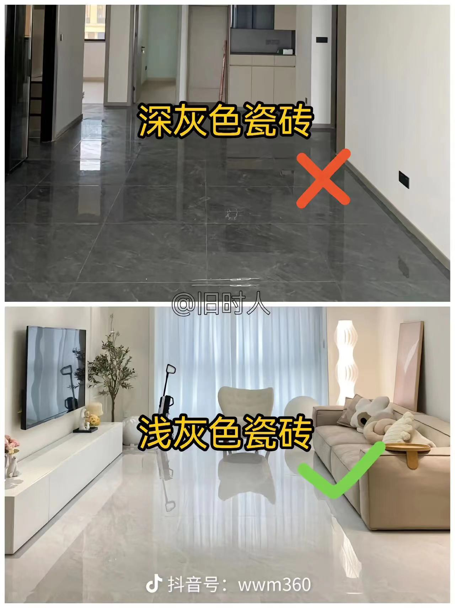
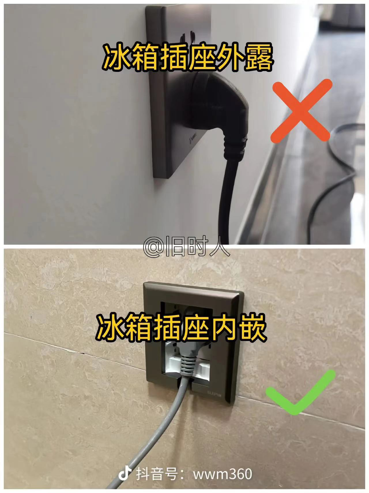
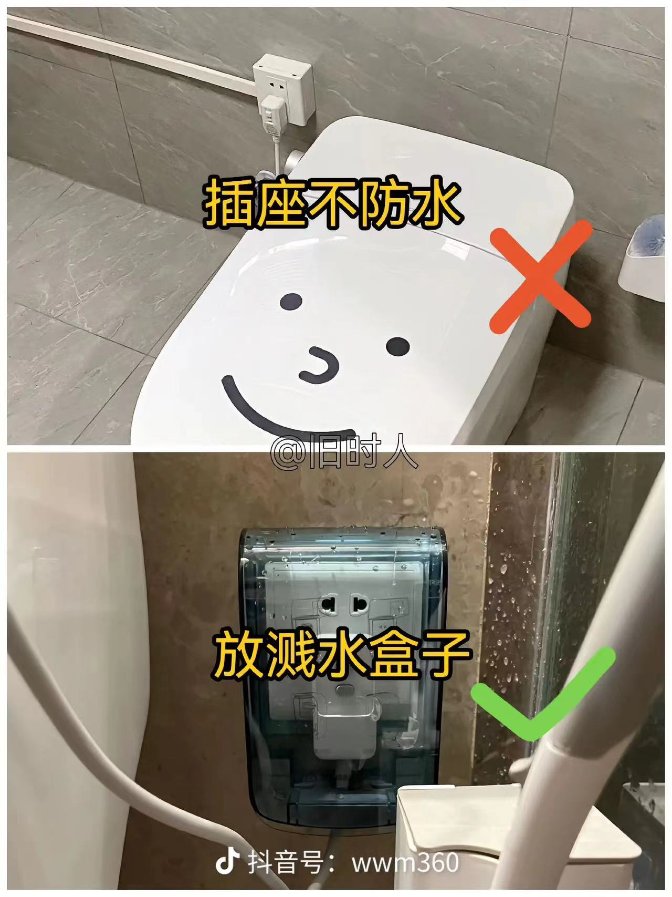
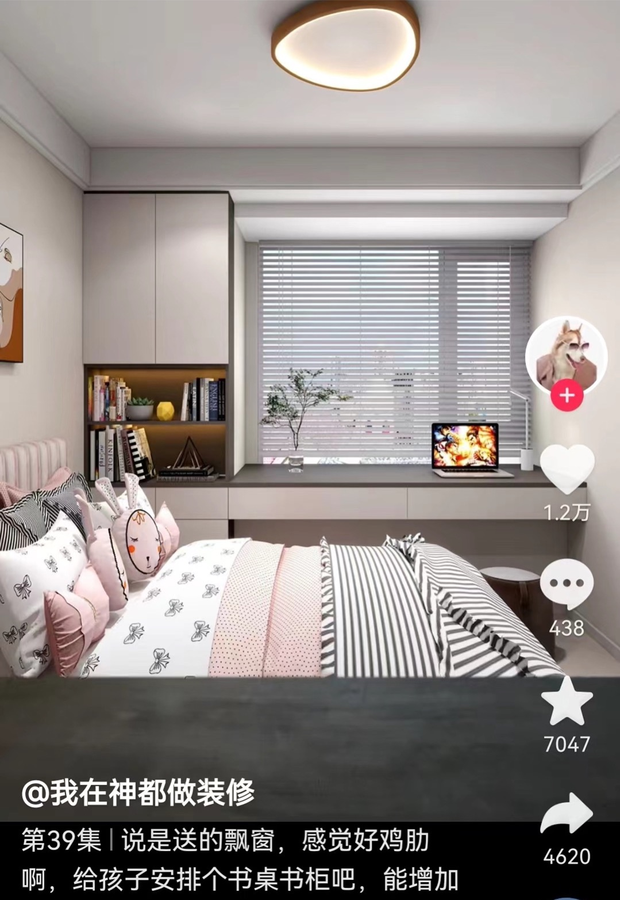
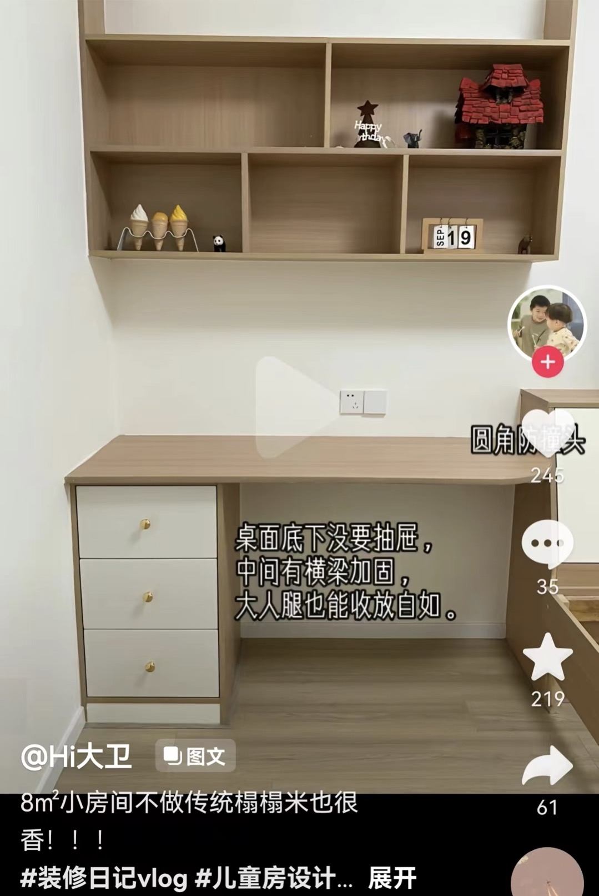

Light luxury style, simple, bright, modern, prioritizing residential function, focusing on lighting, borrowed scenery, transparency, and fire safety.

Walls with simple lines, beautiful and easy to maintain; main components like lighting and furniture accented with gold; auxiliary color atmosphere created by furniture hangings and ornaments that can be changed anytime.

Overall style reference: [https://ydt.app/jc2096981](https://ydt.app/jc2096981)

### Overall Requirements

1. Living room, dining room, balcony, kitchen and bathroom use large tiles; bedrooms use flooring;
2. Simple style, no need for suspended ceilings, spotlights, TV; install chandeliers in living room and dining room;
3. Bright, mainly white with light colors as accents, no dark colors; bathroom with blue theme, blue-white combination; kitchen mainly white.
4. Two bathrooms with wet-dry separation, smart toilets installed, shower head and toilet on one side, public bathroom with external washbasin.
5. Reserve as many sockets as possible, living room, kitchen, bedroom office desks use three-position row sockets, height to prevent toddler accidents.
6. Furniture, appliances, hangings, ornaments, etc., to be added slowly later.

### Process Flow

- [ ] Design, floor plan, switch wiring, material list, budget table
- [ ] Demolition and renovation, wall layout, be careful not to touch load-bearing walls
- [ ] Plumbing and electrical, positioning, grooving, pipes, gas, plumbing and electrical must be durable, meanwhile tiler measures, order tiles
- [ ] Waterproofing, kitchen, bathroom and balcony waterproofing, quality is important
- [ ] Tiling, windows, pipe wrapping, tiles, grouting, meanwhile carpenter measures, order boards
- [ ] Balcony enclosure
- [ ] Carpentry, cabinets
- [ ] Painting, plastering, latex paint, cabinet painting
- [ ] Installation, wooden doors, sliding doors, switches, sockets, lighting, sanitary ware, curtains, flooring
- [ ] Soft furnishing, sofas, tables and chairs, beds, appliances, hangings

### Floor Plan

Version 2023.02.15

### Informatization

Network Structure

1. Fiber optic to home, 200-1000Mbps.
2. Plastic panel weak current box, install optical modem, output 4 gigabit cat8 network cables to living room bookshelf.
3. Living room bookshelf host position reserve gigabit network port, install gigabit wifi6 router, output gigabit cat7 network cables to gigabit network ports in three rooms.
4. If optical modem integrated machine already supports gigabit wifi6, install gigabit switch in bookshelf.
5. Conduits run both network cables and optical fiber simultaneously, optical and electrical signals don't interfere with each other, network ports can be reserved for KVM extenders, optical fiber as backup.

Whole House Intelligence

High-performance central host carries whole house information services, including multi-seat systems, artificial intelligence and IoT. Multi-seat only requires adding monitors, keyboards and mice, while driving voice AI, projectors, smart appliances, sensors, etc.

1. Host placed in second column bottom compartment of living room bookshelf near hallway, equipped with sockets and network ports.
2. Host installs Win10 LTSC version, install spacedesk server, install aster multi-seat software (paid), install WSL subsystem or hyper-v virtual machines.
3. Whole house wireless screen projection, supporting projectors and other Android wifi devices, i.e., Win10 projecting to Android, can use Miracast or AirPlay.
4. Whole house wireless multi-seat, meeting flexible expansion needs, Miracast/spacedesk+aster, supporting laptops, tablets, phones, TVs, projectors and other wifi devices, monitors require Android intelligence.
5. Wired connection to large secondary bedroom, stable low latency, meeting gaming and professional scenarios, using dp cables and usb hub docking stations, using ultrawide high-definition monitors.
6. Master bedroom, small secondary bedroom, using smart monitors. If wireless multi-seat is unstable, can connect through network cables using KVM extenders, then connect keyboards, mice and standard resolution monitors.

### Living Room and South Balcony

1. Wall facing bedrooms made into full bookshelf wall, bottom drawers extending for placing items, upper open compartments of various sizes;
2. Bottom bookshelf compartments with distributed sockets, middle and sides must have them;
3. Top of bookshelf install roll-up projection screen, projector installed on opposite wall;
4. Wall near entrance door for sofa and coffee table, floor air conditioner, reserve sockets;
5. South balcony (large balcony) as leisure viewing area.
6. Living room and south balcony can be connected, sliding glass doors for balcony enclosure.

Sofa bookshelf illustration

Bottom layer of bookshelf are drawers

Sliding glass door balcony enclosure

Light colors are brighter

Entrance tile continuous laying

Curtain box

### Dining Room and North Balcony

Refrigerator socket recessed

### Kitchen and Bathroom

1. Kitchen installs gas wall-mounted boiler, supplying hot water to kitchen and bathroom;
2. Washbasin half-wall for storage.

Public bathroom external washbasin

Bathroom door single frame

Floor drain needs slope

Kitchen bathroom sockets waterproof

Kitchen high-gloss cabinet doors

### Master Bedroom

1. Bay window made into integrated office desk, bottom suspended, can accommodate stools normally, split curtains;
2. Bed head against outer wall side with direct sunlight;
3. Wardrobe partitioned, adjustable;

### Large Secondary Bedroom

1. Bed head against master bedroom with direct sunlight;
2. Integrated desk, wardrobe, bed;

### Small Secondary Bedroom

1. Guest room, bed using tatami, under-bed as common storage space;

### Budget and Expenses
