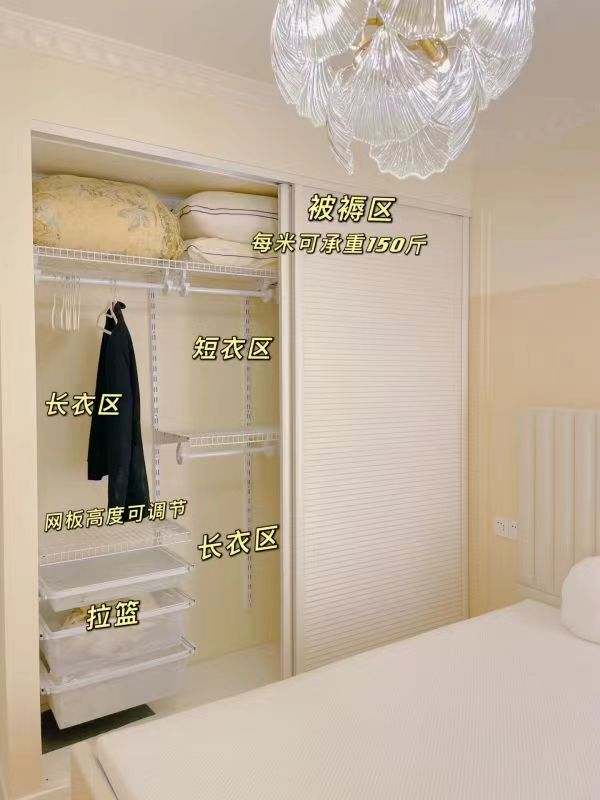

轻奢风格，简约、明亮、现代化，优先保证居住功能，关注采光、借景、通透感、消防安全。

墙体带简单线条，好看又好维护；灯具灯光家具等主要部分用金色点缀；辅助色彩氛围靠家具挂件摆件烘托，随时可更换。

整体风格参考：https://ydt.app/jc2096981

### 整体要求

1. 客厅、餐厅、阳台、厨卫使用大瓷砖，房间使用地板；
2. 简约，不需要吊顶、射灯、电视，客厅餐厅安装吊灯；
3. 明亮，白色为主，浅色系为辅，不使用深色；卫生间海蓝色主题，蓝白搭配；厨房白色为主。
4. 两个卫生间干湿分离，安装智能马桶，莲蓬头和马桶在一边，公共卫生间外置洗手台。
5. 插座尽量多预留，客厅、厨房、房间办公台使用三位联排插座，离地高度防止幼儿误触。
6. 家具、家电、挂件、摆件等等，后面慢慢补。

### 工序流程

- [ ] 设计，平面布置、开关布线、材料清单、预算表
- [ ] 拆改，墙体格局，注意不要动承重墙
- [ ] 水电，定位、开槽、管道、燃气，水电必须保证耐用，同时瓦工量尺，订瓷砖
- [ ] 防水，厨卫和阳台防水，质量很重要
- [ ] 瓦工，窗户、包管、瓷砖、勾缝，同时木工量尺，订板材
- [ ] 封阳台
- [ ] 木工，柜子
- [ ] 油漆工，刮白、乳胶漆、柜体刷漆
- [ ] 安装，木门、推拉门、开关、插座、灯具、洁具、窗帘、地板
- [ ] 软装，沙发、桌椅、床、家电、挂件

### 平面布置图

2023.02.15 版本

### 信息化

网络结构

1. 光纤入户，200-1000Mbps。
2. 塑料面板弱电箱，安装光猫，输出 4 万兆 cat8 网线 至 客厅书柜。
3. 客厅书柜的主机位 预留 万兆网口，安装 千兆 wifi6 路由器，输出万兆 cat7 网线 至 三个房间的万兆网口。
4. 如果光猫一体机已经支持千兆 wifi6，则书柜安装千兆交换机。
5. 管道同时穿网线和光纤，光信号与电信号之间互不干扰，网口可预留给 KVM 延长器，光纤备用。

全屋智能

高性能中央主机承载全屋信息服务，包括拖机、人工智能与物联网。一拖多只需增加显示器键鼠，同时驱动语音 AI、投影仪、智能家电、传感器等。

1. 主机放在客厅书柜靠走廊的第二列底部格子中，配备插座、网口。
2. 主机安装 Win10 LTSC 版本，安装 spacedesk 服务端、安装 aster 拖机软件（收费），安装 WSL 子系统或者 hyper-v 虚拟机。
3. 全屋可无线投屏，支持投影仪等安卓 wifi 设备，即 Win10 投屏至安卓，可以使用 Miracast 或者乐播。
4. 全屋可无线拖机，满足自由拓展需求，Miracast/spacedesk+aster，支持笔记本、平板、手机、电视、投影仪等 wifi 设备，显示器要求安卓智能。
5. 有线连接至大次卧，稳定低延时，满足游戏和专业场景，使用 dp 线和 usb hub 拓展坞，使用带鱼屏高清显示器。
6. 主卧、小次卧，使用智慧显示器。如果无线拖机不稳定，可以通过网线连接 KVM 延长器，然后接入键鼠和标准分辨率显示器。

### 客厅与南阳台

1. 靠房间的墙做成整面书柜，底部抽屉伸出可摆放物品，上方开放格子且大小不一；
2. 书柜底部格子内间隔分布插座，中间与两边必须有；
3. 书柜顶部安装卷帘投影幕布，正对面安装投影仪；
4. 靠入户门的墙放沙发茶几，立式空调，预留插座；
5. 南阳台（大阳台）做休闲观景区。
6. 客厅和南阳台之间可以打通，推拉玻璃门封阳台。

沙发书柜示意图

书柜底层是抽屉

推拉玻璃门封阳台

浅色系更明亮

门口瓷砖通铺

窗帘盒

### 餐厅与北阳台

冰箱插座内嵌

### 厨房与卫生间

1. 厨房安装燃气壁挂炉，为厨房、卫生间供应热水；
2. 洗手台半墙，可收纳。

公共卫生间外置洗手台

卫生间门单包套

地漏要有坡度

厨房卫生间插座防水

厨房高光柜门

### 主卧

1. 飘窗做成一体式办公台，底部悬空，平时可容纳凳子，对开式窗帘；
2. 床头靠外墙侧，有阳光直射；
3. 衣柜分区，可调节；

### 大次卧

1. 床头靠主卧，有阳光直射；
2. 一体式桌子、衣柜、床；

### 小次卧

1. 客房，床使用榻榻米，床底作为公共收纳空间；

### 预算与支出
