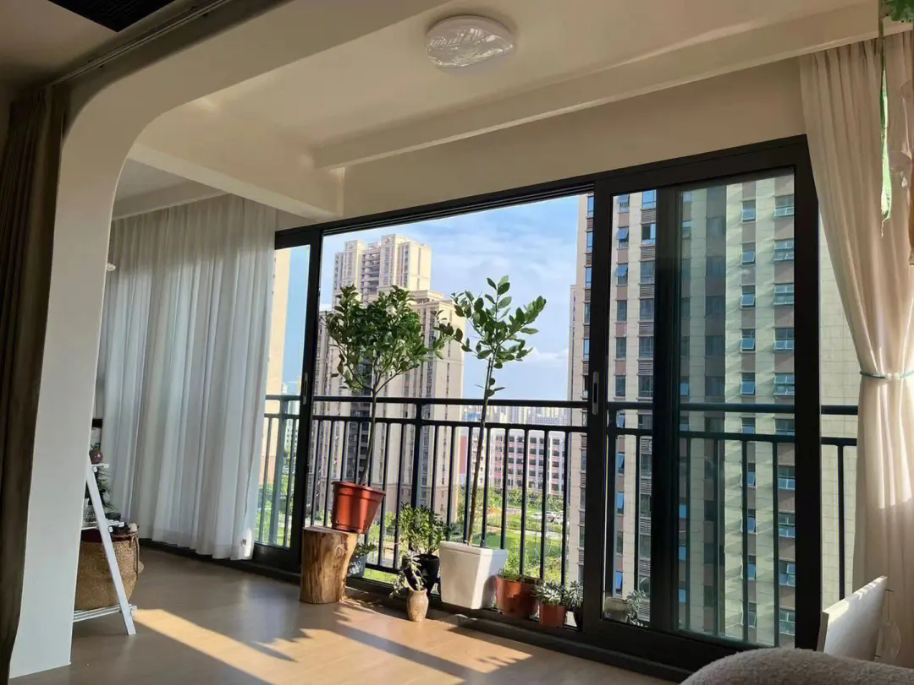

轻奢风格，简约、明亮、现代化，优先保证居住功能，注意采光、借景、通透感、消防安全。

墙体带简单线条，好看又好维护；灯具灯光家具等主要部分用金色点缀；辅助色彩氛围靠家具挂件摆件烘托，随时可更换。

整体风格参考：https://ydt.app/jc2096981

整体要求

1. 客厅、餐厅、阳台、厨卫使用大瓷砖，房间使用地板；
2. 简约，不需要吊顶、射灯、电视，客厅餐厅安装吊灯；
3. 明亮，白色为主，浅色系为辅，不使用深色；卫生间海蓝色主题，蓝白搭配；厨房白色为主。
4. 两个卫生间干湿分离，安装智能马桶，莲蓬头和马桶在一边，公共卫生间外置洗手台。
5. 插座尽量多预留，客厅、厨房、房间办公台使用三位联排插座，离地高度防止幼儿误触。
6. 家具、家电、挂件、摆件等等，后面慢慢补。

平面布置图（未更新）

客厅与南阳台

1. 靠房间的墙做成整面书柜，底部抽屉伸出可摆放物品，上方开放格子且大小不一；
2. 书柜底部格子内间隔分布插座，中间与两边必须有；
3. 书柜顶部安装卷帘投影幕布，正对面安装投影仪；
4. 靠入户门的墙放沙发茶几，立式空调，预留插座；
5. 南阳台（大阳台）做休闲观景区。
6. 客厅和南阳台之间可以打通，推拉玻璃门封阳台。

沙发书柜示意图

书柜底层是抽屉

推拉玻璃门封阳台

浅色系更明亮

门口瓷砖通铺

窗帘盒

餐厅与北阳台

冰箱插座内嵌

厨房与卫生间

1. 厨房安装燃气壁挂炉，为厨房、卫生间供应热水；
2. 洗手台半墙，可收纳。

公共卫生间外置洗手台

卫生间门单包套

地漏要有坡度

厨房卫生间插座防水

厨房高光柜门

主卧

1. 飘窗做成一体式办公台，底部悬空，平时可容纳凳子，对开式窗帘；
2. 床头靠外墙侧，有阳光直射；
3. 衣柜分区，可调节；

大次卧

1. 床头靠主卧，有阳光直射；
2. 一体式桌子、衣柜、床；

小次卧

1. 客房，床使用榻榻米，床底作为公共收纳空间；
