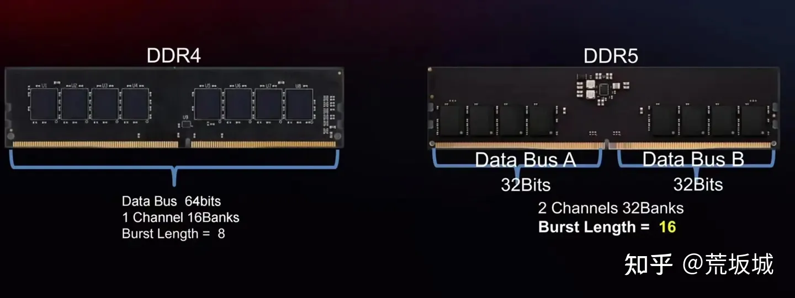
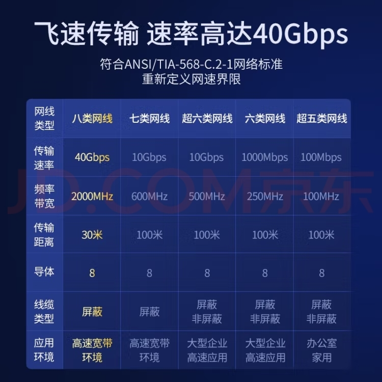
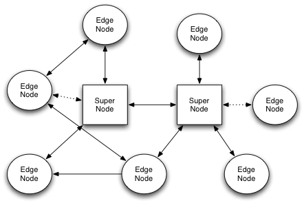
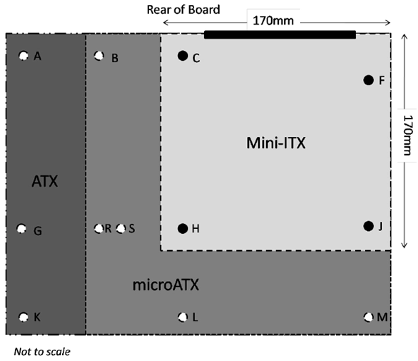
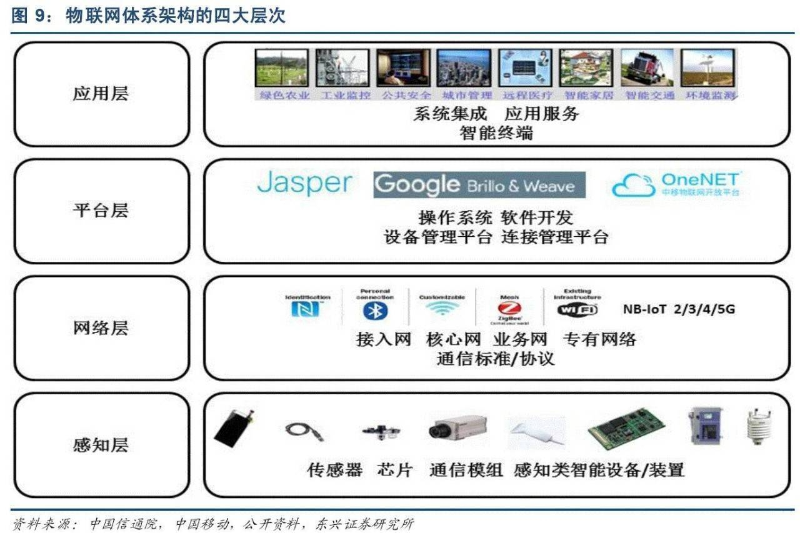

## Memory

SDRAM memory performance is affected by factors such as frequency, bandwidth, and timing. Higher frequency and bandwidth are better, but frequency needs CPU support. Lower timing means faster response speed and higher potential performance.

### Timing

Timing is a key parameter describing the performance of Synchronous Dynamic Random Access Memory (SDRAM), specifically referring to the time delay required for memory to perform read/write operations, measured in clock cycles. Memory timing typically consists of four main parameters:

1. **CAS Latency (CL)**: Column Address Strobe latency, also called CL value, represents the minimum number of clock cycles required from when memory receives a read command to when it outputs data.

2. **RAS to CAS Delay (tRCD)**: Row Address Strobe to Column Address Strobe Delay, representing the number of clock cycles required from row activation to when data can be read or written.

3. **Row Precharge Time (tRP)**: Row Precharge Delay, the number of clock cycles required from closing the current active row to before opening a new row.

4. **Row Active Time (tRAS)**: Row Active Time, representing the minimum number of clock cycles required from when a row is activated until it must return to precharge state.

Sometimes includes a fifth parameter:

5. **Command Rate (CR) or tCMD**: Command rate, representing the number of clock cycles required between consecutive command sends, typically 1T (one clock cycle) or 2T (two clock cycles).

Memory timing parameters combine to form a format like 7-8-8-24, representing corresponding CL-tRCD-tRP-tRAS values.

### DRAM

DRAM (Dynamic Random-Access Memory) is a type of computer memory that stores each bit of information through capacitors, but since the charge in capacitors naturally leaks over time, the charge must be periodically refreshed (regenerated) to maintain data integrity. Each storage unit of DRAM has relatively low cost, enabling large-scale, high-density storage, making it widely used in main memory (RAM) of personal computers, servers, and other computing devices. However, due to its refresh mechanism requirement, access speed is slower.

### SDRAM

SDRAM (Synchronous Dynamic Random-Access Memory) is an evolved version of DRAM technology. Its biggest feature is the addition of synchronization mechanism, enabling it to perform read/write operations synchronized with system clock signals. This means SDRAM operations are triggered on rising or falling edges of clock signals, ensuring data transmission coordinates more closely with CPU timing, improving data transmission efficiency and overall performance. Compared to traditional DRAM, SDRAM reduces wait time and allows multiple internal operations to complete within one clock cycle, thereby improving memory bandwidth and overall system performance. With technological development, SDRAM evolved into different variants, such as DDR SDRAM (Double Data Rate SDRAM), which can transfer data twice per clock cycle, further improving data transfer rate.

### DDR



DDR (Double Data Rate SDRAM), mainly used for desktops, servers, workstations and other traditional computer systems, with versions DDR, DDR2, DDR3, DDR4, DDR5.

DDR, operating voltage 2.5V or 2.0V, provides double data transfer rate, transferring data on both rising and falling edges of clock cycles. Common specifications include DDR-200 (corresponding to PC1600) and DDR-266 (corresponding to PC2100).

DDR2, operating voltage 1.8V, improves performance by increasing prefetch bits, higher clock frequencies, etc. Common specifications include DDR2-400, DDR2-533, DDR2-667, DDR2-800, etc.

DDR3 released in 2007, operating voltage 1.5V, with higher operating frequency and bandwidth, supporting features like asynchronous reset and point-to-point connections. Common specifications include DDR3-800, DDR3-1066, DDR3-1333, DDR3-1600, DDR3-2133, etc.

DDR4 released in 2014, operating voltage 1.2V, introduced higher bank numbers, higher prefetch depth, higher frequency range and higher bandwidth. Common specifications include DDR4-2133, DDR4-2400, DDR4-2666, DDR4-3200, DDR4-4000 and above.

DDR5 released in 2021, operating voltage 1.1V, adopts dual 32-bit sub-channel design. Compared to DDR4's single 64-bit channel, it effectively improves memory controller utilization. Independent PMIC power management chip, while DDR4 is integrated on motherboard. Added simplified ECC error correction function. Starting frequency 4800MHz, almost the frequency limit of DDR4 memory.

DDR5 took a big step forward compared to DDR4, but initially has drawbacks of high timing and high latency. CPUs are just beginning to adapt to DDR5's high frequency, with actual performance not much different from DDR4 memory. DDR5 has some improvement in CPU multi-threading support. If you frequently use multiple cores, you can try DDR5 memory.

| Basic Attributes | DDR3 | DDR4 | DDR5 |
| ---------------- | ---- | ---- | ---- |
| Release Date | 2007 | 2014 | 2021 |
| Clock Rate | 800-2133MHz | 1600-3200MHz | 3200-6400MHz |
| Memory Density | Up to 16GB | Up to 128GB | Up to 512GB |
| Maximum UDIMM | 8GB | 32GB | 128GB |
| Voltage | 1.5V | 1.2V | 1.1V |
| Latency | CL9-CL13 | CL14-CL19 | CL32-CL40 |
| Transfer Rate | 6400MB/s | 12800MB/s | 44800MB/s |
| Maximum Data Rate | 1.6Gbps | 3.2Gbps | 6.4Gbps |
| Power Management | Motherboard | Motherboard | PMIC |
| DIMM Pins | 240 (R, LR, U); 204 (SODIMM) | 288 (R, LR, U); 260 (SODIMM) | 288 (R, LR, U); 260 (SODIMM) |

### LPDDR

LPDDR (Low Power Double Data Rate SDRAM), low-power SDRAM designed for mobile devices, mainly used in phones and tablets. Compared to DDR, it has lower power consumption but at the cost of bandwidth. Versions include LPDDR4, LPDDR4X, LPDDR5, LPDDR5X.

LPDDR4 has two 16-bit channels, making total bus width 32 bits per DIMM. In contrast, DDR4 has 64-bit channels per DIMM.

### GDDR

GDDR (Graphics Double Data Rate SDRAM), series specifically designed for graphics processing, with versions GDDR3, GDDR4, GDDR5, GDDR5X, GDDR6.

## Hard Drives

## Operating Systems

### Win10 LTSC 2021

Microsoft's official streamlined enterprise edition, very stable, long-term support for 5 years, no app store, system doesn't need upgrades. Through WSL (Windows Subsystem for Linux) [Windows Subsystem for Linux Documentation](https://learn.microsoft.com/en-us/windows/wsl/install) uses Linux as subsystem.

[https://hellowindows.cn/](https://hellowindows.cn/)

### Linux

Linux distribution rankings
[https://distrowatch.com/dwres.php?resource=popularity](https://distrowatch.com/dwres.php?resource=popularity)

#### Debian

Debian is a completely free Linux operating system! Supports desktops like KDE, native applications include WeChat, QQ, Feishu, DingTalk, WPS, Sogou Input Method, Edge Browser, VSCode, JetBrains suite, etc., meeting daily needs.

[https://www.debian.org/](https://www.debian.org/)

WeChat UbuntuKylin store deb package
[https://www.ubuntukylin.com/applications/106-cn.html](https://www.ubuntukylin.com/applications/106-cn.html)

QQ Linux version
[https://im.qq.com/linuxqq/index.shtml](https://im.qq.com/linuxqq/index.shtml)

Feishu
[https://www.feishu.cn/download](https://www.feishu.cn/download)

Sogou Input Method
[https://shurufa.sogou.com/](https://shurufa.sogou.com/)

Edge Browser
[https://www.microsoft.com/en-us/edge/download](https://www.microsoft.com/en-us/edge/download)

JetBrains Golang
[https://www.jetbrains.com/go/download/#section=linux](https://www.jetbrains.com/go/download/#section=linux)

#### Ubuntu, UbuntuKylin

UbuntuKylin is Ubuntu's official Chinese version, stable and reliable, based on Debian, a global open source project led by Kylin Software Co., Ltd., focusing on developing "friendly, easy-to-use, simple and relaxed" desktop environment, committed to bringing smarter user experience to global users!

[https://www.ubuntukylin.com/](https://www.ubuntukylin.com/)

#### Deepin

Deepin developed by Wuhan Deepin Technology Co., Ltd. based on Debian, beautiful interface, supports Windows applications through wine, some software has compatibility issues, like WPS.

[https://www.deepin.org/index/zh](https://www.deepin.org/index/zh)

### UnRaid

Mainly used for NAS, Linux system based on Slackware, virtual machine kernel is also KVM. Disk array management is very distinctive with high flexibility. Also has good plugin, Docker and virtual machine support.

## Network Technology

### Fiber to Home

1000Mbps bandwidth can possibly have 100Mbps upload speed. Now ISP home gigabit fiber costs 1000+/year, activities are more favorable. Due to few fiber equipment and high prices, wireless technology popularity, short-distance cable speed sufficiency, fiber advantages in home LAN are not obvious, usually only used for home access, i.e., FTTH (Fiber To The Home).

### RJ45 Network Cable

Common crystal head network cable, divided into shielded and unshielded, Category 6 cat6 gigabit 1000Mbps, Category 6a cat6a 10 gigabit 10Gbps, cat7 10Gbps, cat8 40Gbps.

Market network cable prices aren't expensive, but Category 8 distance shortened, Category 6a and 7 are sufficient.



### Optical Modem

Optical signal modem, converts optical and electrical signals, can connect network cables on backend. Market generally has optical modem and wireless router integrated machines, most support gigabit, and ISPs may provide them for free.

### Switch

Can expand one network cable to multiple, independent use, home-grade prices are cheap.

### Router

Connects to network terminals via wired or wireless methods, most on market are wireless routers, also supporting wired. Can dial, forward, also has switch functionality. Some have soft router functions like offline download, online cloud storage.

### Soft Router

Focuses on low power consumption, can install systems, powerful functions, supports gigabit bandwidth. Can serve as bypass router for direct scientific internet access. Currently J4125 chip is optimal choice, maximum power consumption 10W, price 800+, performance exceeds old low-end laptops but still poor, few web pages can max it out. Unless particularly concerned about power consumption or must use certain soft router functions, otherwise not very meaningful.

### WiFi6

Speed 9.6Gbps triple improvement, covers 2.4/5GHz, transmission distance 300 meters, lower latency, supports sleep wake-up, better energy consumption, communicates with up to 8 devices simultaneously.


### Bluetooth 5.0+

Ultra-low power consumption, 5.0 focuses on IoT applications, supports Mesh networking, speed 43Mbps, supports Long Range mode, maximum transmission distance 300 meters, specific to power, keyboards and mice typically 10 meters. Supports multi-master multi-slave, connecting 7 slave devices simultaneously. Latest market version is 5.3.

### 2.4G Keyboards and Mice

Manufacturer proprietary 2.4G keyboard and mouse communication technology, high bandwidth, low latency, stable, suitable for gaming scenarios, maximum distance about 10 meters, with USB receiver, more power consuming than Bluetooth.

### Mesh

Network structure, each node can forward, flexible switching access points, but multiple levels may cause latency. Unless area is very large, otherwise unnecessary.

### Bridge

Router only serves as channel forwarding. If upstream already dialed, bridge can directly access public network, otherwise downstream needs to dial.

### WiFi Amplifier (Recommended)

Equivalent to wifi router bridge mode, much cheaper than buying another router for bridging. If you have idle router at home, can directly bridge.

### AP Panel

Converts wireless signal to wired signal, also has wifi amplifier function, network cable POE power supply. Expensive, impractical.

### IPv6

IPv4 already exhausted, IPv6 resources abundant, each device can be allocated IPv6 address, no need for NAT LAN conversion, no need for intranet penetration, can directly connect to public network.

[https://ipw.cn](https://ipw.cn/)

### Intranet Penetration

Machines inside LAN don't have public IPv4 addresses, cannot be directly accessed by clients outside LAN. Intranet penetration needs a server with public IPv4 as relay to achieve purpose of accessing intranet machines.


frp

Divided into frps server side, frpc client side.

[https://github.com/fatedier/frp](https://github.com/fatedier/frp)

```bash
brew install frpc
```

### DDNS

Dynamic DNS, device gets local public IP, syncs to domain resolution service provider, needs to set TTL as short as possible, but resolution delay naturally exists.

ddns-go

Supports IPv4, IPv6, many domain resolution service providers, Alibaba Cloud, Tencent Cloud, Huawei Cloud, GoDaddy, Cloudflare.

[https://github.com/jeessy2/ddns-go](https://github.com/jeessy2/ddns-go)

```
docker run -d --name ddns-go --restart=always -p 9876:9876 -v ~/ddns-go:/root jeessy/ddns-go
```

### P2P

After devices negotiate through node servers, they directly communicate point-to-point (P2P), with direct data transmission between devices.



N2N [https://www.ntop.org/products/n2n/](https://www.ntop.org/products/n2n/) [https://github.com/ntop/n2n/](https://github.com/ntop/n2n/)

ZeroTier [https://www.zerotier.com](https://www.zerotier.com/)

## Display Technology

### Usage Logic

1. Screen projection or mirroring, small screens need to project to large screens, large screens won't project to small screens.
2. Extension, main screen is large screen, both large and small screens can be extension screens.
3. Streaming, gaming scenarios, use large screen for shock, small screen for convenience.
4. Multi-screen collaboration, small screen displayed as window on large screen, system data integration.

### Resolution

1080P isn't smooth enough for eyes, screens must start from 2K resolution.

### Remote Desktop

Control devices remotely through network, using RDP remote desktop protocol, requires terminals to have operating systems, greatly limited by network conditions, and mobile data is expensive. Low image quality, not optimal choice even in home LAN.

FreeRDP

Open source free, supports Linux, Windows, Mac.

[https://www.freerdp.com/](https://www.freerdp.com/)

[https://github.com/FreeRDP/FreeRDP](https://github.com/FreeRDP/FreeRDP)

TeamViewer

Supports not only RDP but also proprietary protocols and other remote control protocols, widely used across platforms including Windows, Mac, Linux, iOS and Android. Charges for 3+ machines.

[https://www.teamviewer.com/en/download/](https://www.teamviewer.com/en/download/)

Microsoft Remote Desktop

Can only connect Windows, free, provides Windows, Mac, Web clients. Mac China region doesn't allow installation, can install beta version.

[https://learn.microsoft.com/en-us/windows-server/remote/remote-desktop-services/clients/remote-desktop-clients](https://learn.microsoft.com/en-us/windows-server/remote/remote-desktop-services/clients/remote-desktop-clients)

[https://install.appcenter.ms/orgs/rdmacios-k2vy/apps/microsoft-remote-desktop-for-mac/distribution_groups/all-users-of-microsoft-remote-desktop-for-mac](https://install.appcenter.ms/orgs/rdmacios-k2vy/apps/microsoft-remote-desktop-for-mac/distribution_groups/all-users-of-microsoft-remote-desktop-for-mac)

RustDesk

Comprehensive device coverage, light latency, supports self-built servers. Based on screen recording, when host isn't connected to screen, resolution is very low and cannot be set. Touchscreen operation from mobile to desktop has poor compatibility, Mac to Mac keyboard cannot input.

[https://rustdesk.com](https://rustdesk.com/)

VNC

Remote control tool software developed by AT&T's famous European research laboratory, paid.

[https://www.realvnc.com/en/connect/download/viewer/](https://www.realvnc.com/en/connect/download/viewer/)

Wireless Cloud Terminal (Not Recommended)

Also called thin client, computer sharing device. Micro hardware device, supports wired connection, uses RDP remote desktop protocol implementation, market supports maximum resolution 1080P. Commonly used in real estate agencies.

### Wired Display (Preferred)

HDMI2.1, DP1.4, Type-C, wired solutions stable and high-definition. HDMI cable maximum 20 meters, with amplifier 30 meters, can extend 100 meters with network cable or fiber optic, fiber optic being expensive. DP extension has few market choices and expensive prices.

KVM Extender (Not Recommended)

Keyboard Video Mouse, monitor, keyboard, mouse extender, typically HDMI + usb + 3.5mm headphone jack, extended via network cable, fiber optic extenders expensive. Most market products only support standard resolution, maximum 60Hz refresh rate.

xdisplay (Not Recommended)

Wired connection extension screen, more performance consuming than SpaceDesk, latest version only 10-minute trial.

https://www.splashtop.com/wiredxdisplay

### Wireless Screen Projection (Recommended)

Application layer streaming screen projection, very popular on TVs, projectors and other devices, DLNA, AirPlay, etc.


### Wireless Display (Recommended)

Constrained by problems like low speed, high latency, audio-video desync, high cost, etc., never became popular. WiFi Alliance's Miracast (recommended), Apple's AirPlay. Miracast has highest support, Apple second.

SpaceDesk (Recommended)

No protocol support needed, install server and client software, through wifi router, wirelessly connect any screen, can serve as extension screen, supports Windows desktops and mobile devices. Slightly higher latency, free, but official website cannot be accessed. WiFi devices must have operating systems, i.e., intelligence.

SuperDisplay

Supports windows server + android client, free trial 3 days.

[https://superdisplay.app/](https://superdisplay.app/)

Millimeter Wave HDMI, Wireless Screen Projector (Not Recommended)

Expensive. Millimeter wave difficult to penetrate obstacles, WiFi-based projectors not as good as WiFi6 routers.

### Streaming (Recommended)

Cloud gaming technology, receiving end decodes, can play console 3A games on phones and tablets. Parsec, Moonlight, AMD link, steam link.

### Multi-Screen Collaboration

Small screen displayed as window on large screen, like phone tablet displayed on computer, Huawei HarmonyOS, Wormhole er.run, open source scrcpy.

Scrcpy (Recommended)

Open source software, Android display to computer, uses adb debugging, supports wireless connection, supports Win, Mac, Linux three major operating systems.

```bash
# Mac
brew install scrcpy
brew install --cask android-platform-tools

# Windows
scoop install scrcpy
scoop install adb

#restarting in USB mode
adb usb
#restarting in TCP mode port: 5555
adb tcpip 5555

adb connect 172.20.100.207:5555
adb connect 192.168.1.7:5555

scrcpy
```

## Smart Home

### Central Host

Purchase high-performance host, ATX motherboard, with wifi6 and Bluetooth 5.0+, reserve sufficient graphics card, memory, hard drive, peripheral interfaces.



### CPU

12th and 13th generation Core use big.LITTLE design on desktop, extremely high core count, strong benchmarks, but big.LITTLE scheduling immature, easily causing productivity software to run on efficiency cores throughout, unable to meet professional needs. Big.LITTLE more suitable for single-task models, foreground display priority low-power mobile scenarios.

Ryzen 7000X series, thick heat spreader serious heat accumulation, non-X versions have no heat accumulation issues, no castration, can overclock, and cheaper, even future price may further decrease. First choice R9 7900, 12 cores 24 threads, price around ¥2599.

### Server

Server CPU and motherboard prices easily tens of thousands, second-hand but starting from tens of yuan, scavenging extremely high cost-performance, disadvantage is luck-based without guarantee. Second-hand platforms unreliable, find Taobao multi-year old stores more trustworthy.

Xeon E5 cult. EPYC core count terrifying, 7002 series zen2 architecture 8-64 cores, 7003 series zen3 architecture 8-64 cores, 9004 series zen4 architecture 16-96 cores.

### Multi-Seat Software Aster (Preferred)

Russian multi-seat software, free trial 10 days, connects multiple sets of monitors, keyboards, mice, multi-person split-screen simultaneous operation, based on windows multi-user, no performance loss, split screens must be set as extension screens, some software multi-opening needs sandbox technology.


### Multi-Seat Connection Monitors, Keyboards, Mice

Wired connection through dp cable connects high-definition ultrawide monitors, usb hub connects keyboards and mice. Long distance can use KVM extenders, HDMI monitors, but only supports standard resolution monitors.

Wireless connection monitors, use Miracast or SpaceDesk. Latest smart monitors have built-in operating systems, support Wi-Fi, even without Miracast support can install SpaceDesk Android APP, can be used independently as smart TV when not multi-seating.

### Voice Control

Host runs open source AI software, can do voice recognition, speech synthesis, can execute system commands, can issue custom MQTT IoT protocol commands, controlling switches, projectors, TVs, robot vacuums, etc.

### Open Source AI GPT-neox

Open source large model artificial intelligence, doesn't support voice itself, training requires extremely high-performance computers, but can directly use pre-trained data, home mid-to-high configuration devices can run.

[https://github.com/EleutherAI/gpt-neox](https://github.com/EleutherAI/gpt-neox/tree/v2.0)

Voice Recognition

[https://github.com/Uberi/speech_recognition](https://github.com/Uberi/speech_recognition)

Speech Synthesis

[https://github.com/coqui-ai/TTS](https://github.com/coqui-ai/TTS)

### Sensors

Host connects sensors for intelligent sensing: microphones for audio pickup; cameras for monitoring and recognition; infrared for temperature and living body detection.

### IoT Architecture

Platforms: Alibaba Cloud, Huawei Cloud, China Mobile IoT, Xiaomi IoT, etc.;

Networks: WiFi, Bluetooth, 2/3/4/5G, NB-IoT, LoRa, ZigBee, NFC, etc.;

Protocols: MQTT, CoAP, LWM2M, HTTP, Modbus, OPCUA;

Systems: Android Things, Azure Sphere, RTOS, Tizen, HarmonyOS LiteOS, AliOS, mbed OS, etc.;

Devices: phones, computers, wearables, switches and sockets, robot vacuums, rice cookers, refrigerators, etc.;



