## 内存

SDRAM 内存性能受频率、带宽、时序等因素影响。频率、带宽越高越好，但是频率需要 CPU 支持。较低的时序意味着更快的响应速度和更高的潜在性能。

### 时序

时序是描述同步动态随机存取存储器（SDRAM）性能的关键参数，具体指的是内存执行读写操作所需要的时间延迟，以时钟周期为单位。内存时序通常由以下四个主要参数组成：

1. **CAS Latency（CL）**：Column Address Strobe（列地址选通脉冲）延迟，也叫 CL 值，表示内存从接收到一个读取命令到输出数据所必需的最小时钟周期数。

2. **RAS to CAS Delay（tRCD）**：Row Address Strobe to Column Address Strobe Delay，行地址选通脉冲到列地址选通脉冲的延迟，表示内存行激活到可以读取或写入数据所需要的时钟周期数。

3. **Row Precharge Time（tRP）**：Row Precharge Delay，行预充电时间，是从关闭当前活动行到打开新行之前需要的时钟周期数。

4. **Row Active Time（tRAS）**：Row Active Time，行激活时间，表示一行数据从被激活到必须回到预充电状态之间所需的最短时钟周期数。

有时还包括第五个参数：

5. **Command Rate（CR）或 tCMD**：命令速率，表示连续发送命令之间所需的时钟周期数，通常为 1T（一个时钟周期）或 2T（两个时钟周期）。

内存时序参数组合起来形成了一个类似 7-8-8-24 的格式，用来表示对应的 CL-tRCD-tRP-tRAS 值。

### DRAM

DRAM (Dynamic Random-Access Memory) 动态随机存取内存 是一种计算机内存类型，通过电容器存储每个比特的信息，但由于电容器的电荷会随时间自然泄漏，因此必须定期刷新（再生）电荷以保持数据的完整性。DRAM 每个存储单元的成本相对较低，这使得它可以实现大规模、高密度的存储，从而被广泛应用在个人计算机、服务器以及其他计算设备的主存储器（RAM）中。然而，由于其需要刷新机制，访问速度较慢。

### SDRAM

SDRAM (Synchronous Dynamic Random-Access Memory) 同步动态随机存取内存 是 DRAM 技术的一个进化版本，它最大的特点是加入了同步机制，使其能够与系统的时钟信号同步进行读写操作。这意味着 SDRAM 的操作是在时钟信号的上升沿或下降沿触发的，确保了数据传输与 CPU 的时序更加紧密地配合，提高了数据传输效率和整体性能。相较于传统的 DRAM，SDRAM 减少了等待时间，允许在一个时钟周期内完成多个内部操作，从而提升了内存带宽和系统的整体性能。随着技术的发展，SDRAM 演变为不同的变种，例如 DDR SDRAM（Double Data Rate SDRAM），它能够在每个时钟周期传输两次数据，进一步提高了数据传输速率。

### DDR

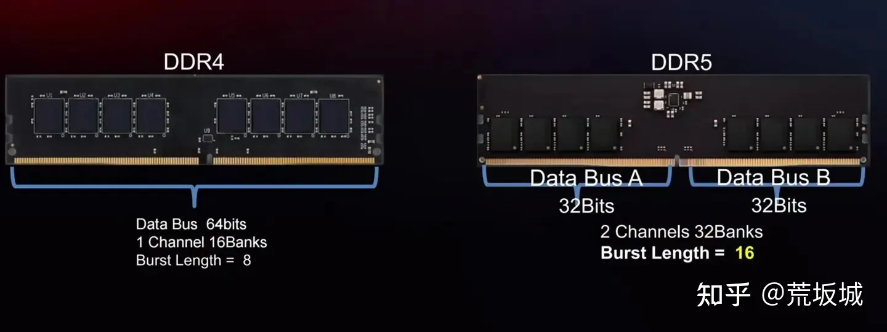

DDR (Double Data Rate SDRAM) 双倍数据率同步动态随机存取内存，主要用于台式机、服务器、工作站等传统计算机系统，版本有 DDR、DDR2、DDR3、DDR4、DDR5。

DDR，工作电压 2.5V 或 2.0V，提供双倍数据传输速率，即在时钟周期的上升沿和下降沿都传输数据，常见规格包括 DDR-200（对应 PC1600）和 DDR-266（对应 PC2100）。

DDR2，工作电压 1.8V，并且通过增加预读取位数、更高的时钟频率等方式提升性能，常见规格包括 DDR2-400、DDR2-533、DDR2-667、DDR2-800 等。

DDR3 发布于 2007 年，工作电压 1.5V，并且拥有更高的运行频率和带宽，支持异步重置、点对点连接等特性，常见规格包括 DDR3-800、DDR3-1066、DDR3-1333、DDR3-1600、DDR3-2133 等。

DDR4 发布于 2014 年，工作电压 1.2V，引入了更高的 Bank 数量、更高的预读取深度、更高的频率范围和更高的带宽，常见规格包括 DDR4-2133、DDR4-2400、DDR4-2666、DDR4-3200、DDR4-4000 及以上。

DDR5 发布于 2021 年，工作电压 1.1V，采用双 32 位子通道设计，相较于 DDR4 的单 64 位通道，有效提高了内存控制器的利用率。独立的 PMIC 电源管理芯片，DDR4 集成在主板。加入了简化版本的 ECC 纠错功能。起步频率 4800MHz，几乎是 DDR4 内存频率的极限。

DDR5 相对于 DDR4 向前迈出了一大步，但是初期存在时序高，延迟高的缺点，CPU 才刚开始适应 DDR5 的高频率，实际表现上和 DDR4 内存区别不大。DDR5 在对 CPU 多线程的支持上有一定提升，如果经常用到多个核心，可以尝试 DDR5 内存。

| 基准属性     | DDR3                         | DDR4                         | DDR5                         |
| ------------ | ---------------------------- | ---------------------------- | ---------------------------- |
| 发布日期     | 2007 年                      | 2014 年                      | 2021 年                      |
| 时钟速率     | 800-2133MHz                  | 1600-3200Mhz                 | 3200-6400Mhz                 |
| 内存密度     | 最高 16GB                    | 最高 128GB                   | 最高 512GB                   |
| 最大 UDIMM   | 8GB                          | 32GB                         | 128GB                        |
| 电压         | 1.5V                         | 1.2V                         | 1.1V                         |
| 延迟         | CL9-CL13                     | CL14-CL19                    | CL32-CL40                    |
| 传输速率     | 6400MB/s                     | 12800MB/s                    | 44800MB/s                    |
| 最大数据速率 | 1.6Gbps                      | 3.2Gbps                      | 6.4Gbps                      |
| 电源管理     | 主板                         | 主板                         | PMIC                         |
| DIMM 针脚    | 240 (R, LR, U); 204 (SODIMM) | 288 (R, LR, U); 260 (SODIMM) | 288 (R, LR, U); 260 (SODIMM) |

### LPDDR

LPDDR (Low Power Double Data Rate SDRAM)，专为移动设备设计的低功耗 SDRAM，主要用于手机、平板，相对于 DDR 具有更低的功耗，但是却以带宽为代价，版本有 LPDDR4、LPDDR4X、LPDDR5、LPDDR5X。

LPDDR4 具有两个 16 位通道，从而使每个 DIMM 的总线总长度为 32 位。相比之下，DDR4 每个 DIMM 具有 64 位通道。

### GDDR

GDDR (Graphics Double Data Rate SDRAM)，专门为图形处理设计的系列，版本有 GDDR3、GDDR4、GDDR5、GDDR5X、GDDR6。

## 硬盘

## 操作系统

### Win10 LTSC 2021

微软官方推出的精简企业版，非常稳定、长期支持 5 年，无应用市场，系统无需升级。通过 WSL(Windows Subsystem for Linux) [适用于 Linux 的 Windows 子系统文档](https://learn.microsoft.com/zh-cn/windows/wsl/install) 将 Linux 作为子系统。

[https://hellowindows.cn/](https://hellowindows.cn/)

### Linux

Linux 发行版排行榜  
[https://distrowatch.com/dwres.php?resource=popularity](https://distrowatch.com/dwres.php?resource=popularity)

#### Debian

Debian 是一个完全自由的 Linux 操作系统！支持 KDE 等桌面，原生应用包括微信、QQ、飞书、钉钉、WPS、搜狗输入法、Edge 浏览器、VSCode、JetBrains 全家桶 等，可以满足日常使用。

[https://www.debian.org/](https://www.debian.org/)

微信优麒麟商店 deb 包  
[https://www.ubuntukylin.com/applications/106-cn.html](https://www.ubuntukylin.com/applications/106-cn.html)

QQ linux 版  
[https://im.qq.com/linuxqq/index.shtml](https://im.qq.com/linuxqq/index.shtml)

飞书  
[https://www.feishu.cn/download](https://www.feishu.cn/download)

搜狗输入法  
[https://shurufa.sogou.com/](https://shurufa.sogou.com/)

Edge 浏览器  
[https://www.microsoft.com/zh-cn/edge/download](https://www.microsoft.com/zh-cn/edge/download)

JetBrains Golang  
[https://www.jetbrains.com/go/download/#section=linux](https://www.jetbrains.com/go/download/#section=linux)

#### Ubuntu、优麒麟

优麒麟是 Ubuntu 的官方中国版本，稳定可靠，基于 Debian，由麒麟软件有限公司主导开发的全球开源项目，专注于研发“友好易用，简单轻松”的桌面环境，致力为全球用户带来更智能的用户体验！

[https://www.ubuntukylin.com/](https://www.ubuntukylin.com/)

#### Deepin

Deepin 由武汉深之度科技有限公司基于 Debian 开发，界面美观，通过 wine 支持 Windows 应用，部分软件有兼容性问题，比如 WPS。

[https://www.deepin.org/index/zh](https://www.deepin.org/index/zh)

### UnRaid

主要用于 NAS，基于 Slackware 的 Linux 系统，虚拟机内核也是 KVM。磁盘阵列管理非常有特色，灵活性很高。同时还有很不错的插件、Docker 和虚拟机支持。

## 网络技术

### 光纤入户

1000Mbps 带宽才可能有 100Mbps 上传速度，现在运营商的家用千兆光纤 1000+/年，活动更优惠。 由于光纤设备支持少、价格高，无线技术火热，短距离网线速率足够，导致光纤在家庭局域网内优势不明显，通常只作为入户使用，即 FTTH（Fiber To The Home）。

### RJ45 网线

常见的水晶头网线，分屏蔽、非屏蔽，六类 cat6 千兆 1000Mbps，超六类 cat6a 万兆 10Gbps，cat7 10Gbps、cat8 40Gpbs。

市面上网线价格都不贵，但是八类距离缩短，超六类、七类足够。

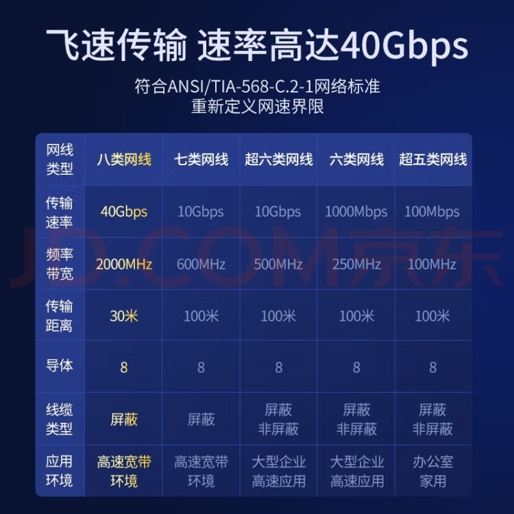

### 光猫

光信号的调制解调器，光信号与电信号转换，后端可接入网线。市面上一般都是光猫和无线路由器一体机，大部分支持千兆，而且运营商可能赠送使用。

### 交换机

可以将一根网线拓展为多根，独立使用，家用级价格便宜。

### 路由器

通过有线或者无线方式接入网络终端，市面上大部分是无线路由器，同时支持有线。可拨号，可转发，也具有交换机功能。部分具有离线下载、在线云盘等软路由功能。

### 软路由

主打低功耗，可安装系统，功能强大，支持千兆带宽。可作为旁路由直连科学上网。当前 J4125 芯片是最优选择，最大功耗 10W，价格 800+，性能超过旧款低端笔记本，但还是很差，几个网页就能跑满。除非特别在意功耗，或者必须使用软路由的某些功能，否则意义不大。

### WiFi6

速率 9.6Gbps 提升三倍，覆盖 2.4/5GHz，传输距离 300 米，延时更低，支持休眠唤醒、能耗更优，最多与 8 台设备同时通信。

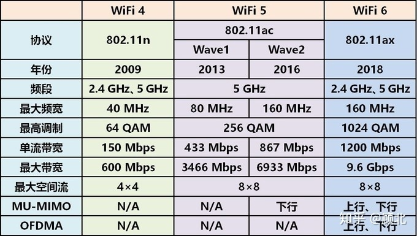

### 蓝牙 5.0 以上

超低功耗，5.0 主打物联网应用，支持 Mesh 组网，速率 43Mbps，支持 Long Range 模式，最远传输距离 300 米，具体与功率有关，键鼠通常 10 米。支持多主多从，同时连接 7 个从设备。市场最新版本是 5.3。

### 2.4G 键鼠

厂商自研的 2.4G 键鼠通信技术，带宽高、延迟低、稳定，适用游戏场景，最远距离 10 米左右，带 USB 接收器，比蓝牙耗电。

### Mesh

网状结构，每个节点都可以转发，灵活切换接入点，但是层级多可能延迟。除非面积很大，否则没有必要。

### 桥接

路由器只作为通道转发。如果上游已经拨号，桥接可直接访问公网，否则需要下游拨号。

### Wifi 放大器（推荐）

等同 wifi 路由器的桥接模式，比再买一台路由器桥接要便宜很多。如果家里有闲置路由器，可以直接桥接。

### AP 面板

将无线信号转为有线信号，同时具备 wifi 放大器功能，网线 POE 供电。价格昂贵，不实用。

### IPv6

IPv4 已经耗尽，IPv6 资源充足，每台设备都能分配到 IPv6 地址，无需 NAT 局域网转换，无需内网穿透，可以直连公网。

[https://ipw.cn](https://ipw.cn/)

### 内网穿透

局域网内部机器没有公网 IPv4 地址，无法被局域网外部的客户端直接访问。内网穿透需要一台拥有公网 IPv4 的服务器作为中转，实现访问内网机器的目的。

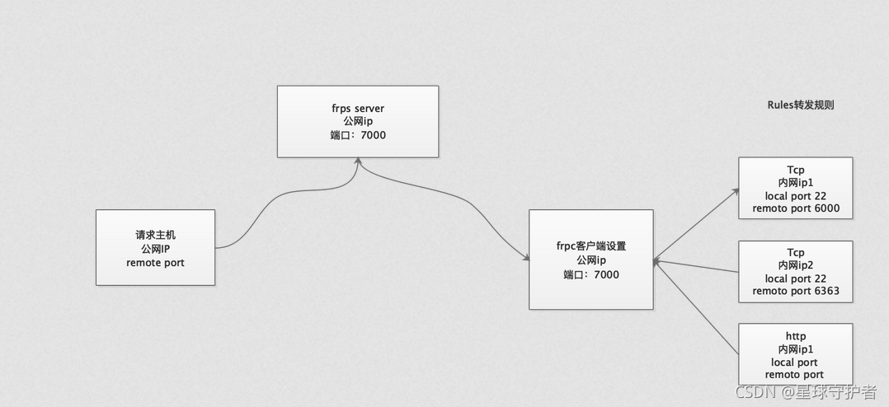

frp

分为 frps 服务端，frpc 客户端。

[https://github.com/fatedier/frp](https://github.com/fatedier/frp)

```bash
brew install frpc
```

### DDNS

动态 DNS，设备获取本机公网 IP，同步至域名解析服务商，需要尽可能设置短的 TTL，但是解析生效延迟天然存在。

ddns-go

支持 IPv4、IPv6，许多域名解析服务商，阿里云、腾讯云、华为云、GoDaddy、Cloudflare。

[https://github.com/jeessy2/ddns-go](https://github.com/jeessy2/ddns-go)

```
docker run -d --name ddns-go --restart=always -p 9876:9876 -v ~/ddns-go:/root jeessy/ddns-go
```

### P2P

设备通过节点服务器协商后，直接进行点对点（P2P）通信，设备间数据直连传输。

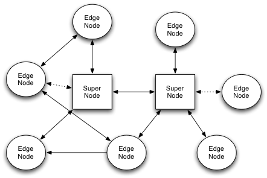

N2N [https://www.ntop.org/products/n2n/](https://www.ntop.org/products/n2n/) [https://github.com/ntop/n2n/](https://github.com/ntop/n2n/)

ZeroTier [https://www.zerotier.com](https://www.zerotier.com/)

## 显示技术

### 使用逻辑

1. 投屏或镜像，小屏有投到大屏的需求，大屏不会投到小屏。
2. 拓展，主屏是大屏，大屏小屏都可能作为拓展屏。
3. 串流，游戏场景，用大屏震撼，用小屏方便。
4. 多屏协同，小屏作为窗口显示到大屏，系统数据打通。

### 分辨率

1080P 不够润眼，屏幕必须 2K 分辨率起步。

### 远程桌面

通过网络远程控制设备，使用 RDP 远程桌面协议，需要终端具有操作系统，受网络条件限制较大，而且移动数据资费很贵。画质低，家庭局域网内也不是最优选择。

FreeRDP

开源免费，支持 Linux、Windows、Mac。

[https://www.freerdp.com/](https://www.freerdp.com/)

[https://github.com/FreeRDP/FreeRDP](https://github.com/FreeRDP/FreeRDP)

TeamViewer

不仅支持 RDP，还支持自家协议以及其他多种远程控制协议，广泛应用于各种平台，包括 Windows、Mac、Linux、iOS 和 Android。3 台以上机器收费。

[https://www.teamviewer.com/en/download/](https://www.teamviewer.com/en/download/)

Microsoft Remote Desktop

只能连接 Windows，免费，提供 Windows、Mac、Web 客户端。Mac 中国区不允许安装，可以安装 beta 版本。

[https://learn.microsoft.com/zh-cn/windows-server/remote/remote-desktop-services/clients/remote-desktop-clients](https://learn.microsoft.com/zh-cn/windows-server/remote/remote-desktop-services/clients/remote-desktop-clients)

[https://install.appcenter.ms/orgs/rdmacios-k2vy/apps/microsoft-remote-desktop-for-mac/distribution_groups/all-users-of-microsoft-remote-desktop-for-mac](https://install.appcenter.ms/orgs/rdmacios-k2vy/apps/microsoft-remote-desktop-for-mac/distribution_groups/all-users-of-microsoft-remote-desktop-for-mac)

RustDesk

覆盖设备很全面，轻度延迟，支持自建服务器。基于录屏实现，主机未连接屏幕时分辨率很低且无法设置。从移动端触屏操作桌面端兼容性不好，Mac 连 Mac 键盘无法输入。

[https://rustdesk.com](https://rustdesk.com/)

VNC

由著名的 AT&T 的欧洲研究实验室开发的远程控制工具软件，收费。

[https://www.realvnc.com/en/connect/download/viewer/](https://www.realvnc.com/en/connect/download/viewer/)

无线云终端（不推荐）

别名 瘦客户端、电脑共享器。微型硬件设备，支持有线连接，使用 RDP 远程桌面协议实现，市面上支持最高分辨率 1080P。常用于房产中介。

### 有线显示（首选）

HDMI2.1、DP1.4、Type-C，有线方案稳定、高清。HDMI 线最长 20 米，带放大器 30 米，借助网线或光纤可延长 100 米，其中光纤价格昂贵。DP 延长市面选择少价格贵。

KVM 延长器（不推荐）

Keyboard Video Mouse，显示器、键盘、鼠标延长器，通常是 HDMI + usb + 3.5mm 耳机孔，通过网线延长，光纤延长器价格贵。市面上的产品大多只支持标准分辨率、最高 60Hz 刷新率。

xdisplay（不推荐）

有线连接拓展屏，相对 SpaceDesk 更耗性能，最新版只能试用 10 分钟。

https://www.splashtop.com/wiredxdisplay

### 无线投屏（推荐）

应用层流媒体投屏，在电视、投影仪等设备上非常流行，DLNA、乐播等。

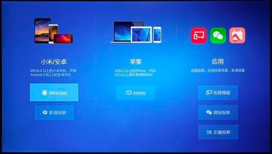

### 无线显示（推荐）

受制于速率低、延迟高、视音不同步、成本高昂等问题，一直无法流行。 WiFi 联盟的 Miracast（推荐）、苹果的 AirPlay。Miracast 支持度最高，苹果次之。

SpaceDesk（推荐）

无需支持协议，安装服务端与客户端软件，经过 wifi 路由器，无线连接任意屏幕，可作为拓展屏，支持 Windows 台式机和移动设备。延迟稍高，免费，但是官网无法打开。带 wifi 的设备必须有操作系统，即智能化。

SuperDisplay

支持 windows 服务端+android 客户端，免费体验 3 天。

[https://superdisplay.app/](https://superdisplay.app/)

毫米波 HDMI、无线投屏器（不推荐）

价格昂贵。毫米波难以穿越障碍，基于 WiFi 的投屏器还不如 WiFi6 路由器。

### 串流（推荐）

云游戏技术，接收端解码，可以在手机平板上玩主机 3A 大作。Parsec、Moonlight、AMD link、steam link。

### 多屏协同

小屏作为窗口显示到大屏，比如手机平板显示到电脑，华为鸿蒙、虫洞 er.run、开源的 scrcpy。

Scrcpy（推荐）

开源软件，安卓显示到电脑，使用 adb 调试，支持无线连接，支持 Win、Mac、Linux 三大操作系统。

```bash
# Mac
brew install scrcpy
brew install --cask android-platform-tools

# Windows
scoop install scrcpy
scoop install adb

#restarting in USB mode
adb usb
#restarting in TCP mode port: 5555
adb tcpip 5555

adb connect 172.20.100.207:5555
adb connect 192.168.1.7:5555

scrcpy
```

## 智能家居

### 中央主机

采购高性能主机，ATX 主板，带 wifi6 和蓝牙 5.0+，预留充足的显卡、内存、硬盘、外设等接口。

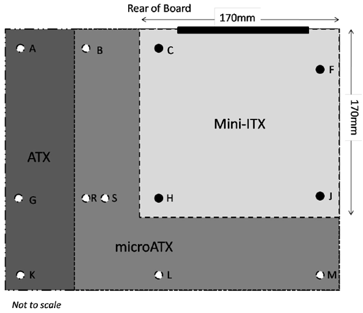

### CPU

12、13 代酷睿在桌面端使用大小核设计，核心数超级多，跑分很强，但是大小核调度不成熟，容易出现生产力软件全程小核的问题，无法满足专业用途。大小核更适合单任务模型，前台显示优先的低能耗移动端场景。

锐龙 7000X 系列，顶盖厚积热严重，不带 X 版本无积热问题，无阉割，可超频，而且更便宜，甚至未来有望价格进一步降低。首选 R9 7900，12 核 24 线程，价格 2599 左右可入手。

### 服务器

服务器 CPU 和主板价格动不动几万，二手却几十起步，捡垃圾性价比极高，缺点是要碰运气没有保障。二手平台不靠谱，找淘宝多年老店更有信誉保证。

至强 E5 神教。霄龙 EPYC 核心数恐怖，7002 系 zen2 架构 8-64 核，7003 系 zen3 架构 8-64 核，9004 系 zen4 架构 16-96 核。

### 拖机软件 Aster（首选）

俄罗斯拖机软件，免费体验 10 天，连接多套显示器、键盘、鼠标，多人分屏同时操作，基于 windows 多用户，性能无损耗，分屏必须设置为拓展屏，部分软件多开需要使用沙箱等技术。

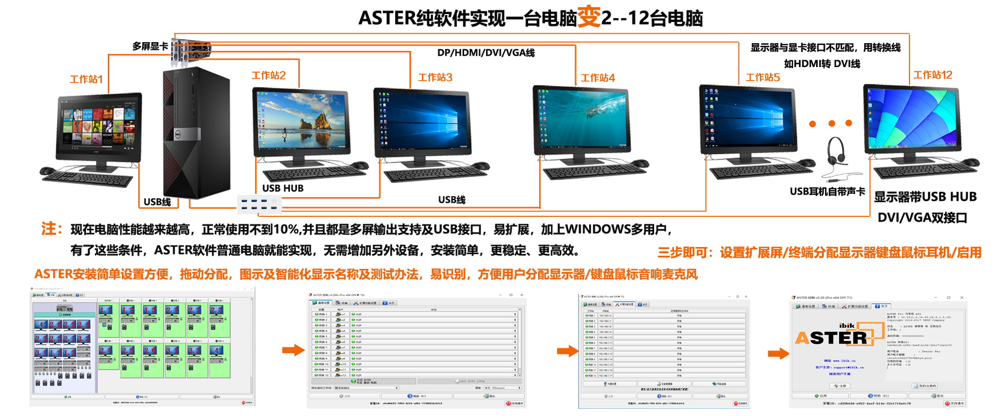

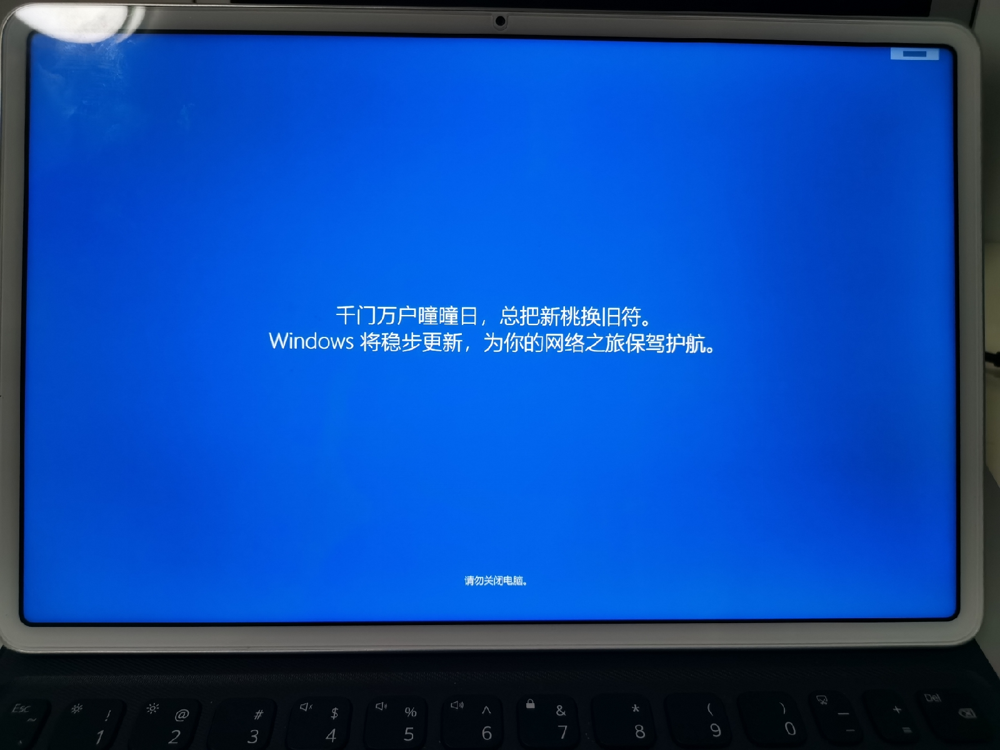

### 拖机连接显示器、键盘、鼠标

有线连接通过 dp 线连接高清带鱼屏显示器，usb hub 连接键盘鼠标。长距离可以使用 KVM 延长器，HMDI 显示器，但是只支持标准分辨率显示器。

无线连接显示器，使用 Miracast 或 SpaceDesk。最新的智慧显示器内置操作系统、支持 Wi-Fi，就算不支持 Miracast 也可以安装 SpaceDesk 安卓 APP，不拖机时可以作为智能电视独立使用。

### 语音控制

主机运行开源 AI 软件，可语音识别、语音合成，可执行系统内指令，可下达自定义 MQTT 物联网协议指令，控制开关、投影仪、电视、扫地机器人等。

### 开源 AI GPT-neox

开源的大模型人工智能，本身不支持语音，训练要求超高性能的电脑，但是可以直接使用预训练数据，家用的中高配设备就能运行。

[https://github.com/EleutherAI/gpt-neox](https://github.com/EleutherAI/gpt-neox/tree/v2.0)

语音识别

[https://github.com/Uberi/speech_recognition](https://github.com/Uberi/speech_recognition)

语音合成

[https://github.com/coqui-ai/TTS](https://github.com/coqui-ai/TTS)

### 传感器

主机接入传感器用于智能感知：麦克风用于收音；摄像头用于监控识别；红外用于探测温度与活体。

### 物联网架构

平台：阿里云、华为云、中移物联、小米 IoT 等；

网络：WiFi、蓝牙、2/3/4/5G、NB-IoT、LoRa、ZigBee、NFC 等；

协议：MQTT、CoAP、LWM2M、HTTP、Modbus、OPCUA；

系统：Android Things、Azure Sphere、RTOS、Tizen、鸿蒙 LiteOS、AliOS、mbed OS 等；

设备：手机、电脑、穿戴、开关插座、扫地机器人、电饭煲、冰箱等；

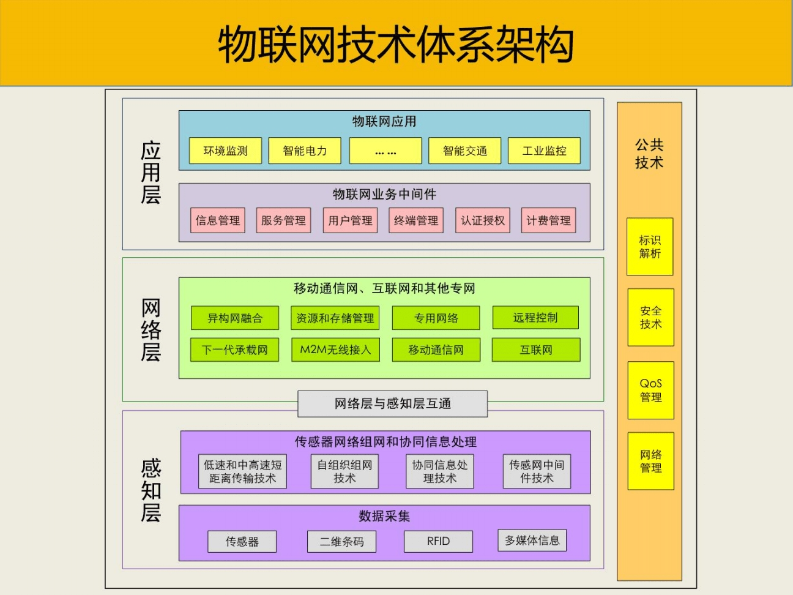

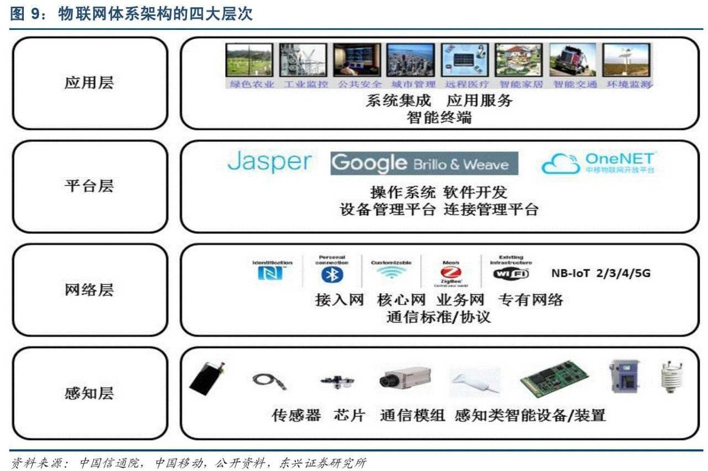
