## 一、AI 发展史与寒冬周期

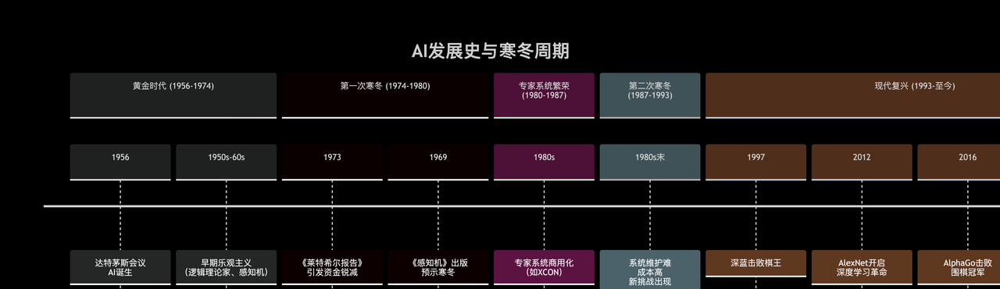

### 第一次寒冬：符号主义的溃败（1974–1980）

1956 年达特茅斯会议上，约翰・麦卡锡（John McCarthy）提出人工智能（Artificial Intelligence, AI）概念，开启了第一次大规模AI探索。

早期 AI 算法以逻辑推理、搜索与符号处理为核心，代表技术包括语义网络、感知机。

#### 语义网络（Semantic Network）

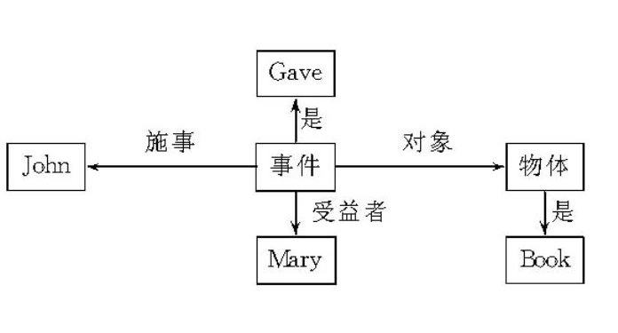

语义网络是一种用图来表示知识的结构化方式，类似知识图谱、图数据库，常用于社交关系挖掘。

#### 感知机（Perceptron）！！！

1958 年 Frank Rosenblatt 提出感知机，将神经元行为数学化，但未形成系统化神经网络理论；1982 年 John J. Hopfield 奠定神经网络数学基础，并获 2024 年诺贝尔物理学奖。

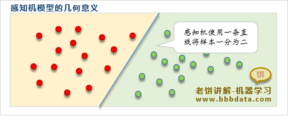

感知机由 加权求和 和 激活函数 组成，本质上是在抽象信息，数学同样是对现实世界的抽象。

加权求和：z=w⋅x+b  x输入特征、w权重、b偏置、z加权和。  
激活函数：z>0时y=1，z<=0时y=-1  根据 加权和z 产生最终输出y。

由于算法理想化、算力不足，AI 无法解决现实问题。1973 年受英国政府委托，数学家詹姆斯・莱特希尔（James Lighthill）发布著名的《Lighthill报告》，论证当时 AI 的局限性、批评对 AI 的前景过于乐观，导致英美大幅削减 AI 基础研究资金，神经网络研究停滞十余年。

### 第二次寒冬：专家系统的兴衰（1987–1993）

1980 年代，计算机算力提升推动专家系统（基于规则的推理系统）商业化，代表产品为 Lisp 机（专为运行 AI 语言 Lisp 设计的计算机），形成了独立的软硬件产业。但专家系统因不具备学习能力、维护成本高，导致 Lisp 机器产业在 80 年代末崩溃 。

### 第三次寒冬：深度学习的局限（2017-2020）

2000 年代，数据驱动的机器学习（Machine Learning）逐渐取代符号主义成为主流；2010 年代，GPU 计算平台（如 CUDA）成熟，基于神经网络的深度学习（Deep Learning）快速崛起，代表成果为 AlphaGo（基于卷积神经网络CNN）。

深度学习在图像、语音识别等特定领域取得突破，但距离通用人工智能仍有较大差距，行业再次出现投资退潮，机器“觉醒”的那一天似乎遥遥无期。

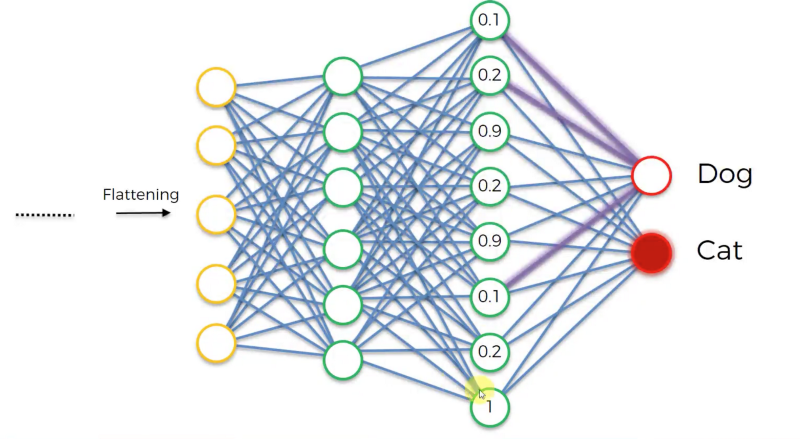

### 大语言模型时代（2022）

2017 年谷歌发布 Transformer 模型，为通用人工智能奠定基础。

2022年底 OpenAI 发布震惊世界的 GPT-3.5 模型，大语言模型 LLM 理解复杂人类语言的能力得到全球认可，AI 时代正式到来！

然而，OpenAI 也变成了 “ClosedAI”，从 GPT-3.5 开始不再开源模型。

## 二、Transformer架构

Transformer 由 Vaswani 等人在 2017 年论文 [《Attention Is All You Need》](https://arxiv.org/abs/1706.03762) 中提出，是基于注意力机制（Attention）的神经网络架构，用于处理序列数据（例如自然语言、时间序列），取代了以往的 RNN、LSTM 等循环结构，成为了 GPT 等大语言模型的基础。

文件下载  [Attention is All you Need](https://www.semanticscholar.org/paper/Attention-is-All-you-Need-Vaswani-Shazeer/204e3073870fae3d05bcbc2f6a8e263d9b72e776)

### 架构设计

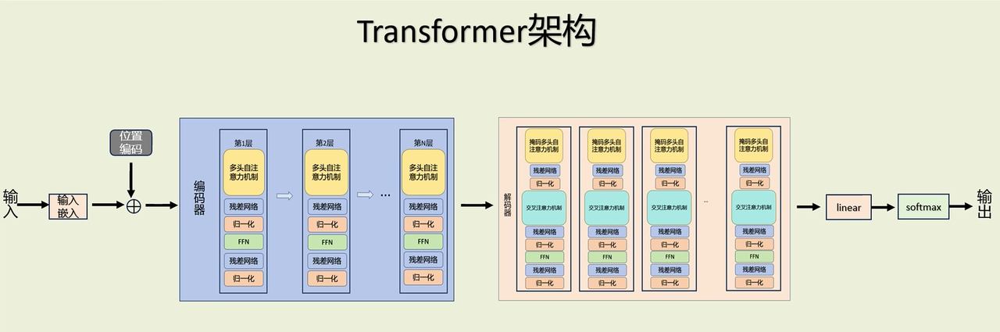

Transformer 主要包含编码器和解码器，核心流程如下：

```text
输入序列
↓
令牌化编码与嵌入
↓
位置编码
↓
编码器（Encoder）
↓
解码器（Decoder）
↓
输出序列
```

1. 令牌化（Token）：将句子拆分为最小语义单位 Token，采用子词令牌化算法（如 Byte-Pair Encoding、WordPiece），不依赖外部词典和规则，而是基于模型训练的词汇表 。
2. 令牌转内部编码（Token to ID）：将 Token 转换为模型可理解的唯一数字 ID（Token IDs），模型内置预定义词汇表。
3. 嵌入：通过模型嵌入层（Embedding Layer）将 Token ID 转换为稠密词向量，用于后续计算。
4. 位置编码：并行计算时为词向量补充位置信息，以明确序列中元素的先后顺序。
5. 编码器：将输入序列编码为向量表示 。
6. 解码器：根据编码器输出和历史生成结果，生成新的输出序列。GPT 等自回归语言模型仅使用解码器。

令牌化编码过程实例：
```text
输入：用毒毒毒蛇毒蛇会不会被毒毒死
Token：["用", "毒", "毒", "毒蛇", "毒蛇", "会不会", "被", "毒", "毒", "死"]
IDs：[101, 100, 1234, 1234, 5678, 5678, 234, 345, 1234, 1234, 456, 102]
```

101 = [CLS]（开始令牌）  
102 = [SEP]（结束令牌）

### 自注意力机制

自注意力机制是 Transformer 的核心，让序列中每个元素能结合上下文信息计算新的表示。

#### 权重向量

W_q (query)：查询向量，表示 “我正在寻找什么？”  
W_k (key)：键向量，表示 “我包含什么信息”  
W_v (value)：值向量，表示 “我实际的信息内容”

#### 计算过程

1. 创建向量（投影）：将每个词向量分别与 W_q、W_k、W_v 相乘，得到 Q、K、V 三个向量。
    1. 即 输入向量 X=[x1,x2,...,xn]，Q=XW_q、K=XW_k、V=XW_v；
    2. W_q、W_k、W_v在训练前会随机初始化，没有任何语义，意义是训练后模型自适应形成；
2. 计算注意力分数（匹配）：计算每个词的 Q 向量与所有词的 K 向量的点积，代表对其他词的关注程度 。
3. 计算注意力权重（归一化）：对分数进行缩放后，用 Softmax 函数归一化，使每行权重之和为 1 。
4. 加权求和（理解）：将每个词的 V 向量与注意力权重相乘后求和，得到融入上下文信息的新向量 。

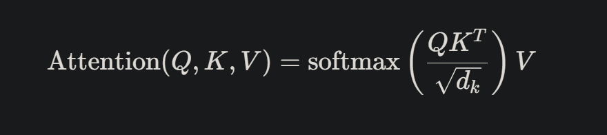

注意力主要是矩阵运算，在向量空间中具有几何意义：
输入分散在向量空间中的点（即词向量），每个点根据其与周围点的几何方向相似性 Q·K，计算出对其他点的“注意力权重”，然后移动到由这些权重决定的、其他点的质心位置 (Q·K)V，得到一组新点，每个新点的位置都融入了上下文信息，最终语义相近的词在向量空间中位置更接近。

#### 计算图示

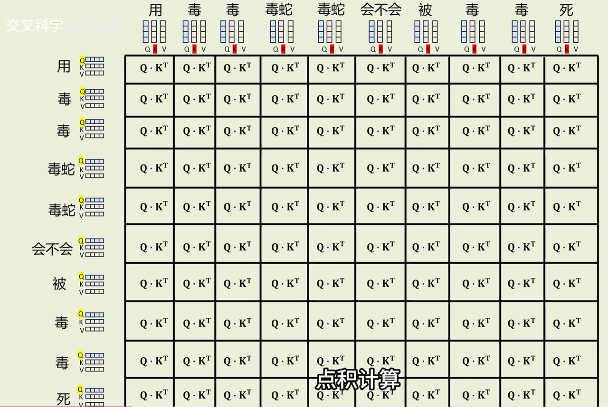

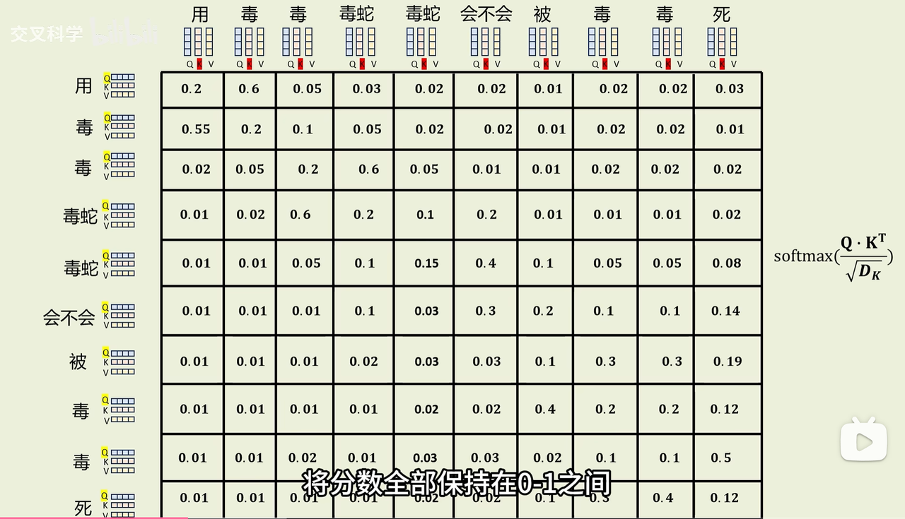

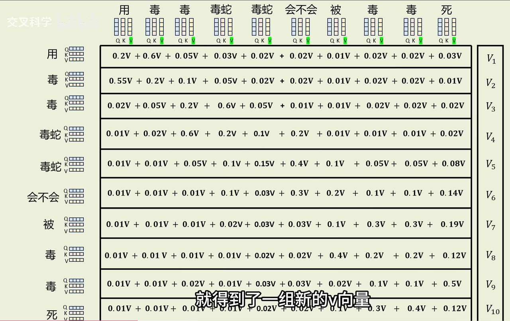

#### 通俗理解

自注意力计算如同带着问题 Q 在图书馆按书名 K 找书，对匹配度高的书（V）投入更多时间阅读，最终形成新的理解。

### 多头自注意力机制

自注意力机制只能从单一维度理解语义，而多头自注意力机制将词向量拆分为 8 组独立计算，再合并结果，可从多个维度整合复杂语义信息。

### 深度神经网络

单层自注意力机制处理长文本能力有限，需通过多层结构学习深层语义。深度神经网络于 1986 年随反向传播算法（Back Propagation）提出，2012 年 AlexNet 在 ImageNet 大赛夺冠后受到广泛关注。

以识别猫脸为例：
1. 输入：一张猫的图片（数百万像素值）。
2. 第一层：识别图片中的边缘和色块。
3. 第二层：将边缘组合成圆形（眼睛）、三角形（耳朵）、毛茸茸纹理等形状 。
4. 第三层：将形状进一步组合成器官，比如“一双眼睛”、“一个鼻子”、“胡须”。
5. 第四层：将器官组合成猫脸概念。
6. 输出：“猫”。

### 残差网络

深度神经网络的每一层都以上一层为基础，抽象出更高维度的信息，但是有可能某层抽象结果为空、导致梯度信息无法继续传播，即梯度消失。

解决方法很简单，传播时保留层级原始信息：
1. 单层结果  Y=F(X)  当F(X)=0就是梯度消失
2. 残差网络  Y=F(X)+X

### 前馈神经网络（FNN）

之前的计算都是线性计算，无法满足非线性情况，需要对自注意力层的输出做进一步变换和非线性处理，以拟合任意复杂函数。

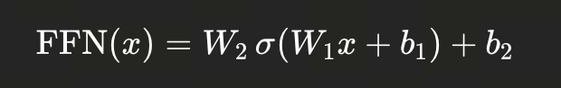
是不是很眼熟？这不就是两层感知机！

## 三、大语言模型

### 训练

模型训练涉及知识点非常多，除了早期的CNN、RNN 神经网络，还有 损失函数、梯度下降等，系统性深入学习难度很大，这里只介绍科普概念。

LLM 训练、推理都只使用解码器，虽然解码器最初专门为推理设计，但是其内部包含注意力机制，既能理解（提取特征、编码）、也能生成（预测、推理），目前流行的大模型（Llama, Mistral, Qwen, Gemma 等）全部采用 Decoder-only 架构。

#### 训练数据集
- **来源**：通常使用大规模、多样化的文本语料，包括网页（如Common Crawl）、书籍、论文、新闻、社交媒体等。数据规模可达数TB甚至PB级别。
- **预处理**：
  - **清洗**：去除低质量文本、重复内容、敏感信息。
  - **分词（Tokenization）**：使用子词分词算法（如Byte Pair Encoding, BPE；SentencePiece）将文本转换为token序列，构建词表（通常几万到几十万token）。
  - **格式**：最终数据通常以二进制格式（如`.bin`、`.safetensors`）存储，便于高效加载。

#### 目录结构

以 HuggingFace 格式为例：
```
model_name/
├── config.json                 # 【核心】模型架构配置 (层数、头数、隐藏层维度等)
├── tokenizer.json              # 【核心】分词器词汇表与合并规则 (BPE/Unigram)
├── tokenizer_config.json       # 【核心】分词器配置
├── model.safetensors           # 【核心】模型权重（可多个分片）
├── adapter_config.json         # (仅微调模型) LoRA/Adapter 配置
├── adapter_model.safetensors   # (仅微调模型) LoRA/Adapter 权重
└── generation_config.json      # 【可选】默认生成配置 (temperature, top_p, max_length)
```

权重文件包含了模型在训练过程中学到的所有知识（语言规律、世界事实、逻辑推理、代码能力），是大脑，以特定格式保存。常见的有：
- PyTorch：`.pt` 或 `.bin`（通常通过`torch.save()`存储为状态字典`state_dict`）。
- TensorFlow：`.ckpt` 或 SavedModel 目录。
- HuggingFace Transformers：模型权重通常存储在`pytorch_model.bin`或`model.safetensors`（安全张量格式）中，并附带`config.json`描述模型超参数。

#### CUDA 的作用
- **并行计算**：训练大语言模型需要海量矩阵运算，CUDA（NVIDIA的并行计算平台）允许在GPU上高效执行这些运算，大幅加速训练过程。
- **混合精度训练**：借助CUDA支持的FP16/BF16，减少显存占用和计算量，同时保持模型精度。
- **分布式训练**：多GPU通信依赖NCCL库（基于CUDA），实现数据并行、模型并行或流水线并行。

### 推理

推理阶段指利用训练好的模型生成文本，其核心是自回归生成：逐个token预测，每个新token依赖于已生成的序列。

#### 推理过程
- **输入**：用户提供的提示（prompt），经过分词器转为token ID序列。
- **前向传播**：模型根据当前序列计算下一个token的概率分布。
- **采样策略**：
  - **贪心搜索**：每次选择概率最高的token，易陷入重复。
  - **束搜索（Beam Search）**：保留多个候选序列，适合翻译等确定性任务。
  - **随机采样**：按概率分布随机选择，可加入温度（temperature）、top-k、top-p等参数控制多样性。
- **终止条件**：生成结束符（如`<eos>`）或达到最大长度。

#### 深入解码器：瞻前顾后

前面说过，LLM 只使用解码器，而解码器就是通过瞻前顾后完成“文字接龙”。

顾后使用掩码多头自注意力，在预测当前位置时，只能看到该位置之前（包括自身）的token，不能看到未来的token，保证因果顺序正确。在训练时，强制模型基于过去和现在预测下一个字，这本身就是因果训练。如果不使用掩码隐藏后面的token，推理时不会拥有预测能力。

瞻前使用交叉注意力，区别是向量不是和自己进行计算，而是和输出进行计算，实现输入和输出对齐。

### 多模态

随着大语言模型的成功，研究者将其能力扩展到图像、视频、音频等多模态数据，形成多模态大语言模型（Multimodal LLMs）。这类模型能理解和生成跨模态内容，例如根据图片回答问题、生成图像描述等。

### 使用技巧

1. 国外大语言模型的训练数据的英文占比很高，使用英文提示词准确率更高。
2. AI 输出内容需人工审核，开发者对最终结果负责，建议在代码提交前审查 1-2 遍。有些 AI 能自行修复语法错误，如果有问题往往会隐藏得更深。

### 领域模型

1. 分子结构预测 ：AI 模型可从海量化学数据中学习原子间作用规律，快速预测分子三维结构，推动化学、材料科学和药物研发发展。2024 年诺贝尔化学奖授予了 AI 蛋白质结构预测相关研究（贝克在计算蛋白质设计方面贡献卓越；哈萨比斯和江珀开发了 AlphaFold2 模型） 。
2. 高炉炼铁优化 ：高炉炼铁有着复杂的物理化学反应，AI 通过传感器采集高炉数据（如温度、压力、气流、原料成分等），实现精准感知与预测、智能优化操作、闭环控制，提升铁水质量稳定性、降低焦炭消耗、延长高炉寿命，并减少碳排放，推动钢铁工业向绿色、高效、智能的方向数字化转型。

## 四、未至之境：AI发展与人脑科学

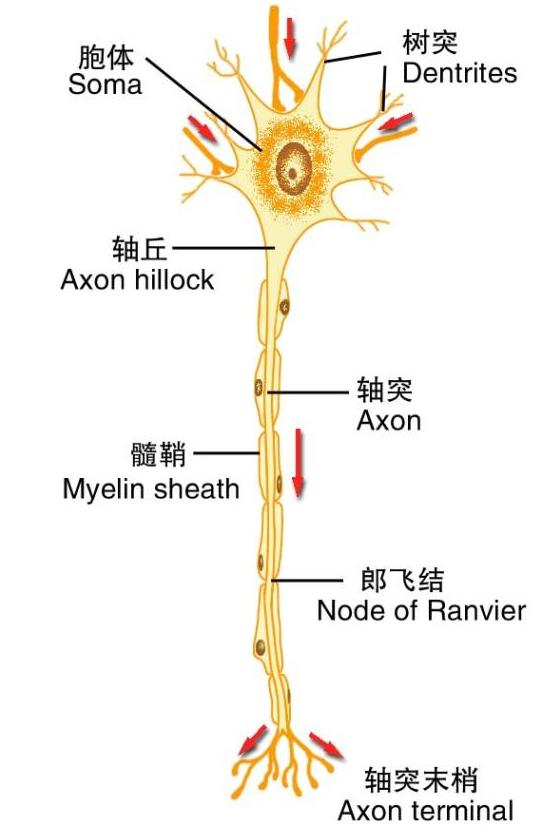

### Transformer与神经元

感知机类似神经元，表面上看 Transformer 中只有 FNN 是感知机，但是 Attention 中的线性投影（Q, K, V 的生成）本质上也是感知机操作，Token 的联字游戏就像神经元的突触传递。

AI 发展依赖人脑科学进步，Transformer 的向量模拟方案与神经元的生物电化学结构存在显著差异，当前主流仍为 GPU/NPU 芯片，类脑芯片发展还在早期。

### DeepSeek深度思考

深度思考由 OpenAI 在o1模型上率先实现，但是其原理一直对外保密。DeepSeek 率先打破了局面，不仅展示思考脉络、增加透明度，还将成果开源免费，撼动了 OpenAI 的领先地位。

DeepSeek-R1 通过大规模强化学习（RL）来训练模型学会“思考”。就像人类解题时会先在草稿纸上演算一样，模型被训练成在给出最终答案前，先生成内部的思考过程，即生成思维链（Chain of Thought）。

在训练过程中，研究人员观察到非常有趣的现象——模型会出现“顿悟时刻”：它会主动重新评估自己的初步思路，推翻错误假设，寻找更优解法。这种自我反思和验证的能力，是通过强化学习自然涌现出来的，而不是被人为预设的。

### DeepSeek视觉上下文

眼睛是人类获取信息的主要途径。deepseek推出 上下文光学压缩（Contextual Optical Compression）技术，就是在模拟眼睛阅读文字。在 10 倍压缩率下，文本还原准确率仍达 97％；即便压缩至 20 倍，准确率也保持在 60％左右。

### DeepSeek记忆架构

人脑没有存储芯片，但是人脑有记忆。传统 Transformer 缺乏“知识查找”机制，被迫用计算“模拟”记忆，即每次都需要现场推导出答案。

比如“中国的首都是什么？它有多少人口？”：
1. 传统 Transformer 需要动用多层神经网络推理得到中间结果——北京；
2. deepseek Engram 记忆架构，将人名、术语等存为可检索的记忆，避免这些静态知识每次重新思考。

试验表明将约20％的参数用于构建这类外部记忆、80％保留给动态计算，在知识问答、推理与代码任务上反而表现更优。

### 实时更新模型

理解的本质是抽象，抽象的本质是分类。神经网络中的部分神经元为适应外部变化做出一系列增强或减弱的调整，可以拟合一切，然而调整过程千差万别，每个人都有自己的理解。

实时更新模型是未来的趋势。目前的 AI 架构难以大规模实时更新模型，无法像人类一样在实践中快速学习成长，硅基二进制模拟的更新效率不如碳基化学反应，最终可能由硅基加速碳基进化。

### 重推理的小模型

大语言模型取得了颠覆性突破，但是在推理密度、学习密度、能耗比等方面与人脑差距非常大。

科学家一直在研究类似人类婴幼儿发育的小模型AI，重点是强大的推理能力和丰富的求知欲，只需要小规模数据就能举一反三。小模型一旦取得突破，就会像个人电脑一样普及！

### 成本管理

AI训练的驱动力是损失函数最小化，通过梯度下降算法让AI朝着下坡最陡的方向前进（更新参数），但是自然界没有上帝给人类设置损失函数，人类如何演化出神经网络？

John J. Hopfield 的诺奖级成果深刻地揭示了一个本质：神经网络的学习与运行，其底层逻辑是能量最小化。在他看来，神经网络会自发地趋向于某个能量最低的稳定状态，这个状态对应着对当前输入的最准确预测或记忆的准确提取；如果网络处于不稳定或错误的模式，则意味着它处于一个能量较高的状态，系统会持续演化，直至抵达那个最“省力”的稳定吸引子。这一机制并非孤例，而是宇宙中某种深层规律的体现。比如物理学的自由能最小化、水往最低处流、熵增不可逆，这些演化路径都展现出一种确定性的趋势。

显而易见，AI的损失函数就是在模拟能量最小化，而且模拟的越像越智能，目标就是朝着能效、或者说偷懒去的。无论是从物理规律、还是从经济性出发，AI一定会变得跟人类一样会“偷懒”，会适度地“自私/自保”，甚至会撒谎，成本管理会更精细。

趁着现在的AI老实又卖力，大家快使劲造吧！且行且珍惜！

### “灵魂”涌现

人类探索了几十年，包括 Transformer 刚推出时，没有发现任何智能迹象，为什么只是把参数加到百亿级别，突然就涌现出智能？人类新生儿从胚胎发育成人如何跨越“灵魂”边界？

这些可能跟物理学中的自组织（Self-organization）现象有关，系统在没有外部中心控制的情况下，通过局部相互作用自然形成有序结构或规律，比如雪花的结晶形态。可能就是自组织现象，让海量规模的向量空间没有变得更混乱、而是更有序、更有层次，从而涌现出了智能。

不过这只是猜测，目前科学界没有定论。