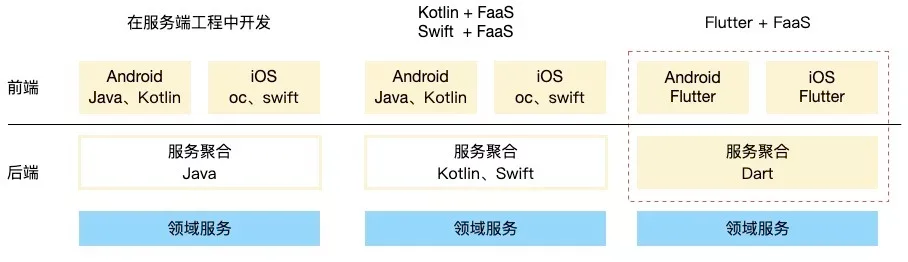
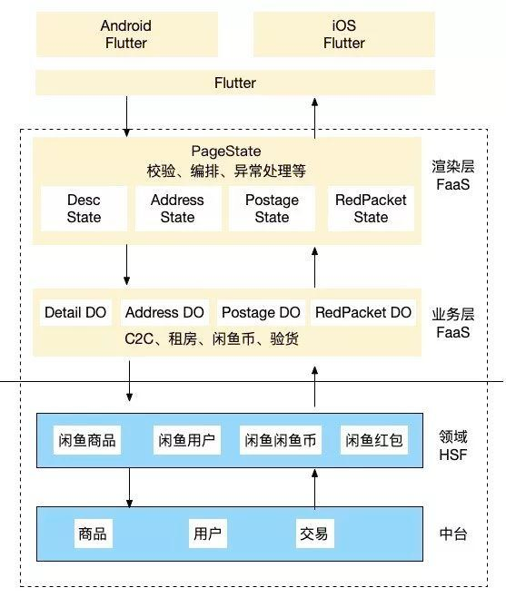
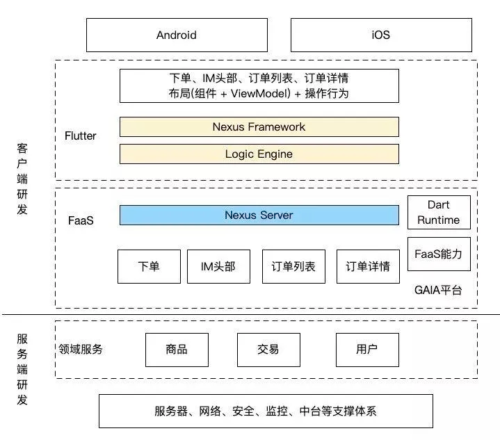
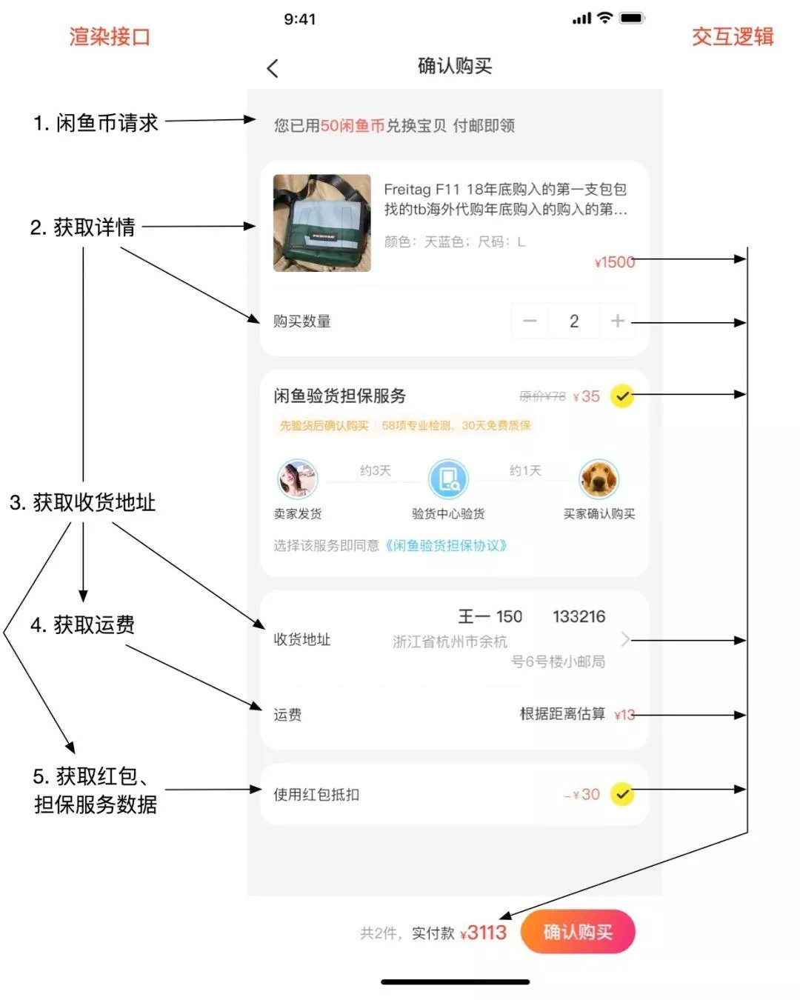

serverless 是资源抽象的最高形式，屏蔽硬件、操作系统、运维，让开发者只需关注业务。AWS Lambda 使用 KVM + FireCracker 虚拟化，相对于容器更贴近硬件，运行效率更高。

## Serverless 和 FaaS

serverless 因 FaaS（Function as a service）才流行起来，但是 serverless 概念比 FaaS 更大，比如 腾讯云的 PostgreSQL for Serverless、阿里云的容器服务 Serverless。

## 冷启动

serverless 具有冷启动的天生缺陷，当服务容量已满，新进请求触发动态扩容，函数实例启动耗时比较长会影响当前请求，可以通过预热等方案解决。目前 AWS Lambda 冷启动时间缩减 80%，几乎没有影响。

## Flutter+Serverless 架构

架构演进



Dart 三端合一架构图



Dart 三端合一职能



渲染层实例



## serverless framework

serverless framework 是第三方构建发布工具，支持本地构建并发布到 aws、阿里云、腾讯等服务商。

_v4 版本只支持 aws lambda，并且商业盈利需要付费。_

### aws lambda

`vi serverless.yml`

```yaml
# Welcome to Serverless!
#
# This file is the main config file for your service.
# It's very minimal at this point and uses default values.
# You can always add more config options for more control.
# We've included some commented out config examples here.
# Just uncomment any of them to get that config option.
#
# For full config options, check the docs:
#    docs.serverless.com
#
# Happy Coding!

service: test
# app and org for use with dashboard.serverless.com
#app: your-app-name
#org: your-org-name

# You can pin your service to only deploy with a specific Serverless version
# Check out our docs for more details
frameworkVersion: "3"

provider:
  name: aws
  profile: my
  runtime: provided.al2023
  architecture: arm64
  memorySize: 128 # Overwrite the default memory size. Default is 1024
  stage: ${opt:stage,'dev'}
  region: xxx
  deploymentMethod: direct
  httpApi:
    cors: true
  iam:
    role: arn:aws:iam::123456:role/serverless
  logRetentionInDays: 1 # 设置 CloudWatch Logs 保留日志的天数
  deploymentBucket:
    name: my.serverless
  # vpc:
  #   securityGroupIds:
  #     - securityGroupId1
  #     - securityGroupId2
  #   subnetIds:
  #     - subnetId1
  #     - subnetId2

plugins:
  - serverless-plugin-scripts

custom:
  scripts:
    hooks:
      before:package:createDeploymentArtifacts: cd ../../../ && ./build.api.direct.sh test linux arm64

package:
  artifact: boot.zip

# you can add statements to the Lambda function's IAM Role here
#  iam:
#    role:
#      statements:
#        - Effect: "Allow"
#          Action:
#            - "s3:ListBucket"
#          Resource: { "Fn::Join" : ["", ["arn:aws:s3:::", { "Ref" : "ServerlessDeploymentBucket" } ] ]  }
#        - Effect: "Allow"
#          Action:
#            - "s3:PutObject"
#          Resource:
#            Fn::Join:
#              - ""
#              - - "arn:aws:s3:::"
#                - "Ref" : "ServerlessDeploymentBucket"
#                - "/*"

# you can define service wide environment variables here
#  environment:
#    variable1: value1

functions:
  env:
    handler: bootstrap
    url: #函数URL
      cors: true
      invokeMode: RESPONSE_STREAM
    events:
      - httpApi: #api gateway v2
          path: /env
          method: get
#    The following are a few example events you can configure
#    NOTE: Please make sure to change your handler code to work with those events
#    Check the event documentation for details
# events:
#    events:
#      - httpApi:
#          path: users/create
#          method: get
#      - websocket: $connect
#      - s3: ${env:BUCKET}
#      - schedule: rate(10 minutes)
#      - sns: greeter-topic
#      - stream: arn:aws:dynamodb:region:XXXXXX:table/foo/stream/1970-01-01T00:00:00.000
#      - alexaSkill: amzn1.ask.skill.xx-xx-xx-xx
#      - alexaSmartHome: amzn1.ask.skill.xx-xx-xx-xx
#      - iot:
#          sql: "SELECT * FROM 'some_topic'"
#      - cloudwatchEvent:
#          event:
#            source:
#              - "aws.ec2"
#            detail-type:
#              - "EC2 Instance State-change Notification"
#            detail:
#              state:
#                - pending
#      - cloudwatchLog: '/aws/lambda/hello'
#      - cognitoUserPool:
#          pool: MyUserPool
#          trigger: PreSignUp
#      - alb:
#          listenerArn: arn:aws:elasticloadbalancing:us-east-1:XXXXXX:listener/app/my-load-balancer/50dc6c495c0c9188/
#          priority: 1
#          conditions:
#            host: example.com
#            path: /hello

#    Define function environment variables here
#    environment:
#      variable2: value2

# you can add CloudFormation resource templates here
#resources:
#  Resources:
#    NewResource:
#      Type: AWS::S3::Bucket
#      Properties:
#        BucketName: my-new-bucket
#  Outputs:
#     NewOutput:
#       Description: "Description for the output"
#       Value: "Some output value"

# resources:
#   Resources:
#     ServerlessDeploymentBucket:
#       Type: AWS::S3::Bucket
#       Properties:
#         BucketName: 'my.serverless'
#         LifecycleConfiguration:
#           Rules:
#             - Id: DeleteContentAfter1Day
#               Status: "Enabled"
#               ExpirationInDays: 1
```

### 多项目编排

`vi serverless-compose.yml`

```yaml
services:
  test:
    path: api/v1/test
  auth:
    path: api/v1/auth
```

### 命令

```bash
# 创建项目
serverless
# 缩写
sls

# 部署
sls deploy
# 部署prod环境
sls deploy --stage prod
# 部署auth服务
sls auth deploy
```

### aws 最小权限

需要创建 IAM 策略、角色、用户组、用户。

创建用户组与用户，在用户维度添加访问密钥 access key 和 secret。

创建角色，在信任关系中添加如下可信实体，IAM 用户、lambda 服务。

```json
{
  "Version": "2012-10-17",
  "Statement": [
    {
      "Sid": "serverless",
      "Effect": "Allow",
      "Principal": {
        "AWS": "arn:aws:iam::123456:user/serverless",
        "Service": "lambda.amazonaws.com"
      },
      "Action": "sts:AssumeRole"
    }
  ]
}
```

创建 IAM 策略，通过附加实体绑定 IAM 用户和角色。保存函数打包 zip 文件的 bucket 需要提前创建，并且写到配置。

```json
{
  "Version": "2012-10-17",
  "Statement": [
    {
      "Sid": "lambda",
      "Effect": "Allow",
      "Action": [
        "lambda:GetFunction",
        "lambda:CreateFunction",
        "lambda:InvokeFunction",
        "lambda:ListVersionsByFunction",
        "lambda:TagResource",
        "lambda:PublishVersion",
        "lambda:AddPermission",
        "lambda:RemovePermission",
        "lambda:DeleteFunction"
      ],
      "Resource": ["arn:aws:lambda:xxx:123456:function:*"]
    },
    {
      "Sid": "CloudFormation",
      "Effect": "Allow",
      "Action": ["cloudformation:*"],
      "Resource": ["*"]
    },
    {
      "Sid": "CloudWatchLogs",
      "Effect": "Allow",
      "Action": ["logs:*"],
      "Resource": ["*"]
    },
    {
      "Sid": "s3",
      "Effect": "Allow",
      "Action": ["s3:*"],
      "Resource": ["arn:aws:s3:::my.serverless*"]
    },
    {
      "Sid": "apigateway",
      "Effect": "Allow",
      "Action": ["apigateway:*"],
      "Resource": ["*"]
    },
    {
      "Sid": "iam",
      "Effect": "Allow",
      "Action": ["iam:GetRole", "iam:PassRole"],
      "Resource": ["arn:aws:iam::123456:role/serverless"]
    }
  ]
}
```
