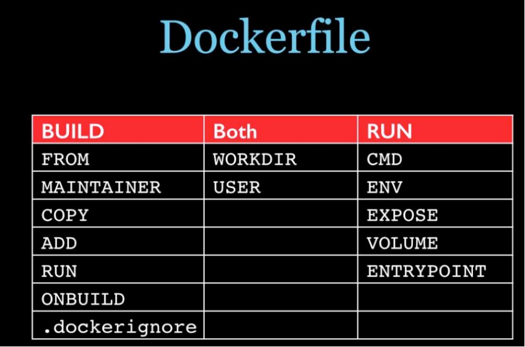

## 架构

Docker 使用客户端-服务器 (C/S) 架构模式，通过远程 API 来管理和创建 Docker 容器。


| 概念   | 英文           | 说明                                                                                                                                                                |
| ------ | -------------- | ------------------------------------------------------------------------------------------------------------------------------------------------------------------- |
| 主机   | Host           | 一个物理或者虚拟的机器用于执行 Docker 守护进程（Daemon）和容器。                                                                                                    |
| 镜像   | Images         | 创建容器的模板，镜像与容器的关系类似于面向对象编程中的类与对象。                                                                                                    |
| 仓库   | Registry       | 镜像仓库，[https://hub.docker.com/](https://hub.docker.com/)。                                                                                                      |
| 容器   | Container      | 容器是独立运行的应用，是镜像运行时的实体。                                                                                                                          |
| 客户端 | Client         | 客户端通过命令行或者其他工具使用 Docker SDK)与 守护进程通信。                                                                                                       |
| \      | Docker Machine | 简化安装的命令行工具，在相应的平台上安装 Docker，比如 VirtualBox、 Digital Ocean、Microsoft Azure。                                                                 |
| 引擎   | Docker Engine  | 核心部分，Linux 下无需虚拟机即可运行，包含客户端命令 docker 与守护进程命令 dockerd。                                                                                |
| 桌面   | Docker Desktop | 图形界面+引擎，操作更方便，非 Linux 环境包含虚拟机。Mac、Windows、Linux 可以使用 Docker Desktop 启动和管理。Linux 下还可以直接使用 dockerd 命令，或者系统命令启动。 |

Docker 并非通用的容器工具，它依赖于已存在并运行的 Linux 内核环境，实质上是在 Linux 下制造了一个隔离的文件环境，因此它的执行效率几乎等同于所部署的 Linux 主机。如果在其他系统部署 Docker 就必须安装一个虚拟 Linux 环境，比如 VMWare、VirtualBox、Hyper-V、WSL 等。

### k8s 架构


ingress：入口

### 网络模式

1. bridge：通过 Linux bridge 隔离
2. host：直接使用主机网络，无隔离，但是性能好
3. none：没有网络

> The host networking driver only works on Linux hosts, and is not supported on Docker Desktop for Mac, Docker Desktop for Windows, or Docker EE for Windows Server.

host 模式只能用在 Linux

## 命令

docker info：查看信息。  
docker images：镜像列表。  
docker pull：拉取镜像。  
docker push：推送镜像。  
docker rmi：删除镜像。  
docker rm：删除容器。  
docker run：创建新容器并运行命令。  
docker exec：在运行的容器中执行命令。  
docker create：创建新容器但不启动。  
docker ps：查看容器列表。  
docker top：查看容器进程信息，支持 ps 命令参数。  
docker stats：显示容器资源情况。  
docker start/stop/restart：启动、停止、重启。  
docker network：网络相关。  
docker volume：数据卷，存储在/var/lib/docker/volumes/。

### 守护进程启停、开机自启

```shell
# CentOS
sudo systemctl start docker
sudo systemctl stop docker
sudo systemctl enable docker

# Debian
sudo service docker start
```

### 容器自启

```shell
# 启动时设置
docker run --restart=always redis
# 启动后更新
docker update --restart=always redis

# 取消自启
docker update --restart=no redis
```

## Dockerfile




### 基础镜像

scratch：空镜像。  
busybox：最小 linux，只有 1M，支持几百个常用命令，没有包管理器。  
alpine：基于 busybox，只有 5M，有包管理器 apk。alpine 没有/bin/bash，是/bin/sh。

### 私有仓库

```shell
# 登录
docker login --username=x@x.com registry.cn-shanghai.aliyuncs.com
# 构建
docker build -t registry.cn-shanghai.aliyuncs.com/lynnclub/box .
# 指定Dockerfile构建
docker build -f /path/to/a/Dockerfile .
# 标签
docker tag [ImageId] registry.cn-shanghai.aliyuncs.com/lynnclub/box:latest
# 构建并且打标签
docker build -t registry.cn-shanghai.aliyuncs.com/lynnclub/box:latest .
# 推送
docker push registry.cn-shanghai.aliyuncs.com/lynnclub/box:latest
```

## Docker Desktop

Linux 可以只安装 Docker Engine，在 Windows 10 和 macOS 操作系统上必须安装包含图形界面的 Docker Desktop。

### Windows 10+

[https://docs.docker.com/desktop/install/windows-install/](https://docs.docker.com/desktop/install/windows-install/)

Windows 可以使用 WSL 虚拟机作为 docker 底层运行环境。

### Mac

[https://docs.docker.com/desktop/install/mac-install/](https://docs.docker.com/desktop/install/mac-install/)

```shell
brew install –cask docker
```

### Linux

不需要图形界面可以不装，仅需 Docker Engine。

[https://docs.docker.com/desktop/install/linux-install/](https://docs.docker.com/desktop/install/linux-install/)

## Docker Engine

Docker Desktop 主要是图形界面，Windows 和 Mac 系统必须安装 Desktop，Linux 系统可以只安装 Docker Engine。

### CentOS

```shell
# docker仓库
yum-config-manager \
    --add-repo \
    https://download.docker.com/linux/centos/docker-ce.repo

yum install docker-ce docker-ce-cli containerd.io docker-buildx-plugin docker-compose-plugin

systemctl enable docker.service
systemctl start docker.service
```

### Debian

```shell
# 添加官方GPG密钥
apt install ca-certificates curl gnupg
sudo install -m 0755 -d /etc/apt/keyrings
curl -fsSL https://download.docker.com/linux/debian/gpg | sudo gpg --dearmor -o /etc/apt/keyrings/docker.gpg
sudo chmod a+r /etc/apt/keyrings/docker.gpg

# 添加apt源
echo \
  "deb [arch="$(dpkg --print-architecture)" signed-by=/etc/apt/keyrings/docker.gpg] https://download.docker.com/linux/debian \
  "$(. /etc/os-release && echo "$VERSION_CODENAME")" stable" | \
  sudo tee /etc/apt/sources.list.d/docker.list > /dev/null

apt update
apt install docker-ce docker-ce-cli containerd.io docker-buildx-plugin docker-compose-plugin
```

## 常用容器

```shell
docker run -d --restart=always \
--name mariadb \
-e MYSQL_ROOT_PASSWORD=123456 \
-v ~/data/mariadb:/var/lib/mysql -p 3306:3306 \
mariadb:latest

docker run -d --restart=always \
--name postgres \
-e POSTGRES_PASSWORD= -e POSTGRES_HOST_AUTH_METHOD=trust \
-v ~/data/postgresql:/var/lib/postgresql/data -p 5432:5432 \
postgres:alpine

docker run -d --restart=always \
--name redis \
-v D:/Data/redis:/data -p 6379:6379 \
redis:alpine

docker network create elasticsearch
docker run -d --restart=always \
--name elasticsearch \
--net elasticsearch \
-v ~/data/elasticsearch:/usr/share/elasticsearch/data \
-p 9200:9200 -p 9300:9300 -e "discovery.type=single-node" \
elasticsearch:alpine

docker run -d --restart=always \
--name clickhouse \
--ulimit nofile=262144:262144 \
-v ~/data/clickhouse:/var/lib/clickhouse \
-v ~/data/clickhouse:/var/log/clickhouse-server \
-p 8123:8123 -p 9000:9000 \
clickhouse/clickhouse-server:head-alpine

docker run -d --restart=always \
--name ddns-go \
-p 9876:9876 -v ~/data/ddns-go:/root \
jeessy/ddns-go

docker run -d --restart=always \
--name grafana \
-p 3000:3000 \
grafana/grafana:latest

docker run -d --restart=always \
--name rabbitmq \
-v D:/Data/rabbitmq:/var/lib/rabbitmq \
-p 15691:15691 -p 15692:15692 -p 25672:25672 -p 4369:4369 -p 5671:5671 -p 5672:5672 \
rabbitmq:alpine
```
