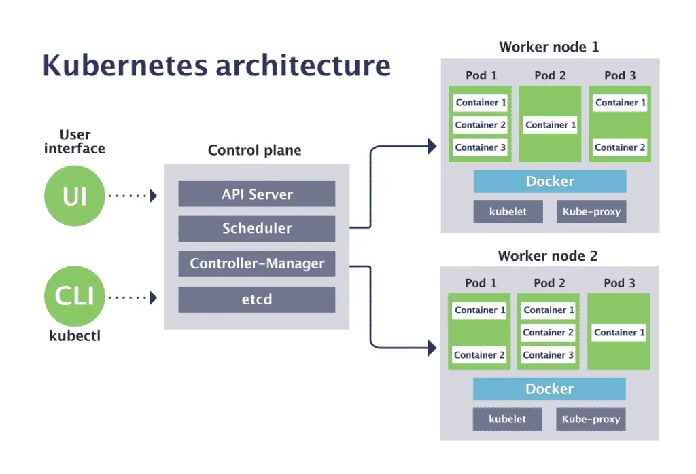

### 架构



Kubernetes（简称K8s）是一个用于自动化部署、弹性伸缩、负载均衡、服务发现和管理容器化应用程序的开源系统。

架构主要包括以下几个组件：

1. **Master 节点（控制平面）**：
    - **API Server**：处理所有的操作请求并更新etcd中的状态。它是 Kubernetes 集群的入口点。
    - **Controller Manager**：管理集群中的各种控制器，包括节点控制器、复制控制器、端点控制器和服务账户控制器等，负责确保集群状态与预期状态的一致性。
    - **Scheduler**：负责将 Pod 分配到合适的工作节点上。
    - **etcd**：一个高可用的键值存储系统，存储 Kubernetes 集群的所有数据和状态。

2. **Worker 节点（计算节点）**：
    - **Kubelet**：负责管理节点上的 Pod，确保容器在节点上按预期运行。
    - **Kube-Proxy**：提供网络代理服务，处理服务的负载均衡和网络流量。
    - **Container Runtime**：负责运行和管理容器，常见的有 Docker、containerd 等。默认使用containerd。

3. **Pod**：Kubernetes 中的基本调度单元，包含一个或多个容器（通常是 Docker 容器），这些容器共享网络和存储。

4. **Service**：定义了一组 Pod 的访问策略，提供负载均衡和服务发现。

5. **Deployment**：用于管理 Pod 的副本和更新策略，确保应用程序的高可用性和可扩展性。

6. **Namespace**：用于将集群中的资源划分为多个虚拟集群，实现资源的隔离。

7. **ConfigMap 和 Secret**：用于存储和管理应用程序配置和敏感数据。

8. **Volume**：提供持久化存储解决方案，确保数据在容器重启或迁移时不丢失。

9. **Ingress**：管理外部访问 Kubernetes 集群中服务的策略，通常与负载均衡器结合使用。

#### 其它核心组件

1. **Kubelet**：运行在每个节点上的代理，确保容器按Pod的定义运行。

2. **Flannel**：简单的网络插件，负责Pod网络的创建和管理。

3. **Calico**：高级的网络插件，用于提供网络策略和安全性，支持 BGP 等高级网络功能。

4. **Kube-Proxy**：维护Service网络规则，允许Pod间的通信和与外部网络的通信。

5. **Cloud Controller Manager**（如果使用云提供商）：与云提供商集成，以管理负载均衡器、存储卷等云资源。

这些核心组件共同工作，以确保Kubernetes集群能够有效地管理和调度容器化应用。

#### 重要组件

除了核心组件之外，Kubernetes 中还有许多重要的组件和工具，它们在不同的场景和需求下发挥着重要作用：

1. **Ingress Controller**：
    - 用于管理 Ingress 资源，实现 HTTP 和 HTTPS 路由。常见的 Ingress Controller 有 NGINX、Traefik 和 HAProxy。

2. **CoreDNS**：
    - Kubernetes 集群中的默认 DNS 服务器，负责为服务发现和 DNS 解析提供支持。

3. **Helm**：
    - Kubernetes 的包管理工具，用于简化应用程序的部署和管理。Helm 使用“charts”来定义、安装和升级 Kubernetes 应用程序。

4. **Prometheus**：
    - 用于监控和告警的系统，可以与 Kubernetes 集成，以收集集群和应用程序的性能数据。

5. **Grafana**：
    - 开源的可视化工具，与 Prometheus 配合使用，提供丰富的监控和可视化能力。

6. **kube-state-metrics**：
    - 用于暴露 Kubernetes 集群状态指标，供 Prometheus 采集。

7. **Fluentd**：
    - 日志收集和聚合工具，可以将 Kubernetes 集群中的日志收集并发送到不同的存储后端。

8. **Jaeger 或 Zipkin**：
    - 分布式追踪系统，用于监控和调试微服务架构中的延迟和性能问题。

9. **Cert-Manager**：
    - 用于在 Kubernetes 集群中自动化管理 TLS 证书，常用于自动申请和续订 Let’s Encrypt 证书。

10. **Kubeflow**：
    - 用于在 Kubernetes 上运行和部署机器学习工作负载的工具包。

11. **Velero**：
    - 用于备份和恢复 Kubernetes 集群资源和持久化卷的工具。

12. **Kubernetes Dashboard**：
    - 一个基于 Web 的用户界面，用于管理和监控 Kubernetes 集群。

13. **Operators**：
    - 用于将复杂的应用程序管理自动化的 Kubernetes 扩展，使用自定义控制器来管理特定的应用程序或服务。

14. **Kustomize**：
    - 原生于 Kubernetes 的配置管理工具，允许用户声明性地管理 Kubernetes 对象配置。

这些组件和工具在不同的应用场景下发挥着重要作用，可以极大地增强 Kubernetes 的功能和用户体验。

#### 其它组件

除了之前提到的组件和工具，还有一些其他的重要组件和工具，它们在特定的用例中也非常有用：

1. **kubeadm**：
    - Kubernetes 集群的安装和配置工具，提供简单的命令行接口来引导集群。

2. **Minikube**：
    - 本地运行 Kubernetes 的工具，适用于开发和测试环境。

3. **Kind (Kubernetes IN Docker)**：
    - 在 Docker 容器中运行本地 Kubernetes 集群的工具，常用于测试和 CI/CD 环境。

4. **Weave Net**：
    - 另一种网络插件，提供简单易用的网络配置和管理。

5. **Cilium**：
    - 基于 eBPF 的网络插件，提供高级网络安全和监控功能。

6. **Linkerd**：
    - 轻量级服务网格，用于提供服务间通信的可观察性、安全性和可靠性。

7. **Istio**：
    - 功能丰富的服务网格，提供流量管理、安全性、策略控制和可观察性。

8. **Keda (Kubernetes Event-driven Autoscaling)**：
    - 允许基于事件的自动扩展，为应用程序提供基于事件的自动缩放能力。

9.  **Argo CD**：
    - 声明式的 GitOps 继续交付工具，帮助管理 Kubernetes 应用程序的持续交付。

10. **Tekton**：
    - 云原生的 CI/CD 系统，提供构建、测试和部署应用程序的流水线。

11. **Velero**：
    - Kubernetes 的备份和恢复工具，用于保护和恢复集群资源和持久化存储。

12. **OpenEBS**：
    - 云原生的持久化存储解决方案，提供基于容器的存储编排。

13. **Longhorn**：
    - CNCF 孵化的分布式块存储系统，用于 Kubernetes 环境。

14. **Kong for Kubernetes**：
    - 云原生 API 网关，提供服务管理、路由、负载均衡和安全性。

15. **Harbor**：
    - 云原生的容器镜像仓库，提供镜像管理、安全扫描和访问控制功能。

16. **Kiali**：
    - 服务网格（如 Istio）的可观察性和可管理性工具，提供仪表盘和可视化功能。

这些组件和工具可以根据具体需求选择和使用，进一步增强 Kubernetes 的功能和管理能力。

#### 推荐容量

根据 Kubernetes 官方文档，集群的推荐容量上限：

1. 节点数（Nodes）：5000 个节点
2. Pod 数（Pods）：每个集群最多 150,000 个 Pod
3. 每节点 Pod 数：每个节点最多 110 个 Pod
4. 每节点容器数：每个节点最多 300 个容器
5. 每个节点的服务（Services）数：每个节点最多 10,000 个服务
6. 每个集群的 ConfigMap 数：最多 10,000 个 ConfigMap
7. 每个集群的 Secrets 数：最多 10,000 个 Secrets
8. 每个节点的 PersistentVolumes 数：最多 2000 个 PersistentVolumes

这些限制是为了确保集群的稳定性和可扩展性，同时这些数字是经过严格测试和验证的，适用于大多数生产环境。

### 控制器

在 Kubernetes 中，有几种常用的控制器用于管理和部署容器化应用程序。以下是主要的控制器及其用途：

### 1. **Deployment**

- **用途**：用于声明和管理一组 Pod 的副本。
- **功能**：支持滚动更新、回滚、扩展和缩减副本数。

```yaml
apiVersion: apps/v1
kind: Deployment
metadata:
name: nginx-deployment
spec:
replicas: 3
selector:
  matchLabels:
    app: nginx
template:
  metadata:
    labels:
      app: nginx
  spec:
    containers:
      - name: nginx
        image: nginx:1.14.2
        ports:
          - containerPort: 80
```

### 2. **ReplicaSet**

- **用途**：确保指定数量的 Pod 副本始终在运行。
- **功能**：主要用于 Deployment 内部，直接使用的场景较少。

```yaml
apiVersion: apps/v1
kind: ReplicaSet
metadata:
  name: nginx-replicaset
spec:
  replicas: 3
  selector:
    matchLabels:
      app: nginx
  template:
    metadata:
      labels:
        app: nginx
    spec:
      containers:
        - name: nginx
          image: nginx:1.14.2
          ports:
            - containerPort: 80
```

### 3. **StatefulSet**

- **用途**：用于管理有状态应用程序，提供稳定的标识、持久存储和有序部署。
- **功能**：保证 Pod 的顺序启动和停止，持久卷绑定到特定的 Pod。

```yaml
apiVersion: apps/v1
kind: StatefulSet
metadata:
  name: web
spec:
  serviceName: "nginx"
  replicas: 3
  selector:
    matchLabels:
      app: nginx
  template:
    metadata:
      labels:
        app: nginx
    spec:
      containers:
        - name: nginx
          image: nginx:1.14.2
          ports:
            - containerPort: 80
```

### 4. **DaemonSet**

- **用途**：在集群的每个节点上运行一个 Pod 的副本。
- **功能**：确保所有（或特定节点上的）节点都运行一个 Pod 实例，适用于日志、监控等系统服务。

```yaml
apiVersion: apps/v1
kind: DaemonSet
metadata:
  name: fluentd
spec:
  selector:
    matchLabels:
      name: fluentd
  template:
    metadata:
      labels:
        name: fluentd
    spec:
      containers:
        - name: fluentd
          image: fluentd:v1.2.0
```

### 5. **Job**

- **用途**：用于一次性任务，即执行完成后终止的任务。
- **功能**：保证任务的完成，支持并行任务。

```yaml
apiVersion: batch/v1
kind: Job
metadata:
  name: pi
spec:
  template:
    spec:
      containers:
        - name: pi
          image: perl
          command: [ "perl",  "-Mbignum=bpi", "-wle", "print bpi(2000)" ]
      restartPolicy: Never
```

### 6. **CronJob**

- **用途**：用于定时任务，类似于 Linux 的 cron 任务。
- **功能**：按照预定的时间表运行任务。

```yaml
apiVersion: batch/v1
kind: CronJob
metadata:
  name: hello
spec:
  schedule: "*/1 * * * *"
  jobTemplate:
    spec:
      template:
        spec:
          containers:
            - name: hello
              image: busybox
              args:
                - /bin/sh
                - -c
                - date; echo Hello from the Kubernetes cluster
          restartPolicy: OnFailure
```

### 7. **HorizontalPodAutoscaler (HPA)**

- **用途**：根据 CPU 利用率或其他指标自动扩展或缩减 Pod 数量。
- **功能**：动态调整 Pod 副本数以应对负载变化。

```yaml
apiVersion: autoscaling/v1
kind: HorizontalPodAutoscaler
metadata:
  name: nginx-hpa
spec:
  scaleTargetRef:
    apiVersion: apps/v1
    kind: Deployment
    name: nginx-deployment
  minReplicas: 1
  maxReplicas: 10
  targetCPUUtilizationPercentage: 50
```

这些控制器各有用途，选择合适的控制器可以更好地管理和部署你的应用程序。

### 流量

在 Kubernetes 中处理流量的方式主要有以下几种：

1. **Service**：
    - **ClusterIP**：默认类型，只能在集群内部访问，提供内部服务的负载均衡。
    - **NodePort**：在每个节点上开放一个端口，允许外部流量访问集群中的服务。
    - **LoadBalancer**：创建一个外部负载均衡器，允许外部流量通过负载均衡器访问集群中的服务。
    - **Headless Service**：不分配 ClusterIP，直接将流量发送到后端 Pod，适用于需要直接访问 Pod 的场景，如状态服务。

2. **Ingress**：
    - Ingress 是一种 API 对象，提供 HTTP 和 HTTPS 路由功能。通过配置 Ingress Controller，可以定义路由规则，将流量从外部路由到集群内部的服务。

3. **NetworkPolicy**：
    - 用于定义网络访问控制规则，以限制不同 Pod 之间的流量。可以实现细粒度的安全策略，控制哪些 Pod 可以访问其他 Pod。

4. **Service Mesh**：
    - 通过 Service Mesh（如 Istio、Linkerd）提供更高级的流量管理功能，包括流量路由、负载均衡、故障恢复、监控和安全控制等。

5. **Ingress Controller**：
    - Ingress Controller 是实现 Ingress 资源的控制器。常用的 Ingress Controller 有 NGINX Ingress
      Controller、Traefik、HAProxy 等。

6. **Custom Resource Definitions (CRDs)**：
    - 通过自定义资源定义扩展 Kubernetes 的功能，可以定义自定义的流量管理策略，满足特定需求。

这些方式可以单独使用，也可以结合使用，根据实际需求和场景选择最合适的流量处理方式。

### 存储

StorageClass、PersistentVolume（PV）和 PersistentVolumeClaim（PVC）是用于管理存储资源的关键概念。

StorageClass（存储类）

StorageClass 用于定义存储的类型和质量，例如性能特征和存储类型（如 SSD、HDD）。它允许用户指定存储的要求和动态提供存储卷。通过不同的存储类，你可以选择不同的存储提供商和配置。

storageclass.yaml

```yaml
apiVersion: storage.k8s.io/v1
kind: StorageClass
metadata:
  name: aws-ebs
  annotations:
    storageclass.kubernetes.io/is-default-class: "true"
provisioner: ebs.csi.aws.com
parameters:
  type: aws-ebs
volumeBindingMode: WaitForFirstConsumer
```

ebs.csi.aws.com 是 AWS 提供的更现代的、基于 CSI 的存储解决方案，推荐在新项目中使用，支持更多的功能和未来发展。kubernetes.io/aws-ebs 是传统的 in-tree 驱动，功能有限且逐步被淘汰，建议尽早迁移到 CSI 驱动。

PersistentVolume（持久卷）

PersistentVolume 是一个集群范围的资源，表示存储资源的实际实现。它由管理员配置，提供了持久的存储卷。持久卷是存储的实际实例，可以是
NFS、iSCSI、云存储等。

persistentvolume.yaml

```yaml
apiVersion: v1
kind: PersistentVolume
metadata:
  name: aws-ebs
spec:
  capacity:
    storage: 20Gi
  accessModes:
    - ReadWriteOnce
  storageClassName: aws-ebs
  hostPath:
    path: /app/k8s_pv
```

PersistentVolumeClaim（持久卷声明）

PersistentVolumeClaim 是用户用来请求存储资源的对象。它描述了应用所需的存储容量、访问模式等。Kubernetes
会根据持久卷声明的要求选择适当的持久卷，或者根据 StorageClass 动态创建新的 PersistentVolume。

persistentvolumeclaim.yaml

```yaml
apiVersion: v1
kind: PersistentVolumeClaim
metadata:
  name: pvc-example
spec:
  accessModes:
    - ReadWriteOnce
  resources:
    requests:
      storage: 5Gi
  storageClassName: aws-ebs
```

使用这些组件，Kubernetes 可以自动化存储的管理，并根据需求提供适当的存储资源。

```shell
# 查看存储类
kubectl get sc
# 删除存储类
kubectl delete sc aws-ebs
# 查看持久卷      
kubectl get pv
kubectl delete pv aws-ebs
# 查看持久卷声明
kubectl get pvc
kubectl delete pvc aws-ebs  
```

### 安装k8s

VERSION="v1.30.1"
wget https://github.com/kubernetes-sigs/cri-tools/releases/download/$VERSION/crictl-$VERSION-linux-arm64.tar.gz
sudo tar zxvf crictl-$VERSION-linux-arm64.tar.gz -C /usr/local/bin

https://mirrors.aliyun.com/kubernetes-new/core/stable/v1.29/rpm/aarch64/

kubectl  
kubelet  
kubeadm

arm平台最新的1.30版本依赖有问题装不上，只能安装1.29（20240801）。

```shell
#初始化控制节点
sudo kubeadm init --pod-network-cidr=10.244.0.0/16

#移除控制节点标签，使其同时作为工作节点（分布式集群不推荐）
kubectl taint nodes --all node-role.kubernetes.io/control-plane-

#配置文件
mkdir -p $HOME/.kube
sudo cp -i /etc/kubernetes/admin.conf $HOME/.kube/config
sudo chown $(id -u):$(id -g) $HOME/.kube/config

#安装网络插件calico
kubectl apply -f https://docs.projectcalico.org/manifests/calico.yaml
#或者安装网络插件flannel
kubectl apply -f https://github.com/flannel-io/flannel/releases/latest/download/kube-flannel.yml

#控制平面节点生成加入命令
kubeadm token create --print-join-command

#加入工作节点（分布式集群）
kubeadm join <control-plane-endpoint> --token <token> --discovery-token-ca-cert-hash <hash>

#设置存储（配置文件见 存储 章节）
kubectl apply -f storageclass.yaml
#设置默认存储
kubectl patch storageclass gp3 -p '{"metadata": {"annotations": {"storageclass.kubernetes.io/is-default-class": "true"}}}'
```

### 通过helm安装kubesphere3.x（推荐）

kubesphere是Kubernetes的开源平台，提供了完整的云原生应用管理、监控、日志、配置、服务发现、网关、身份认证、访问控制、策略管理、工作负载编排、Helm应用管理、多集群管理、多租户管理、多环境管理、多语言支持等功能。

```shell
# 如果没有helm，安装
brew install helm

# 添加 KubeSphere 的 Helm 仓库
helm repo add kubesphere https://charts.kubesphere.io/main
helm repo update

# 安装 KubeSphere
helm install kubesphere kubesphere/ks-installer --namespace kubesphere-system --create-namespace

# 自定义安装 KubeSphere，修改 values.yaml 文件中的配置
helm show values kubesphere/ks-installer > values.yaml
helm install kubesphere kubesphere/ks-installer --namespace kubesphere-system --create-namespace -f values.yaml
```

### 通过helm安装kubesphere4.x（推荐）

```shell
# 如果没有helm，安装
brew install helm

# 如果无法访问 charts.kubesphere.io, 可将 charts.kubesphere.io 替换为 charts.kubesphere.com.cn
helm upgrade --install -n kubesphere-system --create-namespace ks-core https://charts.kubesphere.io/main/ks-core-1.1.3.tgz
```

KubeSphere默认端口与密码

http://ip:30880  
admin/P@88w0rd

### 安装kubesphere

```shell
#安装KubeSphere
kubectl apply -f https://github.com/kubesphere/ks-installer/releases/download/v3.4.0/kubesphere-installer.yaml
kubectl apply -f https://github.com/kubesphere/ks-installer/releases/download/v3.4.0/cluster-configuration.yaml

#删除KubeSphere
kubectl delete -f https://github.com/kubesphere/ks-installer/releases/download/v3.4.0/kubesphere-installer.yaml
kubectl delete -f https://github.com/kubesphere/ks-installer/releases/download/v3.4.0/cluster-configuration.yaml
```

KubeSphere默认端口与密码

http://ip:30880  
admin/P@88w0rd

### 安装镜像仓库

```shell
#创建用户名和密码
sudo yum install httpd-tools
mkdir -p /root/auth
htpasswd -Bc /root/auth/htpasswd default

#将 htpasswd 文件创建为 Kubernetes Secret
kubectl create secret generic registry-auth-secret --from-file=/root/auth/htpasswd -n registry

#将配置文件创建为 Kubernetes ConfigMap
kubectl create configmap registry-config --from-file=config.yml -n registry

#为了更好地管理资源，创建专用 Namespace（可选）
kubectl create namespace registry

#Deployment 会启动一个包含 Docker Registry 的容器，并将容器的端口 5000 暴露出来
#Service 将 Deployment 中的容器端口 5000 暴露为一个 ClusterIP 服务，使集群内部的其他容器可以访问这个 Docker Registry。
kubectl apply -f registry-deployment.yaml
kubectl apply -f registry-service.yaml

# 为了将镜像推送到 Kubernetes 内部的 Docker Registry，需要将 Docker 客户端配置为信任这个私有仓库。
# 可以通过 Kubernetes 集群节点的 IP 地址和 NodePort（例如 32000）访问 Docker Registry。
# 集群内部的其他容器可以直接通过 http://registry.registry:5000 访问 Docker Registry。
kubectl apply -f registry-nodeport.yaml
```

config.yml

```yaml
version: 0.1
log:
  fields:
    service: registry
storage:
  filesystem:
    rootdirectory: /var/lib/registry
http:
  addr: :5000
  secret: registry-auth-secret
  headers:
    X-Content-Type-Options: [ nosniff ]
  auth:
    htpasswd:
      realm: basic-realm
      path: /auth/htpasswd
```

registry-deployment.yaml

```yaml
apiVersion: apps/v1
kind: Deployment
metadata:
  name: registry
  namespace: registry
spec:
  replicas: 1
  selector:
    matchLabels:
      app: registry
  template:
    metadata:
      labels:
        app: registry
    spec:
      containers:
        - name: registry
          image: registry:2
          ports:
            - containerPort: 5000
          volumeMounts:
            - name: registry-storage
              mountPath: /var/lib/registry
            - name: registry-auth
              mountPath: /root/auth
            - name: registry-config
              mountPath: /etc/docker/registry
      volumes:
        - name: registry-storage
          emptyDir: { }
        - name: registry-auth
          secret:
            secretName: registry-auth-secret
        - name: registry-config
          configMap:
            name: registry-config
```

registry-service.yaml

```yaml
apiVersion: v1
kind: Service
metadata:
  name: registry
  namespace: registry
spec:
  selector:
    app: registry
  ports:
    - protocol: TCP
      port: 5000
      targetPort: 5000
```

registry-nodeport.yaml

```yaml
apiVersion: v1
kind: Service
metadata:
  name: registry-nodeport
  namespace: registry
spec:
  type: NodePort
  selector:
    app: registry
  ports:
    - protocol: TCP
      port: 5000
      targetPort: 5000
      nodePort: 32000
```

### containerd常用命令

containerd 是一个类似 docker 的容器运行时，它提供了容器的生命周期管理、镜像管理等功能。

```shell
#启动和停止
sudo systemctl start containerd
sudo systemctl stop containerd
sudo systemctl status containerd
#查看日志
journalctl -u containerd

#容器管理
ctr containers list
ctr container info <container-id>

#容器操作
ctr container create <image> <container-id>
ctr run <options> <image> <container-id> <command> [<args>...]
ctr task start <container-id>
ctr task status <container-id>
ctr task kill <container-id>
ctr container delete <container-id>

#镜像管理
ctr images list
ctr images pull <image-name>
ctr images remove <image-name>
ctr images info <image-name>

#运行容器
ctr run <options> <image> <container-id> <command>
ctr run --tty --rm alpine:latest mycontainer /bin/sh
```

### crictl常用命令

crictl 是 Kubernetes CRI（容器运行时接口）的命令行工具，命令跟 docker 接近。

```shell
#列出正在运行的容器
sudo crictl ps

#列出所有容器（包括已停止的容器）
sudo crictl ps -a

#查看容器详细信息
sudo crictl inspect <容器ID>

#列出所有镜像
sudo crictl images

#查看镜像详细信息
sudo crictl inspecti <镜像ID或名称>

#删除容器
sudo crictl rm <容器ID>

#拉取镜像
sudo crictl pull <镜像名称>

#删除镜像
sudo crictl rmi <镜像ID或名称>

#查看容器日志
sudo crictl logs <容器ID>

#启动容器
sudo crictl start <容器ID>

#停止容器
sudo crictl stop <容器ID>

#运行一个交互式 shell
sudo crictl exec -it <容器ID> sh
```

### k8s常用命令

```shell
#列出所有支持的 API 资源
kubectl api-resources
#查看集群信息
kubectl cluster-info
#列出所有节点
kubectl get nodes
#列出所有命名空间
kubectl get namespaces
#创建命名空间
kubectl create namespace my-namespace
#查看集群的所有资源
kubectl get all --all-namespaces

#查看详细信息
kubectl describe node
kubectl describe service
kubectl describe pod <pod-name> -n <namespace>

kubectl get pods --all-namespaces -o wide
kubectl get pods --all-namespaces
kubectl get pods -n <namespace>

#创建、删除资源
kubectl apply -f <file.yaml>
kubectl delete -f <file.yaml>
kubectl delete pod <pod-name> -n <namespace>

# 执行命令进入到某个 pod 的容器中
kubectl exec -it <pod-name> -n <namespace> -- /bin/bash

#查看 pod 的日志
kubectl logs <pod-name> -n <namespace>
#查看前一个容器的日志，对于调试崩溃或重启的容器特别有用。
kubectl logs <pod-name> -n <namespace> --previous

#使用定时任务模版创建任务
kubectl create job --from=cronjob/test test-1 -n namespace

#flannel网络插件
kubectl get pod -n kube-flannel -l app=flannel
kubectl get daemonset -n kube-flannel kube-flannel-ds
kubectl edit configmap kube-flannel-cfg -n kube-flannel
kubectl delete pod -l app=flannel -n kube-flannel

#服务
kubectl get svc --all-namespaces
kubectl describe service openldap -n kubesphere-system
kubectl edit service openldap -n kubesphere-system
kubectl delete service openldap -n kubesphere-system

#工作负载
kubectl get deployments --all-namespaces
kubectl describe deployment nginx-deployment
kubectl set image deployment/nginx-deployment nginx=nginx:1.19
kubectl rollout undo deployment/nginx-deployment
kubectl scale deployment/nginx-deployment --replicas=5
kubectl delete deployment nginx-deployment
```
