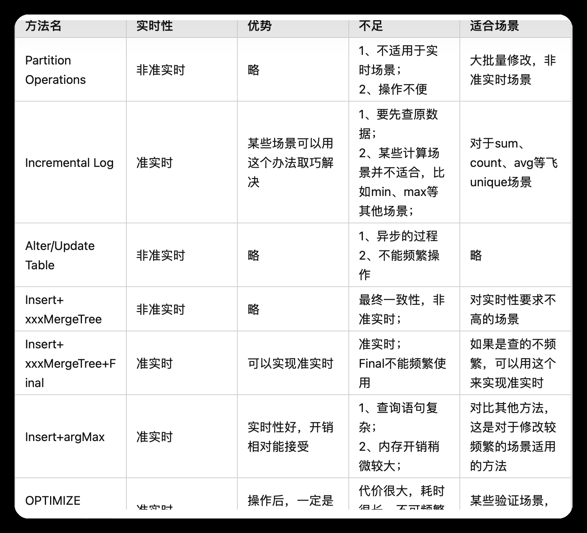

[https://clickhouse.com/docs/zh](https://clickhouse.com/docs/zh)

ClickHouse 是一个用于联机分析(OLAP)的列式数据库管理系统(DBMS)，由俄罗斯 Yandex 于 2016 年开源，具有高性能、高可靠性、高压缩率、高扩展性等特点。

由于列式存储的特性，ClickHouse 擅长聚合，适合读多更新少的场景，能在毫秒级内查询十几亿行，但是单行插入、更新和查询性能差，建议批量操作(> 1000 行)。

ClickHouse 支持一种 SQL 方言，它在许多情况下与 ANSI SQL 标准相同，具体请查看 [兼容性差异](https://clickhouse.com/docs/zh/sql-reference/ansi)。

## Docker 启动

[https://hub.docker.com/r/clickhouse/clickhouse-server](https://hub.docker.com/r/clickhouse/clickhouse-server)

```shell
# http端口8123，tcp端口9000，请注意区分客户端使用的是http还是tcp
docker run -d -p8123:8123 -p9000:9000 --name clickhouse-server --ulimit nofile=262144:262144 clickhouse/clickhouse-server
```

## 表引擎

### MergeTree 系列

1. MergeTree：基本的表引擎，不支持复制。
2. ReplicatedMergeTree：支持复制的表引擎，需要指定一个 zookeeper 集群来管理元数据和协调复制操作，支持按照主键替换已有数据。
3. SummingMergeTree：在合并数据时，可以对某些列进行求和操作，以减少存储空间和提高聚合查询效率。
4. AggregatingMergeTree：在合并数据时，可以对某些列进行聚合函数操作（如 avg、min、max 等），以实现预计算功能。
5. CollapsingMergeTree：在合并数据时，可以根据某些列的正负符号来抵消相同记录，以实现增量更新或删除功能。

### 其他系列

1. Log 系列：用于存储小规模且不需要排序或索引的数据。例如 TinyLog、StripeLog 等。
2. Memory 系列：用于存储内存中临时或易变的数据。例如 Memory、Set 等。
3. File 系列：用于从文件中读取或写入数据。例如 File、URL 等。
4. Integration 系列：用于与其他数据库或系统集成。例如 MySQL、Kafka 等。
5. Distributed：用于创建分布式表，在多个节点上执行查询，并将结果汇总返回。

## 数据类型

### 数值类型

Boolean：布尔类型  
Int8：有符号 8 位整数  
Int16：有符号 16 位整数  
Int32：有符号 32 位整数  
Int64：有符号 64 位整数  
UInt8：无符号 8 位整数  
UInt16：无符号 16 位整数  
UInt32：无符号 32 位整数  
UInt64：无符号 64 位整数  
Float32：单精度浮点数  
Float64（Double）：双精度浮点数  
Decimal：高精度十进制数

### 字符串类型

String：可变长字符串  
FixedString(N)：固定长度字符串，长度 N 可以指定

### 日期和时间类型

DateTime：日期和时间（从 1970 年 1 月 1 日开始）  
DateTime64(N)：带有自定义精度的日期和时间，DateTime64(3)表示毫秒的日期和时间（从 1970 年 1 月 1 日开始）  
Date：日期（从 1970 年 1 月 1 日开始）  
Time：时间（从 00:00:00 开始）  
Timestamp(N)：时间戳（从 1970 年 1 月 1 日开始），Timestamp(3)表示毫秒

### 其它类型

1. Enum：枚举类型
2. Array(T)：数组，其中 T 是数组元素的数据类型，例如 Array(Int32)，表示一个包含 Int32 类型元素的数组。
3. Dictionary(T)：字典，其中 T 是字典键和值的数据类型，例如 Dictionary(String, Int32)，表示一个以 String 为键，Int32 为值的字典。
4. Tuple：元组
5. IPv4：IPv4 地址
6. IPv6：IPv6 地址
7. UUID：通用唯一标识符
8. Nullable：可空类型，用于表示空值

## 索引

ClickHouse 支持以下类型的索引：

1. 主键索引（Primary Index）：在创建表时定义，用于在表中查找数据。主键索引在磁盘上的数据是有序的，这使得 ClickHouse 可以只读取满足查询条件的部分数据，而不是全表扫描。

2. 排序键索引（Sorting Key Index）：用于在表中的数据块内部查找数据。排序键可以是主键的一部分，也可以是完全不同的列。

3. 辅助索引（Secondary Index）：这是 ClickHouse 的一个新特性，可以在表的任何列上创建。辅助索引可以加速某些查询，但是创建和维护索引会有一些开销。

4. 位图索引（Bitmap Index）：这是一种特殊类型的索引，通常用于高基数列，例如 IP 地址、用户 ID 等。位图索引使用了一种特殊的数据结构，可以高效地存储和操作大量的唯一值。

5. 全文索引（Full-text Index）：用于在字符串列上执行全文搜索查询。

6. 跳表索引（Skip Index）：这是一种特殊类型的索引，用于加速某些聚合查询，例如 MIN, MAX, AVG, SUM 等。

请注意，不是所有的索引类型都适用于所有的表引擎。例如，MergeTree 系列的表引擎支持主键索引和排序键索引，而 Log 系列的表引擎则不支持任何类型的索引。

## 更新

[https://zhuanlan.zhihu.com/p/485645089](https://zhuanlan.zhihu.com/p/485645089)  
[https://clickhouse.com/blog/handling-updates-and-deletes-in-clickhouse](https://clickhouse.com/blog/handling-updates-and-deletes-in-clickhouse)

ClickHouse 对 Update 语句支持不好，但是对于 Insert 语句，尤其是批量插入支持的很好。所以更新操作用 Insert 替代会很快。

如果设置了分区，删除分区+插入数据 是比较好的选择。

```sql
ALTER TABLE table_name DROP PARTITION 2023-10-18
```

### MergeTree 更新机制

1. 在 MergeTree 存储引擎执行 UPDATE 操作时，会创建一个新的数据块，将更新后的数据写入其中。旧的数据块仍然存在，但标记为过时，不再参与查询。
2. 对于未更新的字段，ClickHouse 会从旧的数据块中读取相应的值，并将其与更新后的字段值一起写入新的数据块中。
3. ClickHouse 使用后台进程来定期合并数据块，根据数据的时间戳或者主键等规则将过时的数据块与新的数据块合并，以释放空间并提高查询性能。

ClickHouse 在合并数据块的过程中，需要对数据进行聚合操作，以便计算新的数据块中的统计信息，比如行数、最大值、最小值等，会执行类似 SELECT count() WHERE 的语句。这些统计信息对于查询优化和性能提升非常重要。

### 更新方法大全



## 内存

内存使用量会随着更多的 GROUP BY 键而爆炸式增长。

## 问题列表

问题一：clickhouse: dateTime overflow. uninstall_time must be between 1970-01-01 00:00:00 and 2105-12-31 23:59:59

uninstall_time 在 ClickHouse 预期之外的其他时区，被解释为超出了有效范围。ClickHouse 的 DateTime 类型在底层是以 Unix 时间戳（从 1970 年 1 月 1 日开始的秒数）存储的。这种存储方式使得日期和时间的比较和计算变得非常高效。ClickHouse 的 DateTime 类型不包含时区信息。如果需要处理时区，可以使用 DateTime64 类型，它可以存储具有时区的日期和时间。

问题二：code: 252, message: Too many partitions for single INSERT block (more than 100).

错误是由于在单个 INSERT 块中有太多的分区（超过 100 个）。这个限制由 'max_partitions_per_insert_block' 设置控制。大量的分区是一个常见的误解。它会导致严重的性能影响，包括服务器启动慢，INSERT 查询慢，以及 SELECT 查询慢。对于一个表，推荐的总分区数在 1000 到 10000 之间。请注意，在 ClickHouse 中分区并不是为了加速 SELECT 查询（ORDER BY key 足以使范围查询快速）。分区是为了数据操作（如 DROP PARTITION 等）。

问题三：<Error> MutatePlainMergeTreeTask: Code: 241. DB::Exception: Memory limit (total) exceeded: would use 20.61 GiB (attempt to allocate chunk of 4194960 bytes), maximum: 20.49 GiB. OvercommitTracker decision: Memory overcommit isn't used. Waiting time or overcommit denominator are set to zero.: While processing SELECT count() WHERE

MergeTree 引擎执行大量 update、delete 操作后，内部操作（即[mutations](https://clickhouse.com/docs/zh/sql-reference/statements/alter#alter-mutations)）在统计分析时可能会自动生成超长 SQL，导致内存溢出后崩溃，重启后无外部连接时也会继续执行继续崩溃。可在 system.mutations 中找到对应的命令，kill 掉或删除（表会产生异常数据，但服务可恢复）。原则上还是要禁用 update、delete 操作，使用 ttl 代替 delete，比如使用 ReplacingMergeTree 引擎实现 update。
