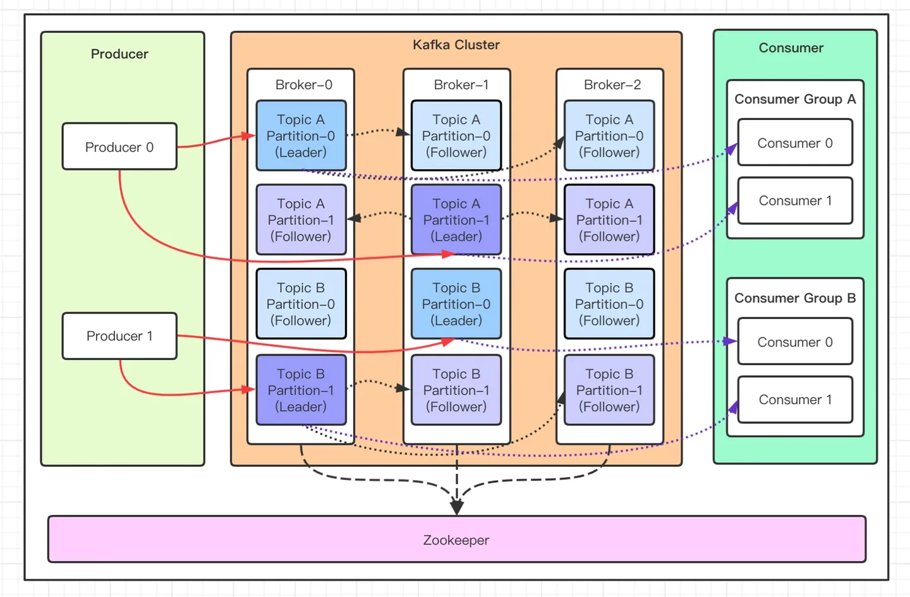

## 架构

1. 生产者（Producer）：负责将消息发布到 Kafka 集群。
2. 消费者（Consumer）：从 Kafka 集群订阅并处理消息。
3. 主题（Topic）：消息的类别，Kafka 消息被发布到主题。
4. 分区（Partition）：每个主题可以分为多个分区，以提高并行处理能力。
5. 副本（Replica）：分区的备份，用于提供容错和高可用性，当主分区（Leader）故障时会选择一个从分区（Follower）上位。
6. ZooKeeper：用于协调和管理 Kafka 集群的分布式系统。
7. Broker：Kafka 集群中的每个服务器节点称为 Broker，负责存储和处理消息。

## 性能优势

Kafka 之所以具有良好的性能，有以下几个原因：

1. 分布式架构：Kafka 采用分布式架构，可以将数据分散存储在多个节点上，实现数据的并行处理和高吞吐量。

2. 高效的存储机制：Kafka 使用磁盘存储消息，而不是内存，这使得它可以处理大量的消息并保持持久性。此外，Kafka 使用了批量写入和顺序写入的方式，提高了磁盘写入的效率。

3. 零拷贝技术：Kafka 使用零拷贝技术来避免数据在内存和磁盘之间的多次拷贝，减少了数据传输的开销，提高了性能。

4. 分区和并行处理：Kafka 将数据分为多个分区，并允许多个消费者并行地读取和处理这些分区，从而实现了高并发和高吞吐量。

5. 可伸缩性：Kafka 的分布式架构和分区机制使得它可以轻松地扩展到大规模的集群，以满足不断增长的数据处理需求。

总的来说，Kafka 通过分布式架构、高效的存储机制、零拷贝技术、分区和并行处理以及可伸缩性等特性，实现了高性能的消息传输和处理能力。

### 零拷贝

零拷贝（Zero-copy）是一种优化技术，旨在减少数据在内存和磁盘之间的多次拷贝。传统的数据传输方式涉及多次拷贝，例如从磁盘读取数据到内核缓冲区，然后再从内核缓冲区拷贝到用户空间缓冲区。这些拷贝操作会增加 CPU 和内存的开销。

零拷贝技术通过避免这些额外的拷贝操作来提高性能。它的核心思想是将数据直接从源位置传输到目标位置，而不需要在中间进行多次拷贝。这可以通过使用内存映射（mmap）或直接 I/O（Direct I/O）等技术来实现。

### 二进制存储

Kafka 在磁盘上存储的消息是以二进制格式进行存储的，而不是明文。Kafka 使用了自定义的二进制格式来表示消息，这样可以有效地压缩和序列化消息，以减少存储空间和网络传输的开销。这种二进制格式包含了消息的元数据（如主题、分区、偏移量等）以及消息的实际内容。这种结构化的二进制格式使得 Kafka 能够高效地读写和处理消息，并支持各种数据类型的消息。

批量写入+顺序读写+零拷贝+二进制存储=最佳读写性能

## 生产数据

kafka 每次都是向 Leader 分区发送数据，并顺序写入到磁盘，然后 Leader 分区会将数据同步到各个从分区 Follower，即使主分区挂了，也不会影响服务的正常运行。

写入原则：

1. 数据写入时可以指定分区；
2. 如果没有指定分区，但是设置了数据的 key，则会根据 key 的值 hash 出一个分区；
3. 如果既没指定分区，又没有设置 key，则会轮询选出一个分区；

## 消费数据

消费者主动去 kafka 集群拉取消息时，也是从 Leader 分区拉取。

多个消费者可以组成一个消费组，以提升并行消息能力。同一消费组内的消费者可以消费同一 topic 下不同分区的数据，同一个分区只会被一个消费组内的某一个消费者所消费，防止出现重复消费的问题。不同的组，可以消费同一个分区的数据。

如果组内消费者数量大于分区数量，就会出现消费者闲置，如果分区数量大于组内消费者数量，就会出现一个消费者负责多个分区的情况、性能不均衡，建议消费者组 consumer 数量与 partition 数量保持一致！
