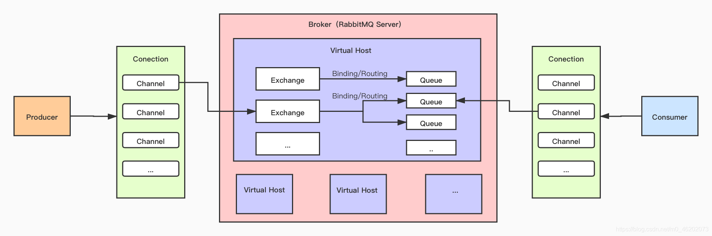

[RabbitMQ Tutorials](https://www.rabbitmq.com/getstarted.html)
[Clients Libraries and Developer Tools](https://www.rabbitmq.com/devtools.html)

## Architecture



Broker: Server that receives and distributes messages.
Virtual Host: Designed for multi-user and security factors, introduces Virtual Host concept - essentially virtual grouping (similar to namespace). When multiple users use same Broker, they create their own Exchange/Queue in respective Virtual Hosts.
Connection: TCP connection between Producer and Broker, Consumer and Broker.
Channel: If establishing Connection for each Broker access, overhead would be huge. Channel is logical connection established inside Connection, mutually independent, one per thread.
Exchange: Exchange is first stop for messages reaching Broker. One Exchange can bind to multiple Queues, and Exchange can route messages to different Queues based on message differences.
Queue: Exchange lacks storage capability, only forwards. Messages are placed in Queue for temporary storage, waiting to be taken.

## Working Modes

## Exchange Types

direct (direct mode): In this mode, when sending messages, need to explicitly specify queue name. When receiving messages, need to set queue name same as when sending. In this mode, one message only sent to one specific queue.
fanout (broadcast mode): In this mode, when sending messages, no need to specify queue name. Messages sent to all bound queues. That is, if you have 10 queues bound to same exchange, when you send message to this exchange, all 10 queues will receive this message.
headers (header information mode): In this mode, messages sent to queues with specific header information. This is more flexible message distribution method, can route based on message header information. For example, can route messages to corresponding queues based on message "type" header information.
topic (topic mode): Can decide which queue messages should be routed to based on message topic.

## Queues

Classic
Quorum
Stream

durable: Persistence
exclusive: Exclusive
Mandatory: If message attempts to publish to unbound queue, message won't be dropped but returned to you so you can decide how to handle this unsuccessful publish.
Immediate: Don't put messages in memory buffer but send to consumer immediately. Helps reduce message latency but may increase network overhead. If queue has no consumers or message cannot be routed to any queue, returns error that can be handled through callback functions or other mechanisms.

## Commands

```shell
rabbitmqctl list_users
```

## Persistence

Exchange persistence
Queue persistence
Message persistence

## Retry

RabbitMQ's retry time interval is not controlled by RabbitMQ itself but by consumer applications. When messages are rejected, consumers can choose when to retry.

Additionally, if using RabbitMQ's dead-lettering and dead-lettering exchange, can indirectly control retry time intervals. By setting message TTL (Time To Live) for dead letter queue, can control time messages stay in queue. If messages stay in queue longer than set TTL, they will be sent to another exchange, thus achieving indirect retry.

In summary, RabbitMQ itself doesn't control retry time intervals but is decided by consumer applications based on specific situations.

Observed RabbitMQ retrying every second, while RocketMQ's retry intervals gradually increase, like 1 second, 3 seconds, 30 seconds... several hours. Gradually increasing retry intervals may sacrifice recovery speed but leave time for manual intervention to solve problems, also extend feasible time for automatic recovery. Also greatly reduces system pressure - handling large amounts of retries squeezes resources from first-time messages.
