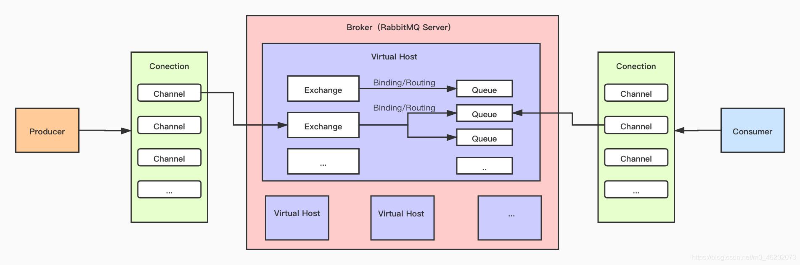

[RabbitMQ Tutorials](https://www.rabbitmq.com/getstarted.html)  
[Clients Libraries and Developer Tools](https://www.rabbitmq.com/devtools.html)

## 架构



Broker：接收和分发消息的服务器。  
Virtual Host：出于多用户和安全因素的设计，引入了 Virtual Host 的概念，其实是一个虚拟分组（类似 namespace），多个用户使用同一个 Broker 的时候，会在各自的 Virtual Host 中创建自己的 Exchange/Queue。  
Connection：Producer 与 Broker，Consumer 与 Broker 之间的 TCP 连接。  
Channel：如果每访问一次 Broker 就建立一个 Connection，那么开销将是巨大的。Channel 是在 Connection 内部建立的、相互独立的、一个线程一个的逻辑连接。  
Exchange：交换机是消息到到达 Broker 的第一站。一个 Exchange 可以绑定（Blinding）若干个 Queue，并且 Exchange 可以根据消息的不同将其路由（Routing）到不同的 Queue 中。  
Queue：Exchange 不具备存储能力，只进行转发，消息被放到 Queue 中被暂存，并等待被取走。

## 工作模式

## 交换机类型

direct（直接模式）：这种模式下，发送消息时，需要将消息的队列名称明确指定。接收消息时，需要将队列名称设置成与发送时一样的名称。这种模式下，一条消息只会发送到一个特定的队列。  
fanout（广播模式）：这种模式下，发送消息时，不需要指定队列名称，消息会被发送到所有绑定的队列。也就是说，如果你有 10 个队列，绑定到了同一个交换机，那么当你向这个交换机发送消息时，这 10 个队列都会收到这条消息。  
headers（头信息模式）：这种模式下，消息会被发送到具有特定头信息的队列。这是一种更为灵活的消息分发方式，可以基于消息头信息进行路由。例如，你可以基于消息的 "type" 头信息将消息路由到对应的队列。  
topic（主题模式）：可以根据消息的主题来决定消息应该被路由到哪个队列。

## 队列类型

Classic
Quorum
Stream

durable 持久化
exclusive 排他

## 命令

```shell
rabbitmqctl list_users
```

## 持久化
