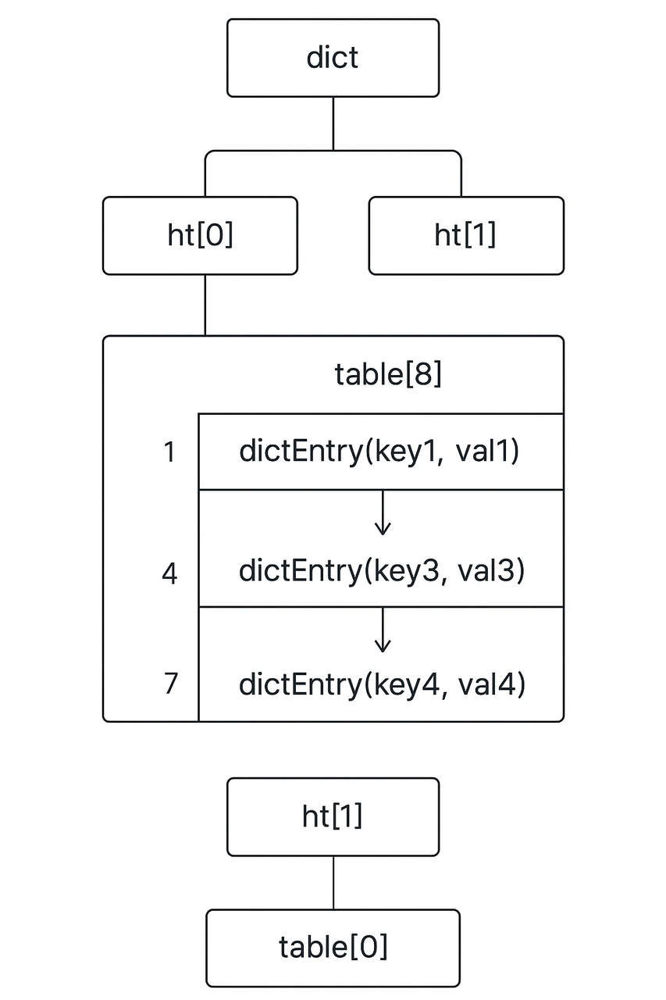
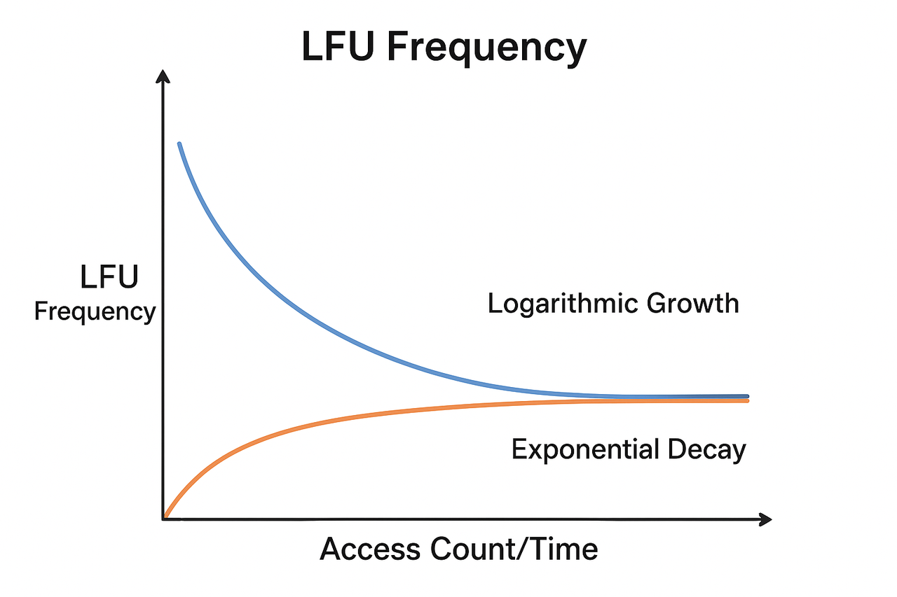

## Background

In pursuit of extreme performance, Redis simplifies or even abandons many advanced features, especially in monitoring, which is relatively weak, lacking session management, single query management, frequency statistics, etc. From the implementation of the official Redis CLI and Redis Insight clients, it can be seen that the design philosophy is: the server side should be as simple as possible to pursue extreme performance, while monitoring and analysis functions are moved to the client side.

For example:
1. Redis transactions are not the common MVCC (Multi-Version Concurrency Control) and do not have strict atomicity. Developers need to ensure data consistency themselves in error situations.
2. Redis Pipeline is not a server-side technology, but an asynchronous network I/O feature provided by the client, which saves I/O waiting time. The more commands in the pipeline, the better the effect.

## Architecture

Redis architecture mainly includes Standalone, Master-Slave Replication, Sentinel, and Cluster. Regardless of which architecture, they all run the same Redis engine, and the differences between them often come from the architecture itself.

### Standalone

- The most basic deployment method.
- All data and requests are processed on one Redis server.
- Advantages: Simple, low latency.
- Disadvantages: Single point of failure, limited capacity.

### Master-Slave Replication

One Redis node acts as the master node (Master), responsible for write operations.  
One or more slave nodes (Slave) replicate master node data, mainly used for read request distribution and backup.

Features:
- Write operations can only be performed on Master.
- Slaves maintain data consistency through replication.
- Solves read scaling and disaster recovery, but requires manual switching when master fails.

### Sentinel

Introduces Sentinel processes on top of the master-slave architecture.

Sentinel functions:
- Monitor health status of master and slave nodes.
- Automatic failover: When Master goes down, automatically elect a Slave to be promoted to Master.
- Provide service discovery: Clients can obtain the current Master address through Sentinel.

Typical architecture: One Master, multiple Slaves, multiple Sentinels.  
Advantages: High availability, automation.  
Disadvantages: Still a single-master architecture with limited storage capacity.

### Cluster

Redis Cluster is a distributed architecture that solves the single-machine capacity bottleneck, using the crc16 algorithm to calculate the slot position of keys.

Features:
- Horizontal scaling: Data is distributed to multiple nodes through hash slots (Hash Slot, 0-16383).
- Multiple masters and slaves: Each master node is responsible for part of the slots, and slave nodes serve as backups.
- Automatic failover: When a master node goes down, a slave node can automatically take over.
- Clients directly connect to each node, with decentralization characteristics.
Advantages: High availability, scalable, distributed storage.
Disadvantages:
- Relatively complex deployment and operation.
- Does not support multi-key cross-slot transactions (unless in the same slot).

Slot algorithm: `slot = CRC16(key) % 16384`  
Slot migration: Adding or removing nodes will evenly distribute slots.

In pursuit of extreme performance, the Redis cluster internally has no load balancing, no task splitting and scheduling, no distributed transactions, and other advanced features. Commands that cross shards or slots are restricted by this architectural design and cannot be executed, such as MGET, MSET, HMGET, MULTI/EXEC, etc. Moreover, commands like SCAN, FLUSHDB, FLUSHALL must be executed on each master node.

#### PhpRedis Workflow in Cluster

Initialization Phase

1. Preprocessing: Validate seed format, deduplicate, randomize
2. Connection attempts: Try to connect to seed nodes one by one
3. Cluster discovery: Send CLUSTER SLOTS command to available seeds
4. Topology construction: Parse returned slot information, build complete cluster mapping
5. Cache storage: Optionally cache topology information locally

Usage Phase

1. Command routing: Calculate slot based on key, locate corresponding shard node
2. Connection reuse: Maintain node connection pool to avoid repeated connection creation
3. Request sending: Send command to target node
4. Error handling: Handle MOVED (permanent redirect)/ASK (temporary redirect), connection failure, timeout, etc.
5. Topology refresh: When receiving redirection, re-obtain CLUSTER SLOTS to update mapping, no scheduled refresh mechanism
6. Result return: Return node response to caller

FAILOVER Strategy

1. FAILOVER_NONE (0): Default, if master node is unavailable, command directly reports error
2. FAILOVER_ERROR (1): Only when master node fails, temporarily try slave nodes
3. FAILOVER_DISTRIBUTE (2): Read operations can be distributed to slave nodes, sharing master node pressure
4. FAILOVER_DISTRIBUTE_SLAVES (3): More aggressive strategy, all read operations go to slave nodes

In pursuit of extreme performance, the Redis cluster server side does not support distributing read operations to slave nodes, but is completely implemented by the client. That is, whether to use master or slave for master-slave sharding? Whether to use all shards or part of them? The server side doesn't care at all.

In the php-fpm process, phpredis can allocate independent memory to maintain persistent connections, but predis's persistent connections are pseudo-persistent connections. Its memory is destroyed along with the request, only the connection is not actively closed to keep it at the fpm process level, then re-instantiated and reconnected. Combined with pure PHP parsing of Redis protocol, this leads to relatively poor performance.

Tip: Among PHP built-in functions, only pfsockopen can reuse connections across request lifecycles (recorded in persistent table, a C language structure that cannot be directly accessed by PHP user state), but predis uses stream_socket_client. Other functions with cross-request lifecycle are implemented by extensions, such as mysqli_connect('p:localhost'), Redis->pconnect().

#### AWS ElasticCache Cluster

1. Only provides one entry domain name, which is essentially a DNS server that randomly returns the IP of a certain shard as the cluster seed.
2. Under high concurrency, the IP returned by the entry domain name may be fixed. Once that shard has problems, a large number of errors will be reported. Need to add several more shards as seeds.
3. Supports automatic scaling based on CPU or memory usage rate, and the shard list will be automatically updated to the IP pool of the entry domain name.
4. When setting a password, the TLS protocol is forcibly enabled, bringing considerable encryption/decryption overhead.

### Split-Brain

In Redis cluster or sentinel mode, due to network partition (network communication is partially or completely interrupted) or node failure, some nodes in the cluster each think they are the master node, resulting in data inconsistency. This problem is typical in distributed systems, also called the dual-master phenomenon caused by network partition.

Methods to reduce split-brain:
1. Ensure sufficient number of nodes and sentinels
  1.1. Sentinel mode recommends at least 3 sentinels.
  1.2. Cluster mode recommends master count ≥3.
2. Network stability: Avoid frequent partitions.
3. Configure reasonable timeout: down-after-milliseconds, failover-timeout should be adjusted according to actual latency and network stability.
4. Monitoring and alerting:
  4.1. Regularly monitor INFO replication / CLUSTER INFO.
  4.2. Investigate promptly when encountering failover or master changes.

## Underlying Mechanisms

### Data Structure - Hash Table

Redis uses a hash table (an implementation of the dictionary concept) at the bottom to store key-value pair mappings, and uses buckets to improve search efficiency; uses SipHash to calculate the hash bucket where the key is located; uses chained hashing to resolve hash collisions. When the linked list becomes too long and causes slow queries, it will rehash to increase the number of hash buckets, making the linked list in each bucket shorter and restoring efficient operations.

- SipHash: A cryptographically strong pseudo-random hash function. When the Redis server starts, it randomly generates a key to ensure that the output cannot be reproduced. CRC16, MD5, SHA and other algorithms do not have keys, and anyone can calculate consistent results. Attackers can carefully construct a large number of keys that produce the same hash value, causing all data to flow into the same bucket, making the linked list very long (i.e., degenerate into a linked list), thus causing performance to drop sharply from O(1) to O(n). This is a denial of service (DoS) attack. SipHash maintains very fast computation speed while providing sufficient security, and is a choice that achieves an excellent balance between security and performance.
- Chained Hashing: When two different keys are calculated to have the same hash value (hash collision), Redis will attach a linked list to the existing key-value pair and store the conflicting multiple key-value pairs in this linked list in order. Starting from Redis 6, when the linked list length exceeds 8 (HT_BUCKET_MAX_LEN), it will consider using skip lists, red-black trees, or rehashing for optimization.
- rehash: If the load factor is greater than the threshold (default 1), it expands; if the load factor is less than 0.1, it may consider shrinking. To avoid performance fluctuations caused by frequent expansion and shrinking, shrinking is relatively conservative; if the hash table is very sparse (used / size is very small), but the single-bucket linked list is too long, forced expansion.

Load factor: `factor = used (current number of elements) / size (number of hash table buckets)`  
Forced expansion: `size < used * dict_force_resize_ratio (default 5)`



dict (dictionary/hash table) -> table (hash bucket) -> dictEntry (key-value pair)

Hash bucket mapping algorithm: `index = siphash(key, secret_key) % ht[x].size`  
Get hash bucket operation: `bucket = ht[x].table[index]`

ht[x]: Redis implements two hash tables, so x represents these two tables. ht[0] is the main hash table currently in use, and ht[1] is the temporary target hash table during rehash expansion/shrinking, which will eventually replace ht[0].

### Data Structure - SDS

All Redis string type data are stored using the self-created SDS data structure, such as the key and value of String type (numbers are also stored in SDS form), the name and value of the field field of Hash type, each element in List type, each member in Set type, etc.

SDS (Simple Dynamic String): Supports dynamic extension, compared to C language strings, it adds length and remaining length records to accelerate statistics and prevent overflow, with time complexity O(1), while C language needs to traverse the entire string O(n).
```c
struct sdshdr {
    int len;      // Current string length
    int free;     // Remaining available space length
    char buf[];   // Character array, stores actual string (ends with '\0')
};
```

### Data Structure - Ziplist

Ziplist is a compact data structure for storing small amounts of elements. It is very compact in memory layout, reducing pointer overhead.

Used in:
- Small lists
- Small hashes
- Small sorted sets (zset)
Advantages
- Small memory footprint
- Good traversal performance (continuous memory block)
Disadvantages
- Poor performance for insertion and deletion in the middle (need to move memory)
- Not suitable for large numbers of elements

### Data Structure - Skip List

Skip list is a linked list structure that can support O(log n) search, insertion, and deletion. It is essentially a multi-level linked list, with each layer having a small number of pointers that skip some nodes, thus speeding up search.

Redis uses skip lists in sorted sets (zset), combined with hash tables (dict) to store score → member mappings
- Hash table: Fast lookup by member
- Skip list: Fast sorted lookup by score range

Advantages
- Supports sorted queries by score
- Higher insertion/deletion efficiency than arrays or linked lists
- Simpler memory and implementation than balanced trees
Disadvantages
- Higher memory overhead than ziplist (each node has multiple pointers)
- Higher complexity than simple linked lists

### Rehash

Redis rehash is not asynchronous, but adopts a "progressive rehash" mechanism to optimize performance.

Working principle:
1. Synchronous but distributed execution: When the hash table needs to expand or shrink, Redis creates a new hash table, but does not migrate all data at once.
2. Batch migration: In each subsequent operation (add, delete, lookup, update), Redis will migrate one or more key-value pairs from the old hash table to the new hash table.
3. Scheduled task assistance: Even if there are no new requests, Redis will periodically perform rehash through scheduled tasks, but the execution time each time will not exceed 1 millisecond.

### Key Expiration

Redis key expiration deletion uses both lazy deletion + periodic deletion.

Lazy Expiration
  - Only when a key is accessed, Redis checks if it has expired, and deletes it if it has.
  - Advantage: No CPU wasted scanning all keys.
  - Disadvantage: Expired keys may occupy memory until accessed.

Periodic / Scheduled Expiration
  - Redis randomly takes a batch of keys every once in a while (default 100 ms) to check if they have expired and deletes them.
  - Advantage: Timely release of expired keys.
  - Disadvantage: Some pressure on CPU, but Redis has set limits (only processes a limited number of keys at a time).

### Memory Eviction Strategy

Used to delete keys when memory reaches the maxmemory limit.

1. noeviction: When memory reaches the limit, write operations will report errors and no data will be deleted.
2. allkeys-lru: Delete the least recently used key from all keys.
3. volatile-lru: Only among keys with TTL (expiration time) set, delete the least recently used key.
4. allkeys-lfu: Delete the key with the lowest access frequency (LFU counter) from all keys.
5. volatile-lfu: Only among keys with expiration time, delete the key with the lowest access frequency.
6. allkeys-random: Randomly delete one from all keys.
7. volatile-random: Randomly delete one from keys with expiration time.
8. volatile-ttl: Prioritize deleting keys with the shortest TTL.

### LFU Access Frequency

LFU access frequency is an 8-bit value (range 0-255). It is not a simple cumulative count, but a random probability count with a decay mechanism.

Growth formula: `freq = min(freq + rand_prob, 255)`  
Growth probability formula: `rand_prob = 1 / (2^(freq - 1))`  
Decay formula: `freq_new = freq_old * (1 - 2^(-(current_time - last_decay_time) / decay_time))`

last_decay_time: The last time frequency decay was performed on this key  
decay_time: Decay period, default is about 60 seconds

It can be simply understood as: approximate logarithmic growth + approximate exponential decay, that is, the higher the frequency, the slower the growth, and the higher the frequency, the faster the decay.

Growth and decay curve:


### Persistence

RDB Snapshot:
- Fork child process to generate data snapshot.
- Copy-on-write increases instantaneous memory usage.

AOF (Append Only File):
- Record write command logs, can choose synchronization strategy.
- AOF rewrite (BGREWRITEAOF) generates new files, executed in the background.

Redis full + incremental migration solutions are based on RDB+AOF implementation, and there are also solutions to disguise as slave nodes for replication.

## Cache Problems

### Cache Avalanche

A large amount of cached data expires at the same time, causing a large number of requests to directly hit the database.

Response:
- Set random TTL to avoid expiring at the same time
- Use mutex locks to rebuild cache
- Implement two-level cache strategy

### Cache Breakdown

When a HotKey expires, a large number of concurrent requests access the key at the same time, directly querying the database.

Response:
- Use mutex locks (distributed locks)
- Set hot data that never expires
- Asynchronously refresh cache in advance

### Cache Penetration

Querying data that does not exist, neither in cache nor in database, and each request hits the database.

Response:
- Cache null values (set shorter TTL)
- Use Bloom filter for pre-judgment
- Interface parameter validation

### Data Consistency

There is no perfect solution for cache data consistency problems. More rigorous queue synchronization and binlog synchronization increase architectural complexity. It is recommended to use Cache-Aside + delayed double delete first.

#### Cache-Aside

Process:
- Read: Check cache first, if miss then query database, then update cache
- Write: Update database first, then delete cache

Advantages: Clear logic, widely applicable  
Disadvantages: May have brief inconsistency

#### Delayed Double Delete

Process: Delete cache → Update database → Delay N seconds → Delete cache again  
Advantages: Solves inconsistency caused by concurrent read-write  
Disadvantages: Delay time is difficult to determine

## Server Monitoring

### Engine CPU

The Redis engine is single-threaded and executes serially. Once blocked, it affects all subsequent operations, so the concept of engine CPU is crucial. However, self-built Redis is difficult to monitor, while cloud Redis has independent monitoring indicators.

Redis uses a single-threaded + I/O multiplexing model (epoll/kqueue/select/poll) to handle a large number of client connections. However, during the execution of a single command, it will not switch to other clients. Big key operations/CPU-intensive operations (such as SORT, ZUNIONSTORE) will block other requests, but I/O blocking commands (such as BLPOP/BRPOP) will only block the client, not the server.

A single Redis instance can only fully utilize one CPU core. Upgrading and adding CPU cores does not help much to alleviate Redis CPU pressure.

As of now (2025.09), the official still does not consider changing to multi-threaded collaborative execution. The Redis author (Salvatore Sanfilippo/antirez, has retired) has clearly stated: will not make a fully multi-threaded Redis, because that would destroy Redis's simplicity and predictable performance.

Starting from Redis 6.x, the official introduced multi-threaded I/O, mainly reflected in network I/O and client request processing. The command processing of the Redis engine is still single-threaded.

### Memory

Memory usage: When usage reaches the set limit, the eviction strategy will be triggered. If the host memory is exhausted, it will directly crash.  
Memory fragmentation ratio: 1.0 is normal, exceeding 1.5 indicates possible fragmentation, that is, the RSS (Resident Set Size, actual occupied physical memory) memory occupied by Redis is much larger than the actual data size.

### Bandwidth

Network I/O: When bandwidth reaches the limit, it will cause increased request latency or TCP retransmission, affecting overall performance.

Possible reasons:
- BigKey causes increased data transmission traffic;
- Instantaneous traffic peaks caused by batch operations;
- Large concurrent requests lead to a lot of data transmission.

Connections: High connection count means many concurrent requests, which will increase network I/O pressure. Short connections (frequent creation/destruction) also increase additional TCP handshake overhead.

## BigKey Analysis

BigKey read and write will cause a lot of network I/O pressure, blocking single-threaded execution. If BigKey has low-frequency access, the impact is temporary, but if it is also a HotKey, it will have a great impact.

### Slowlog

BigKey or dangerous commands like DEL, KEYS, etc., are usually recorded in slowlog due to long execution time.

```shell
SLOWLOG LEN
SLOWLOG GET
SLOWLOG GET 2 # Return the most recent n slow queries
SLOWLOG RESET
```

## HotKey Analysis

HotKey is the top priority of Redis performance analysis. Once a problem occurs, it is a major accident. Even if no problem occurs, it affects performance. Uneven cluster shard pressure often appears on HotKey.

### Based on monitor Command Implementation

The official client supports the monitor command, which can save the results for analysis. Monitor will output Redis operations being executed in real time, which consumes a lot of performance and cannot be executed for a long time, generally executed for 30s.

```shell
redis-cli \
    -h clusters-Redis-0004-001.clusters-Redis.19ewug.usw2.cache.amazonaws.com \
    -p 6379 \
    -a xxx \
    --tls monitor > monitor.txt
```

It is more convenient to write code to execute the monitor command, and implement analysis logic along the way, such as counting the number of times a key appears, GET/SET/HGET times, etc. This is counting the actual number of times, not the same concept as LFU access frequency.

Monitor is suitable for viewing real-time details, but consumes a lot of performance and is generally not recommended for counting HotKey.

### Official Client

The official client provides a HotKey statistics method, which requires that the memory eviction strategy must use LFU (Least Frequently Used). This command is based on LFU's existing access frequency implementation and has lower performance consumption.

```shell
redis-cli --HotKeys \
    -h clusters-Redis-0004-001.clusters-Redis.19ewug.usw2.cache.amazonaws.com \
    -p 6379 \
    -a xxx \
    -i 1 \
    --tls
# -a  password
# -i  Interval time between each batch scan is 1s, recommended to set to reduce performance pressure.
```

After scanning is completed, it will list dozens of keys with the highest access frequency. For clusters, each master shard needs to be scanned.

### Imitate Official Implementation

Although the official client HotKeys command produces a report, it needs to be executed in the AWS internal network environment and cannot be customized to write to Feishu documents. Writing code yourself is the only way to connect the process.

HotKey analysis implementation principle: SCAN * + OBJECT FREQ key. Threshold 100.  
BigKey analysis implementation principle: SCAN * + MEMORY USAGE key. Threshold 1MB.

It is recommended to analyze BigKey, HotKey, and patterns in one scan.

### Hit Rate Analysis

Hit rate mainly reflects the value of using Redis. Large fluctuations in hit rate may be caused by traffic attacks, accidental deletion of important keys, incorrect key names in code, etc.
