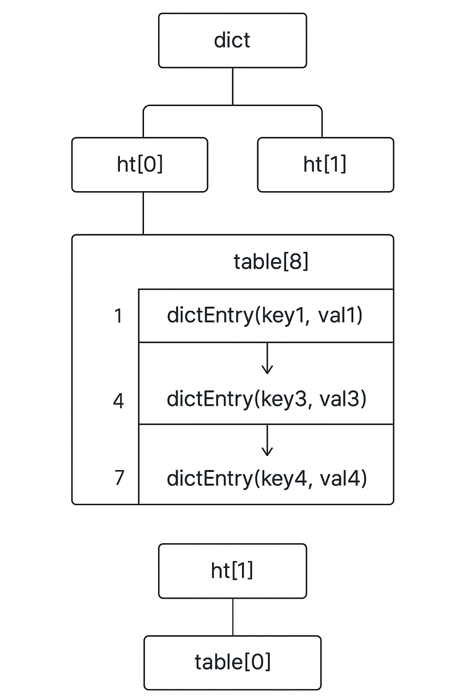
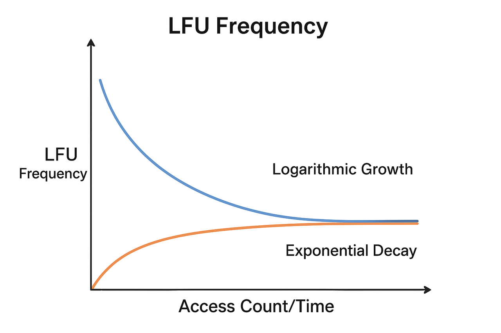

## 背景

Redis为了追求极致性能，简化、甚至舍弃了很多高级功能，尤其是监控方面相对薄弱，缺失会话管理、单次查询管理、频次统计等等。从官方Redis cli和Redis insight客户端的实现可以发现，其设计思想是：服务器端尽量简洁追求极致性能，监控分析等功能挪到客户端。

比如：
1. Redis事务不是常见的MVCC（多版本并发控制），不具备严格的原子性，出错情况下需要开发者自行保证数据一致性。
2. Redis管道（Pipeline）不是服务器端提供的技术，而是客户端提供的异步网络IO功能，节省IO等待时间，管道中指令越多，效果越好。

## 架构

Redis 架构主要有 单机、主从复制、哨兵和集群，不论哪种架构都运行同一套 Redis 引擎，它们之间存在的差异往往来自于架构。

### 单机（Standalone）

- 最基础的部署方式。
- 所有数据和请求都在一台 Redis 服务器上处理。
- 优点：简单，延迟低。
- 缺点：单点故障，容量受限。

### 主从复制（Master-Slave）

一个 Redis 节点作为主节点（Master），负责写入操作。  
一个或多个从节点（Slave）复制主节点数据，主要用于读请求分流和备份。

特点：
- 写入只能在 Master 进行。
- Slave 通过复制保持数据一致。
- 解决了读扩展和容灾，但主挂了需要人工切换。

### 哨兵（Sentinel）

在主从架构上引入 Sentinel 进程。

Sentinel 的功能：
- 监控主从节点健康状态。
- 自动故障转移：Master 宕机后，自动选举一个 Slave 升级为 Master。
- 提供服务发现：客户端可通过 Sentinel 获取当前的 Master 地址。

典型架构：一个 Master，多个 Slave，多个 Sentinel。  
优点：高可用，自动化。  
缺点：仍是单主架构，存储容量有限。

### 集群（Cluster）

Redis Cluster 是分布式架构，解决了单机容量瓶颈，使用crc16算法计算key的槽位。

特点：
- 水平扩展：数据通过 哈希槽（Hash Slot, 0-16383） 分布到多个节点。
- 多主多从：每个主节点负责一部分槽位，从节点作为备份。
- 自动故障转移：主节点挂了，从节点可自动顶上。
- 客户端直连各个节点，具备去中心化特征。
优点：高可用、可扩展、分布式存储。
缺点：
- 部署和运维相对复杂。
- 不支持多键跨槽事务（除非在同一槽位）。

槽位算法：`slot = CRC16(key) % 16384`  
槽位迁移：添加、移除节点会平均分配槽位。

为了追求极致性能，Redis集群内部没有均衡负载、没有任务拆分调度、没有分布式事务等高级功能，跨分片或者槽位的命令会受到此架构设计限制无法执行，比如MGET、MSET、HMGET、MULTI/EXEC等，而且 SCAN、FLUSHDB、FLUSHALL等命令必须在每个主节点执行。

#### PhpRedis在集群下的工作流程

初始化阶段

1. 预处理：验证seed格式，去重，随机化
2. 连接尝试：逐个尝试连接seed节点
3. 集群发现：向可用seed发送CLUSTER SLOTS命令
4. 拓扑构建：解析返回的槽位信息，构建完整的集群映射
5. 缓存存储：可选，将拓扑信息缓存到本地

使用阶段

1. 命令路由：根据key计算slot，定位对应分片节点
2. 连接复用：维护节点连接池，避免重复创建连接
3. 请求发送：向目标节点发送命令
4. 错误处理：处理MOVED（永久性重定向）/ASK（临时性重定向）、连接失败、超时等
5. 拓扑刷新：在接到重定向时，重新获取CLUSTER SLOTS更新映射，没有定时刷新机制
6. 结果返回：将节点响应返回给调用方

FAILOVER 策略

1. FAILOVER_NONE（0）：默认，如果主节点不可用，命令直接报错
2. FAILOVER_ERROR（1）：只在主节点失败时，临时尝试从节点
3. FAILOVER_DISTRIBUTE（2）：读操作可以分布到从节点，分担主节点压力
4. FAILOVER_DISTRIBUTE_SLAVES（3）：更激进的策略，读操作全部走从节点

为了追求极致性能，Redis cluster服务器端不支持分发读操作给从节点，而是完全由客户端实现。即主从分片用主还是用从？分片全部使用还是部分使用？服务器端完全不关心。

在php-fpm进程内，phpredis可以开辟独立内存维护长连接，但是predis的长连接是伪长连接，其内存跟随请求一起销毁，只是不主动关闭连接使其保持在fpm进程层面，然后重新实例化、再次建立连接，叠加上纯PHP解析Redis协议，导致性能相对较差。

提示：php内置函数只有pfsockopen能跨请求生命周期复用连接（记录到persistent table，C语言结构，PHP用户态无法直接访问），但是predis使用的是stream_socket_client。其它跨请求生命周期的函数都是扩展实现的，比如mysqli_connect('p:localhost')、Redis->pconnect()。

#### AWS ElasticCache集群

1. 只提供一个入口域名，其本质是DNS服务器，随机返回某个分片的IP，作为cluster seed。
2. 高并发下入口域名返回的IP可能会固定，一旦该分片出问题就会大量报错，需要多加几个分片当seed。
3. 支持按CPU或内存使用率自动扩缩，分片列表会自动更新到入口域名的IP池。
4. 设置密码时强制开启tls协议，带来不少加解密开销。

### 脑裂

Redis 集群或哨兵模式下，由于网络分区（网络通信被部分或全部中断）或节点故障，集群的部分节点各自认为自己是主节点，从而导致数据不一致的情况。这个问题在分布式系统中比较典型，也叫 网络分区导致的双主现象。

减少脑裂的方法：
1. 保证节点和哨兵数量足够
  1.1. Sentinel 模式建议至少 3 个哨兵。
  1.2. Cluster 模式建议 master 数量 ≥3。
2. 网络稳定：避免频繁分区。
3. 配置合理的超时时间：down-after-milliseconds、failover-timeout 要根据实际延迟和网络稳定性调整。
4. 监控和告警：
  4.1. 定期监控 INFO replication / CLUSTER INFO。
  4.2. 遇到 failover 或 master 变化及时排查。

## 底层机制

### 数据结构-哈希表

Redis 底层使用 哈希表（Hash Table，字典概念的一种实现）存储键值对映射，而且分桶提升查找效率；使用SipHash计算键所处的哈希桶（Hash Bucket）；使用链式哈希（Chained Hashing）解决哈希冲突，当链表太长导致查询变慢时，会 rehash 增加哈希桶的数量，让每个桶里的链表变短，恢复高效操作。

- SipHash：一种具有加密强度的伪随机哈希函数。Redis服务器启动时，会随机生成一个密钥，保证输出无法被复现。CRC16、MD5、SHA等算法没有密钥，任何人都能计算出一致结果，攻击者可以精心构造大量的键，使它们产生相同的哈希值，导致所有数据都涌入同一个桶，使链表变得非常长（即退化成一个链表），从而让性能急剧下降，从O(1)退化为O(n)。这是一种拒绝服务攻击（DoS）。SipHash在提供足够安全性的同时，仍然保持了非常快的计算速度，是一种在安全和性能之间取得优秀平衡的选择。
- 链式哈希（Chained Hashing）：当两个不同的键被计算出相同的哈希值（哈希冲突），Redis 会在已存在的键值对上挂一个链表，将冲突的多个键值对按顺序存入这个链表。从Redis 6开始，当链表长度超过8（HT_BUCKET_MAX_LEN），会考虑使用跳表、红黑树或进行rehash优化。
- rehash：如果负载因子大于阈值（默认1）则扩容；如果负载因子小于0.1会考虑缩容，为了避免频繁扩缩容引起性能波动，缩容比较保守；如果哈希表很稀疏（used / size 很小），但单桶链表过长，强制扩容。

负载因子：`factor = used(当前元素数量) / size(哈希表桶数量)`  
强制扩容：`size < used * dict_force_resize_ratio(默认5)`



dict（字典/哈希表）-> table（哈希桶）-> dictEntry（键值对）

哈希桶映射算法：`index = siphash(key, secret_key) % ht[x].size`  
获取哈希桶操作：`bucket = ht[x].table[index]`

ht[x]：Redis实现了两张哈希表，所以用x表示这两张表。ht[0]是正在使用的主哈希表，ht[1]是rehash扩容/收缩时临时的目标哈希表，最终将替换成ht[0]。

### 数据结构-SDS

所有 Redis 字符串类型数据都使用自创的SDS数据结构存储，比如String类型的key和value（数字也以 SDS 形式存储）、Hash类型field字段的name和value、List类型中的每个元素、Set类型中的每个成员等等。

SDS（Simple Dynamic String，简单动态字符串）：支持动态扩展，相对C语言字符串多了长度和剩余长度记录，加速统计、防止溢出，其时间复杂度O(1)，然而C语言需要遍历整个字符串O(n)。
```c
struct sdshdr {
    int len;      // 当前字符串长度
    int free;     // 剩余可用空间长度
    char buf[];   // 字符数组，存储实际字符串（以 '\0' 结尾）
};
```

### 数据结构-压缩表

压缩表是用来紧凑存储少量元素的小型数据结构，它在内存布局上非常紧凑，减少指针开销。

使用在：
- 小型的 列表（list）
- 小型的 哈希（hash）
- 小型的 有序集合（zset）
优势
- 内存占用小
- 遍历性能好（连续内存块）
劣势
- 插入、删除在中间位置性能较差（需要搬移内存）
- 大量元素时不适合

### 数据结构-跳表

跳表是一种可以支持 O(log n) 查找、插入、删除的链表结构，本质上是一个多层级链表，每层都有少量指针跳过部分节点，从而加快搜索速度。

Redis在有序集合（zset）中使用跳表，配合 哈希表（dict）存储 score → member 映射
- 哈希表：按 member 快速查找
- 跳表：按 score 快速排序查找区间

优势
- 支持按 score 排序查询
- 插入/删除效率比数组或链表高
- 内存和实现比平衡树简单
劣势
- 内存开销比压缩表高（每个节点有多个指针）
- 复杂度比简单链表高

### Rehash

Redis rehash 不是异步的，但采用了"渐进式 rehash"机制来优化性能。

工作原理：
1. 同步但分散执行：当哈希表需要扩容或缩容时，Redis 会创建一个新的哈希表，但不会一次性迁移所有数据。
2. 分批迁移：在后续的每次操作（增加、删除、查找、更新）中，Redis 会顺带将旧哈希表中的一个或多个键值对迁移到新哈希表中。
3. 定时任务辅助：即使没有新的请求，Redis 也会通过定时任务定期执行 rehash，但每次执行时间不会超过 1 毫秒。

### 键过期

Redis key过期删除，会同时使用 惰性删除 + 定期删除。

惰性删除（Lazy Expiration）
  - 只有当 key 被访问时，Redis 才检查它是否过期，如果过期就删除。
  - 优点：不浪费 CPU 去扫描所有 key。
  - 缺点：过期 key 可能占用内存，直到被访问。

定期删除（Periodic / Scheduled Expiration）
  - Redis 会每隔一段时间（默认 100 ms）随机取一批 key 检查是否过期并删除。
  - 优点：及时释放过期 key。
  - 缺点：对 CPU 有一定压力，但 Redis 做了限制（一次只处理有限数量 key）。

### 内存淘汰策略

用于在内存达到 maxmemory 限制时删除 key。

1. noeviction：当内存达到上限时，写入操作会报错，不会删除任何数据。
2. allkeys-lru：从所有 key 中删除最近最少使用的 key。
3. volatile-lru：只在有设置 TTL（过期时间）的 key 中，删除最近最少使用的 key。
4. allkeys-lfu：从所有 key 中删除访问频率（LFU counter）最低的 key。
5. volatile-lfu：只在有过期时间的 key 中，删除访问频率最低的 key。
6. allkeys-random：从所有 key 中随机删除一个。
7. volatile-random：从有过期时间的 key 中随机删除一个。
8. volatile-ttl：优先删除 TTL 最短的 key。

### LFU访问频率

LFU访问频率是一个 8 bit 数值（范围0-255），它不是简单的累加计数，而是带有衰减机制的随机概率计数。

增长公式：`freq = min(freq + rand_prob, 255)`  
增长概率公式：`rand_prob = 1 / (2^(freq - 1))`  
衰减公式：`freq_new = freq_old * (1 - 2^(-(current_time - last_decay_time) / decay_time))`

last_decay_time：上一次对该 key 进行频率衰减的时间  
decay_time：衰减周期，默认约为 60 秒

可以简单理解为：近似对数型增长+近似指数型衰减，即频率越高增长越慢、频率越高衰减越快。

增长与衰减曲线：


### 持久化

RDB 快照：
- fork 子进程生成数据快照。
- Copy-on-write 会增加瞬时内存占用。

AOF（Append Only File）：
- 记录写命令日志，可选择同步策略。
- AOF 重写（BGREWRITEAOF）生成新文件，后台执行。

Redis 全量+增量迁移方案就是基于 RDB+AOF 实现，还有伪装成从节点进行复制的方案。

## 缓存问题

### 缓存雪崩（Cache Avalanche）

大量缓存数据在同一时间过期，导致大量请求直接打到数据库。

应对：
- 设置随机TTL，避免同时过期
- 使用互斥锁重建缓存
- 实施二级缓存策略

### 缓存击穿（Cache Breakdown）

HotKey过期时，大量并发请求同时访问该key，直接查询数据库。

应对：
- 使用互斥锁（分布式锁）
- 设置永不过期的热点数据
- 提前异步刷新缓存

### 缓存穿透（Cache Penetration）

查询不存在的数据，缓存和数据库都没有，每次请求都打到数据库。

应对：
- 缓存null值（设置较短TTL）
- 使用布隆过滤器预判
- 接口参数校验

### 数据一致性

缓存数据一致性问题，没有十全十美的解决方案，比较严谨的队列同步、binlog同步会增加架构复杂度，建议优先使用旁路缓存 + 延时双删。

#### 旁路缓存（Cache-Aside）

流程：
- 读：先查缓存，未命中再查数据库，然后更新缓存
- 写：先更新数据库，再删除缓存

优点：逻辑清晰，适用面广  
缺点：可能出现短暂不一致

#### 延时双删

流程：删除缓存 → 更新数据库 → 延时N秒 → 再次删除缓存  
优点：解决并发读写导致的不一致  
缺点：延时时间难以确定

## 服务器监控

### 引擎CPU

Redis引擎是单线程串行执行，一旦阻塞会影响后续所有操作，所以引擎CPU的概念至关重要，但是自建Redis不好监控，云上Redis有独立的监控指标。

Redis使用单线程 + I/O多路复用的模型（epoll/kqueue/select/poll）处理大量客户端连接，但是单个命令执行期间不会切换到其他客户端，大key操作/CPU密集型操作（比如SORT、ZUNIONSTORE）会阻塞其它请求，但是I/O阻塞命令（如 BLPOP/BRPOP）只会阻塞客户端、不会阻塞服务器。

单个Redis实例只能充分利用一个CPU核心，升配加CPU核心数对缓解Redis CPU压力没有多少帮助。

官方至今（2025.09）依然不考虑改成多线程协同执行。Redis作者（Salvatore Sanfilippo/antirez，已退出）曾明确说过：不会做全多线程化的 Redis，因为那会破坏 Redis 的简洁性和可预测性能。

从 Redis 6.x 开始，官方引入了多线程 I/O，主要体现在网络 I/O 与客户端请求的处理上，Redis引擎的命令处理依然是单线程。

### 内存

内存使用率：使用达到设置上限会触发淘汰策略，如果是宿主机内存用尽会直接宕机。  
内存碎片率：1.0 正常，超过 1.5 说明可能有碎片，即 Redis 占用的 RSS（Resident Set Size，实际占用的物理内存）内存远大于实际数据大小。

### 带宽

网络IO：带宽达到上限会导致请求延迟增加或 TCP 重传，影响整体性能。

可能原因有：
- BigKey导致数据传输流量增加；
- 批量操作引起的瞬时流量峰值；
- 并发请求多导致大量数据传输。

连接数：高连接数意味着并发请求多，会加重网络IO压力。短连接（频繁创建/销毁）也会增加额外的 TCP 握手开销。

## BigKey分析

BigKey读写会造成大量网络IO压力，阻塞单线程执行。如果BigKey低频访问造成的影响是临时的，但如果同时是HotKey会造成极大影响。

### 慢查询

BigKey或者DEL、KEYS等危险命令，由于执行时间较长通常会记录在slowlog。

```shell
SLOWLOG LEN
SLOWLOG GET
SLOWLOG GET 2 #返回最近n条慢查询
SLOWLOG RESET
```

## HotKey分析

HotKey是Redis性能分析的重中之重，一出问题就是大事故，不出问题也影响性能。集群分片压力不均匀也往往会出现在HotKey上。

### 基于monitor命令实现

官方客户端支持monitor命令，可以将结果保存下来分析。monitor会实时输出正在执行的Redis操作，对性能消耗很大，不能长时间执行，一般执行30s。

```shell
redis-cli \
    -h clusters-Redis-0004-001.clusters-Redis.19ewug.usw2.cache.amazonaws.com \
    -p 6379 \
    -a xxx \
    --tls monitor > monitor.txt
```

自行写代码执行monitor命令更方便，顺带着实现分析逻辑，比如统计key出现次数、GET/SET/HGET次数等。这里是统计真实次数，跟LFU访问频率不是一个概念。

monitor适合查看实时明细，性能消耗大，一般不建议用于统计HotKey。

### 官方客户端

官方客户端提供HotKey统计方法，要求内存淘汰策略必须使用LFU（Least Frequently Used），该命令基于LFU现成的访问频率实现，性能消耗较低。

```shell
redis-cli --HotKeys \
    -h clusters-Redis-0004-001.clusters-Redis.19ewug.usw2.cache.amazonaws.com \
    -p 6379 \
    -a xxx \
    -i 1 \
    --tls
#-a  密码
#-i  每批扫描间隔时间1s，建议设置以降低性能压力。
```

扫描完成会列出访问频率最高的几十个key，集群需要扫描每个master分片。

### 仿官方实现

官方客户端HotKeys命令虽然会产出报告，但是需要在aws内网环境执行，也不能自定义写入飞书文档，自行写代码才能打通流程。

HotKey分析实现原理：SCAN * + OBJECT FREQ key。阈值100。  
BigKey分析实现原理：SCAN * + MEMORY USAGE key。阈值1MB。

建议一次扫描同时分析BigKey、HotKey、模式。

### 命中率分析

命中率主要体现了Redis的使用价值，命中率大幅波动可能是流量攻击、重要key误删、代码key名写错等问题。
