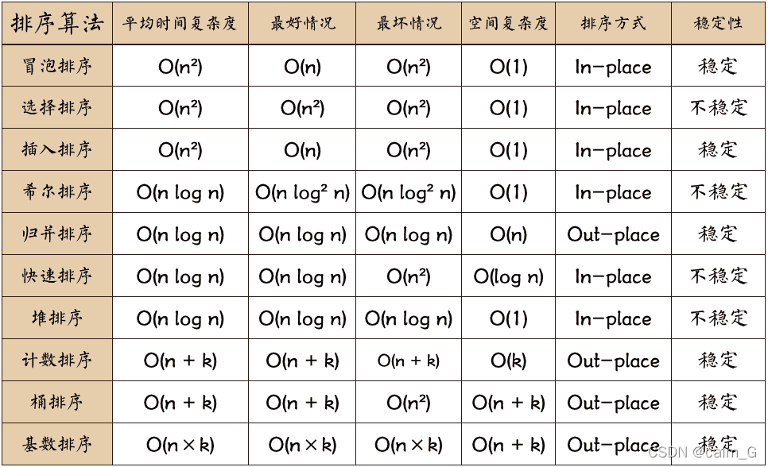

## Time Complexity

Time complexity describes the relationship between algorithm execution time and input scale. Since execution time is affected by runtime environment, the number of key operations is used to represent time.

### Binary Search Example

Quantity n, execution count k
n/2^k=1, i.e., k=log2n, base omitted, resulting in time complexity O(log n)

### Common Time Complexities

1. Constant time complexity O(1): Regardless of input scale, algorithm execution time is constant. For example, directly accessing array elements.
2. Logarithmic time complexity O(log n): As input scale increases, execution time grows logarithmically. Binary search algorithm is a typical example.
3. Linear time complexity O(n): Execution time has linear relationship with input scale. For example, traversing all elements in an array.
4. Linear logarithmic time complexity O(n log n): Common in efficient sorting algorithms like quicksort and merge sort.
5. Quadratic time complexity O(n^2): Execution time is proportional to square of input scale. Usually seen in simple nested loop algorithms.
6. Cubic time complexity O(n^3): Execution time is proportional to cube of input scale. Usually seen in three-layer nested loop algorithms.
7. Exponential time complexity O(2^n) and factorial time complexity O(n!): These complexities usually appear in exponential growth problems with very high execution time, requiring careful use.

Growth data


Growth curves


## Sorting Algorithms

1. Bubble Sort: Compare adjacent elements, swap if first is larger than second.
2. Selection Sort: Find minimum value from unsorted sequence each time, place in sorted sequence.
3. Insertion Sort: Consider first element as sorted, compare with sorted sequence and insert at correct position.
4. Shell Sort: Improvement on insertion sort, split into several subsequences for insertion sort separately, then do insertion sort on entire sequence once.
5. Merge Sort: Split sequence in half, recurse to bottom, then merge two sorted subsequences.
6. Quick Sort: Choose pivot, sort partitions, then recurse on partition subsequences.
7. Heap Sort: Nearly complete binary tree, max heap min heap.
8. Counting Sort: Non-comparison sort, count occurrences of element values, then restore sorted sequence.
9. Bucket Sort: Sort by buckets, then merge.
10. Radix Sort: Group by digit positions.

Sorting time complexity



### Bubble Sort

```go
func BubbleSort(list []int) {
    n := len(list)
    // Whether any swaps occurred in a round
    didSwap := false

    // Perform N-1 rounds of iteration
    for i := n - 1; i > 0; i-- {
        // Compare from first position each time, compare up to position i, because previous round made this position ordered
        for j := 0; j < i; j++ {
            // If front number is larger than back number, swap
            if list[j] > list[j+1] {
                list[j], list[j+1] = list[j+1], list[j]
                didSwap = true
            }
        }

        // If no swaps in a round, already sorted, return directly
        if !didSwap {
            return
        }
    }
}
```

### Selection Sort

```go
func SelectSort(list []int) {
    n := len(list)
    // Perform N-1 rounds of iteration
    for i := 0; i < n-1; i++ {
        // Starting from position i each time, find minimum element
        min := list[i] // minimum number
        minIndex := i  // index of minimum number
        for j := i + 1; j < n; j++ {
            if list[j] < min {
                // If found number smaller than previous, minimum becomes it
                min = list[j]
                minIndex = j
            }
        }

        // If index of minimum found this round doesn't equal initial index, swap elements
        if i != minIndex {
            list[i], list[minIndex] = list[minIndex], list[i]
        }
    }
}
```

### Insertion Sort

```go
func InsertSort(list []int) {
    n := len(list)
    // Perform N-1 rounds of iteration
    for i := 1; i <= n-1; i++ {
        deal := list[i] // number to be sorted
        j := i - 1      // position of first number left of number to be sorted

        // If first comparison, smaller than first sorted number on left, enter processing
        if deal < list[j] {
            // Keep searching left, numbers larger than to-be-sorted all move right, making space for insertion
            for ; j >= 0 && deal < list[j]; j-- {
                list[j+1] = list[j] // some number moves right, leaving space for to-be-sorted
            }
            list[j+1] = deal // finished, to-be-sorted number inserted in space
        }
    }
}
```

### Quick Sort

```go
func quickSort(arr []int, begin, end int) {
	if begin < end {
		i := begin + 1 // Use array[begin] as pivot, so start comparing from array[begin+1]! 
		j := end       // array[end] is last position of array
		// Before overlapping 
		
		for i < j {
			if array[i] > array[begin] {
				array[i], array[j] = array[j], array[i] // swap
				j--
			} else {
				i++
			}
		}
		
		/* After exiting while loop, i = j.
		* At this point array is divided into two parts  -->  array[begin+1] ~ array[i-1] < array[begin]
		*                        -->  array[i+1] ~ array[end] > array[begin]
		* At this time divide array into two parts, then compare array[i] with array[begin], decide position of array[i].
		* Finally swap array[i] with array[begin], sort the two divided parts! By analogy, until finally i = j doesn't satisfy condition and exit!
		*/
		if array[i] >= array[begin] { // Must use ">=" here, otherwise when array elements consist of same values, errors will occur! 
			i--
		}

		quickSort(arr, begin, i-1)
		quickSort(arr, i+1, end)
	}
}
```
