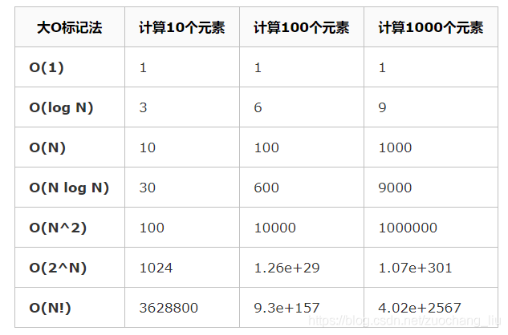
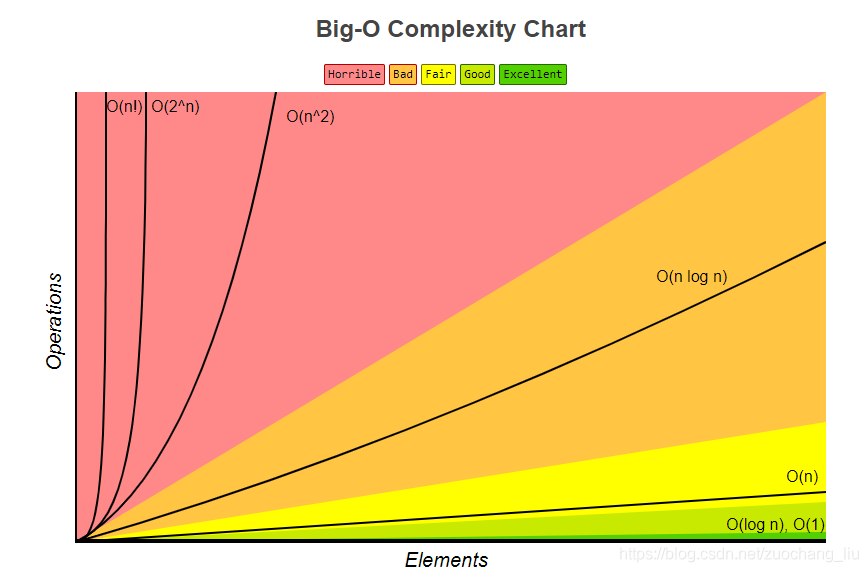
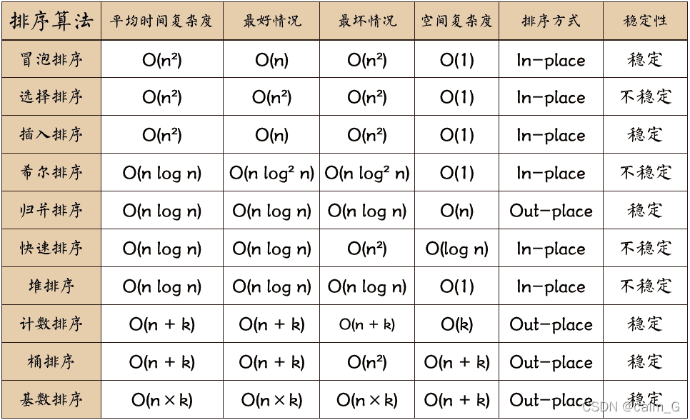

## 时间复杂度

时间复杂度描述的是算法执行所需的时间与输入规模之间的关系，由于执行时间受运行环境影响，所以使用关键操作的执行次数代表时间。

二分法实例  
数量n，执行次数k  
n/2^k=1，即k=log2n，底数省略，得出时间复杂度O(log n)

常见的时间复杂度：

1. 常数时间复杂度 O(1)：不论输入规模的大小如何，算法的执行时间都是常数。例如，直接访问数组元素的操作。
2. 对数时间复杂度 O(log n)：随着输入规模的增加，执行时间以对数方式增长。典型的例子是二分查找算法。 
3. 线性时间复杂度 O(n)：执行时间与输入规模成线性关系。例如，遍历一个数组中的所有元素。 
4. 线性对数时间复杂度 O(n log n)：常见于一些高效的排序算法，如快速排序和归并排序。 
5. 平方时间复杂度 O(n^2)：执行时间与输入规模的平方成正比。通常见于一些简单的嵌套循环算法。 
6. 立方时间复杂度 O(n^3)：执行时间与输入规模的立方成正比。通常见于三层嵌套循环算法。 
7. 指数时间复杂度 O(2^n) 和 阶乘时间复杂度 O(n!)：这些时间复杂度通常出现在指数级增长的问题上，算法的执行时间非常高，需要谨慎使用。

增长数据



增长曲线



## 排序算法

1. 冒泡（Bubble Sort）：比较相邻的元素，如果第一个比第二个大就交换。
2. 选择（Select Sort）：每次从未排序序列中找到最小值，放在已排序序列。
3. 插入（Insertion Sort）：第一个元素认为已排序，对已排序序列比较后插入到正确位置。
4. 希尔（Shell’s Sort）：对插入排序的改进，分割成若干子序列分别进行插入排序，再对全体序列做一次插入排序。
5. 归并（Merge Sort）：将序列对半分割，递归到底，再把两个排序好的子序列合并。
6. 快速（Quick Sort）：选择基准，排序分区，再对分区子序列递归。
7. 堆（Heap Sort）：近似完全二叉树，最大堆最小堆。
8. 计数（Counting Sort）：非比较排序，统计元素值出现的次数，再还原排序序列。
9. 桶（Bucket Sort）：分桶排序，再合并。
10. 基数（Radix Sort）：按位数分组。

排序时间复杂度



### 冒泡排序

```go
func BubbleSort(list []int) {
    n := len(list)
    // 在一轮中有没有交换过
    didSwap := false

    // 进行 N-1 轮迭代
    for i := n - 1; i > 0; i-- {
        // 每次从第一位开始比较，比较到第 i 位就不比较了，因为前一轮该位已经有序了
        for j := 0; j < i; j++ {
            // 如果前面的数比后面的大，那么交换
            if list[j] > list[j+1] {
                list[j], list[j+1] = list[j+1], list[j]
                didSwap = true
            }
        }

        // 如果在一轮中没有交换过，那么已经排好序了，直接返回
        if !didSwap {
            return
        }
    }
}
```

### 选择排序

```go
func SelectSort(list []int) {
    n := len(list)
    // 进行 N-1 轮迭代
    for i := 0; i < n-1; i++ {
        // 每次从第 i 位开始，找到最小的元素
        min := list[i] // 最小数
        minIndex := i  // 最小数的下标
        for j := i + 1; j < n; j++ {
            if list[j] < min {
                // 如果找到的数比上次的还小，那么最小的数变为它
                min = list[j]
                minIndex = j
            }
        }

        // 这一轮找到的最小数的下标不等于最开始的下标，交换元素
        if i != minIndex {
            list[i], list[minIndex] = list[minIndex], list[i]
        }
    }
}
```

### 插入排序

```go
func InsertSort(list []int) {
    n := len(list)
    // 进行 N-1 轮迭代
    for i := 1; i <= n-1; i++ {
        deal := list[i] // 待排序的数
        j := i - 1      // 待排序的数左边的第一个数的位置

        // 如果第一次比较，比左边的已排好序的第一个数小，那么进入处理
        if deal < list[j] {
            // 一直往左边找，比待排序大的数都往后挪，腾空位给待排序插入
            for ; j >= 0 && deal < list[j]; j-- {
                list[j+1] = list[j] // 某数后移，给待排序留空位
            }
            list[j+1] = deal // 结束了，待排序的数插入空位
        }
    }
}
```

### 快速排序

```go
func quickSort(arr []int, begin, end int) {
	if begin < end {
		i := begin + 1 // 将array[begin]作为基准数，因此从array[begin+1]开始与基准数比较！ 
		j := end       // array[end]是数组的最后一位
		// 没重合之前 
		
		for i < j {
			if array[i] > array[begin] {
				array[i], array[j] = array[j], array[i] // 交换
				j--
			} else {
				i++
			}
		}
		
		/* 跳出while循环后，i = j。
		* 此时数组被分割成两个部分  -->  array[begin+1] ~ array[i-1] < array[begin]
		*                        -->  array[i+1] ~ array[end] > array[begin]
		* 这个时候将数组array分成两个部分，再将array[i]与array[begin]进行比较，决定array[i]的位置。
		* 最后将array[i]与array[begin]交换，进行两个分割部分的排序！以此类推，直到最后i = j不满足条件就退出！
		*/
		if array[i] >= array[begin] { // 这里必须要取等“>=”，否则数组元素由相同的值组成时，会出现错误！ 
			i--
		}

		quickSort(arr, begin, i-1)
		quickSort(arr, i+1, end)
	}
}
```
