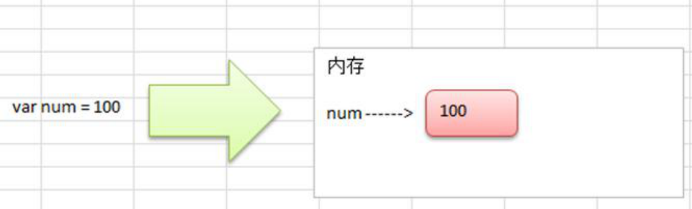
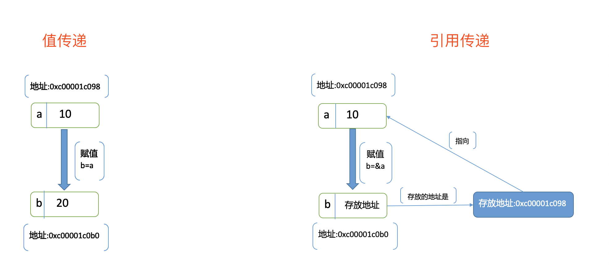
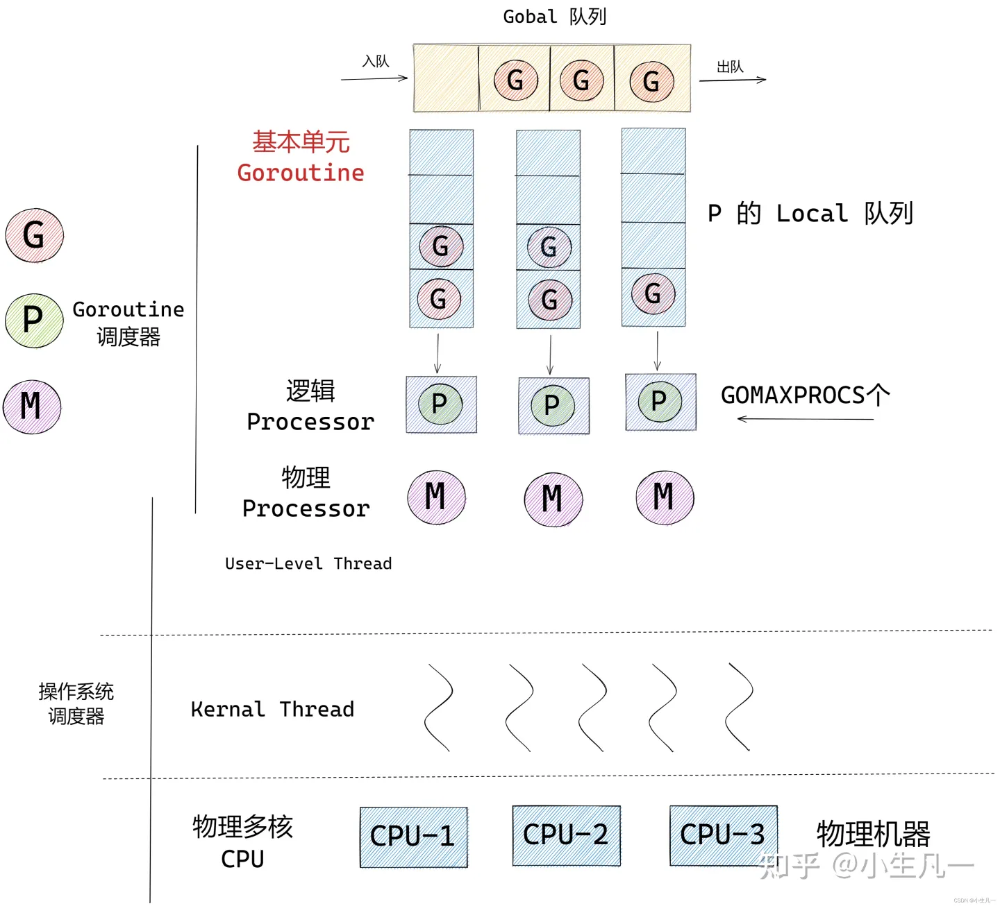

Official Website
[https://go.dev/](https://go.dev/)

Basic Syntax
[https://www.runoob.com/go/go-tutorial.html](https://www.runoob.com/go/go-tutorial.html)

Reference Books
[Go Language Design and Implementation](https://draveness.me/golang/)

PHP to Golang Manual
[https://php2golang.com/](https://php2golang.com/)

## Data Types

1. Boolean: bool
2. Numeric types: int, uint, int8, int64, float32, float64, complex64, complex128
3. Other numeric types: byte (int8), rune (int32), int (32 or 64 bits, depends on system), uintptr (unsigned integer for storing pointers)
4. String type: Implemented through byte array at bottom level, each character occupies one byte, default encoding utf8
5. Derived types: pointer, array, slice, struct, channel (communication between goroutines), function, interface, map

Related:

1. Zero value: When variables are declared (memory allocated) without explicit initialization, default initial values are automatically set - boolean false, numeric 0, string "", reference types nil.
2. rune: rune type variables represent Unicode characters, declared using single quotes ', actually stored using integer int32, can perform arithmetic operations.
3. Chinese length: To get true length of string (one Chinese character counts as one), need to convert string to rune then get length.
4. slice: Bottom implementation is a struct containing pointer to underlying array, slice length and capacity information.
5. Pointer and reference: Pointer is an entity storing memory address, while reference is alias of original variable.

### Value Types vs Reference Types

Basic types int integer, float floating-point, bool boolean, string string, array array and struct structure all belong to value types. Variables directly store values, memory usually allocated on stack. slice slice, map dictionary, chan channel, interface interface and func function belong to reference types. Variables store references (addresses) to data, actual data stored on heap.

Value types copy during assignment and function parameter passing. Modifications don't affect original variables.

Reference types also copy during assignment and function parameter passing, but copy pointers, not values pointed to. Modifications affect original variables, generally allocated on heap.

Value types



Reference types


Go language has no pass-by-reference, all pass-by-value.



## Features

1. iota: Special constant, can be thought of as compiler-modifiable constant. Each new line of constant declaration increments iota count.
2. select statement: Similar to switch statement, but each case must be channel operation - either send or receive. If no case can run, it blocks until a case can run. If multiple channels ready, randomly selects one channel to execute. Adding fallthrough keyword continues to execute immediately following case.
3. break: In nested loops, can use label to mark which loop to break.
4. map: Bottom implementation uses hash table, unordered key-value pairs.
5. defer: Statement executes before function returns, order is LIFO (last in, first out), like stack. Execution order: return, defer, return value. Return value determined and not modified by defer unless named return values or pointers.
6. Parallel assignment: Left and right sides of equals sign contain multiple expressions `i,j = j, i`. For loops don't support comma-separated multiple assignment statements, must use parallel assignment.
7. Goroutine: Keyword go doesn't execute concurrent tasks, but creates concurrent task unit.
8. init function: Package can contain multiple init functions. During compilation, imported package init functions execute first, then current package init functions.
9. Singleton: Can use sync.Once, init function to create singletons.

## Commands

### Modules

Go modules is modern dependency management tool to replace GOPATH.

```shell
# Initialize module, create new project
go mod init xxx
# Organize and download dependencies
go mod tidy
# Copy dependencies to vendor directory (optional)
go mod vendor
# Replace dependencies
go mod edit -replace [old package]@[version]=[new package]@[version]

# Clean cache
go clean -modcache
# View dependencies
go list -m all
# Upgrade all dependency packages to latest version
go get -u ./...
```

### Environment

```shell
# View environment configuration
go env
# Enable modules feature, set to off only searches vendor directory or GOPATH
go env -w GO111MODULE=on
# Proxy
go env -w GOPROXY="https://mirrors.aliyun.com/goproxy/,direct"
# Private repositories
go env -w GOPRIVATE="code.xxx.com,git.xxx.com"
# Support http
go env -w GOINSECURE="code.xxx.com/*,git.xxx.com/*"

# Can also set through environment variable file
# Linux vi ~/.bashrc
# Mac vi ~/.zshrc
export GO111MODULE=on
export GOPRIVATE="git.xxx.com"
export GOINSECURE="git.xxx.com/*"
```

### Execution

```shell
# Run
go run main.go
# Execute tests
go test
# Compile
go build main.go
# Compile to target system, darwin(mac), linux, windows
# Use vendor dependencies
CGO_ENABLED=0 GOOS=darwin GOARCH=amd64 go build -mod=vendor -o ./$out/main -tags v1 -v main.go
```

### Workspace

```shell
# Create new workspace
go work init ./one
# Switch workspace
go work use ./two
```

## Runtime

Composed of following parts:

1. Compiler: Compiles source code to machine code.
2. Linker: Links compiled object files into executable files.
3. Runtime library: Contains standard library functions and internal implementations, such as standard I/O, file system, network etc.
4. Garbage collector: Automatically manages memory recycling of unused objects.
5. Memory allocator: Used for dynamic memory allocation at runtime.
6. Goroutine scheduler: Used for scheduling goroutine execution.
7. Channel mechanism: Provides convenient inter-thread communication.

```go
// Number of goroutines in use
runtime.NumGoroutine()
// Number of CPUs in use
runtime.NumCPU()
// Number of CGO calls
runtime.NumCgoCall()
// Get memory status
runtime.ReadMemStats()
```

Note: runtime.NumGoroutine() function returns current program's goroutine count. This count includes all goroutines, not just those directly created by your program, but also those created by runtime system, such as garbage collection, scheduling and other system-level goroutines. These system goroutines run in background and your program cannot directly control them. If you want to check whether all goroutines in your program have exited, you need to use other methods, such as using sync.WaitGroup to wait for all goroutines to complete.

### Get File Path

```go
// General method
_, file, _, _ := runtime.Caller(0)
path := path.Dir(file)
println(file, path)

// Working directory, must enter working directory to execute correctly
path, _ = os.Getwd()
println(path)

// Will get compilation-time directory
ex, err := os.Executable()
if err != nil {
	panic(err)
}
path, err = filepath.EvalSymlinks(ex)
if err != nil {
	panic(err)
}
println(path)
```

## Memory Allocation

### Stack and Heap

Stack is data structure that automatically allocates and releases memory, used to store function local variables and call context.

Heap is area for dynamic memory allocation, stores reference type data, can be allocated through make function or new keyword, suitable for unpredictable size memory allocation.

Variable storage location is automatically decided by memory allocator. Generally, large variables allocated to heap, while small variables, especially local variables, allocated to stack. Stack has size limits, typically between several MB to tens of MB. Stack size limit mainly protects system from infinite recursion or excessive local variables consuming too much memory. If larger stack space needed, can use `runtime.GOMAXPROCS` function to set.

Go uses tcmalloc memory allocation model, dividing memory pages into small blocks by fixed sizes. This approach solves external fragmentation but still has fragments inside small blocks, with overall expected internal fragmentation rate controlled around 12.5%.

### make, new

new function allocates memory for value types and returns pointer to newly allocated memory. make function allocates memory for reference types and performs initialization operations. new not commonly used because it involves troublesome pointer operations.

### Garbage Collection

Garbage collector mainly based on mark and sweep algorithm, uses tricolor marking (PHP, Python use reference counting) to identify unused objects and mark them as garbage. Then at appropriate times, clears this garbage to release memory.

Features include:

1. Automatic memory management: Garbage collector automatically manages memory, programmers don't need to manually allocate and release memory.
2. Efficient: Garbage collector uses many optimization techniques such as concurrent marking, incremental marking etc., minimizing garbage collection overhead.
3. Controllability: Garbage collector can be tuned and controlled through parameters, such as setting minimum and maximum time intervals for garbage collection.

### Memory Optimization

For garbage collector performance issues, can adopt some optimization strategies.

For example:

1. Avoid frequent small memory allocations, can use object pools (sync.Pool) to reuse objects;
2. Try to use stack-allocated value types rather than heap-allocated reference types;
3. Reasonable use of slice pre-allocation and reuse etc.

### Escape Analysis

Pointer escape refers to during compilation, for certain reasons, local variable pointer is allocated to heap. This may happen when variable escapes outside function or when variables are shared between multiple goroutines. Pointer escape causes memory allocator to allocate memory on heap and affects garbage collection.

Go language compiler performs escape analysis during compilation phase to determine whether variable is allocated on stack or heap. Escape analysis can help developers better understand and control memory allocation, thus optimizing program performance.

## For Range

array, slice: Copy data and statistics before loop, adding/deleting elements during loop doesn't affect.

```go
// Array, slice
for_temp := range
len_temp := len(for_temp)
for index_temp = 0; index_temp < len_temp; index_temp++ {
	value_temp = for_temp[index_temp]
	index = index_temp
	value = value_temp
	original body
}
```

map: No specified loop count, uses pointers, but map bottom layer is hash, adding/deleting elements during loop has random positions, cannot determine effects.

```go
// map
var hiter map_iteration_struct
for mapiterinit(type, range, &hiter); hiter.key != nil; mapiternext(&hiter) {
	index_temp = *hiter.key
	value_temp = *hiter.val
	index = index_temp
	value = value_temp
	original body
}
```

channel: Loop continuously, if data available take it out, if not block, if channel closed exit loop.

```go
// channel
for {
	index_temp, ok_temp = <-range
	if !ok_temp {
		break
	}
	index = index_temp
	original body
}
```

Using index, value to receive range return values produces one data copy, consider not receiving based on situation to improve performance.

## Panic Capture

runtime.throw() directly terminates process, cannot be caught by recover.

Examples:

1. sync.Mutex when using uninitialized lock and unlocking without locking in code, will cause throw crash;
2. map without read-write locks under concurrency will throw;

## Goroutine Scheduling

Golang goroutines use cooperative scheduling. After goroutine completes execution, resources are released for other goroutines to use. But since goroutines are parasitic within threads, OS time-slice-based preemptive scheduling of threads also affects goroutines.

To improve efficiency, scheduler switches goroutines in following situations:

1. Blocking: I/O wait, channel blocking, waiting for locks, network connections etc.
2. Memory allocation: When performing large amounts of memory allocation, may be switched out.
3. Active yield: Calling time.Sleep, runtime.Gosched etc.
4. Stack overflow: When goroutine stack size exceeds preset limit, generally 2K.
5. Timeout: Execution time too long, switch to give other goroutines execution opportunity.

### GMP

G: goroutine, has independent stack space, timer, reusable. Initial stack space around 2k, space grows with demand.
M: machine, system kernel thread, records thread stack information. When goroutine scheduled to thread, uses that goroutine's own stack information.
P: processor, virtual processor, less than or equal to CPU cores. Main role is having G local queue, linked list, some cache and state.



Q: How much memory does one goroutine occupy?
A: 200,000 goroutines occupied 500M memory, 500,000 KB, averaging 2.5KB per goroutine.

Q: How to solve CPU load spikes?
A: May be too many suspended goroutines, frequent goroutine switching polling I/O. Shortening goroutine timeout can solve this.

## Goroutine Timeout

Implementation 1: time.After+select

```go
func TestContext12(t *testing.T) {
   ch := make(chan struct{}, 1)
   go func() {
       fmt.Println("running...")
       time.Sleep(3 * time.Second)
       ch <- struct{}{}
   }()
   select {
       case <-ch:
       fmt.Println("done")
       case <-time.After(2 * time.Second):
       fmt.Println("timeout")
   }
}
```

Implementation 2: time.NewTimer

```go
func TestContext5(t *testing.T) {
   timer := time.NewTimer(time.Duration(time.Millisecond * 900))
   ch := make(chan struct{}, 1)
   go func() {
      fmt.Println("running...")
      time.Sleep(3 * time.Second)
      ch <- struct{}{}
   }()
   select {
   case <-ch:
      fmt.Println("done")
   case <-timer.C:
      fmt.Println("timeout")
   }
}
```

Implementation 3: context+select

```go
func TestContext6(t *testing.T) {
   ch := make(chan string)
   timeout, cancel := context.WithTimeout(context.Background(), 2*time.Second)
   defer cancel()
   go func() {
      time.Sleep(time.Second * 3)
      ch <- "done"
   }()
   select {
   case res := <-ch:
      fmt.Println(res)
   case <-timeout.Done():
      fmt.Println("timout", timeout.Err())
   }
}
```

## Channel

### Errors

Reading closed channel has no effect
Writing to closed channel causes panic: send on closed channel
Closing already closed channel causes panic: close of closed channel

### Deadlock

1. Multiple goroutines waiting for each other.
2. When channel has no data, directly reading causes deadlock, need to use select to read.
3. When channel data full, trying to write more data causes deadlock, need to use select to write.
4. When goroutine sends data to channel, presumably other goroutines will receive data. If not, program will trigger panic at runtime, forming deadlock.

### Check Closure

To check if channel is closed, can implement through reading channel.

```go
func isChanClose(ch chan int) bool {
    select {
    case _, received := <- ch:
        return !received
    default:
    }
    return false
}
```

Case code must be in form `_, received := <- ch`. If just `<- ch` to judge, it's wrong logic because we care about `received` value;
select must have default branch, otherwise will block function. This function must guarantee normal return.

### Timing

Above implemented `isChanClose` function may still panic because judgment has time window.

To avoid panic, essentially ensuring event timing. Official recommendation is using `context` for cooperation. We can indicate close event through ctx variable rather than directly judging channel state.

```go
select {
case <-ctx.Done():
    // ... exit
    return
case v, ok := <-c:
    // do something....
default:
    // do default ....
}
```

After `ctx.Done()` event occurs, we explicitly don't read channel data.

### Buffer Order

Can control through context.

## Context

Methods include Deadline, Done, Err, Value.

1. Control concurrent task order, stopping, timeout.
2. Pass KV.

## Thread Safety

Slices, maps are not safe under multi-threading. During concurrent writes, slices overwrite, maps report error `fatal error: concurrent map writes`.

sync.atomic: Atomic operations, either execute all successfully or none at all.
sync.Map: Concurrent-safe Map structure implemented using read-write locks and atomic operations.
sync.Once: Only executes on first call, even with different parameters, can be used to create singletons.
sync.Mutex: Mutual exclusion lock, only one goroutine can hold lock at any time.
sync.RWMutex: Read-write mutual exclusion lock, allows multiple goroutines to simultaneously read shared resources, while only one goroutine can write shared resources.
sync.Cond: Synchronization primitive, usually used with Mutex, calls Signal or Broadcast methods to notify other threads.
sync.WaitGroup: Wait group, contains counter with decrement design. Add sets value, Done decrements by one each time, Wait blocks until count is 0.
sync.Pool: Reuse pool.

## CGO Issues

### Thread Increase

C/C++ language code blocking or long-running may not be sensed by Go scheduler, causing Go goroutines to be blocked. Scheduler will create additional system threads to ensure all Go goroutines can get execution.

In this situation, using CGO to call long-running C/C++ code, especially involving blocking operations, may cause system thread increase, affecting system resource usage efficiency.

To avoid this problem, consider avoiding blocking operations in C/C++ code in Go, or use Go concurrency primitives to control concurrent quantity of calling C/C++ code, better utilizing scheduler characteristics. In some cases, may need to modify C/C++ code to allow calling in Go goroutines, better cooperating with Go scheduler to avoid unnecessary thread increase.

### Memory Management

When passing data between Go and C/C++, need to pay attention to memory allocation and release. Go uses garbage collection to manage memory, while C/C++ needs manual memory management. Ensure no memory leaks or dangling pointers when passing data.

### Data Structure Mismatch

Go and C/C++ have different data structures and type systems. Ensure appropriate type conversion and data structure matching when passing data, avoiding type mismatch issues between different languages.

### Error Handling

In Go, errors are explicit return values, while C/C++ typically uses error codes or exceptions to handle errors. Need to pay attention to how to pass and handle errors during interaction.

### Multi-thread Safety

If involving multi-thread operations, need special attention to data races and concurrent access issues. Go and C/C++ have different multi-threading models, need to ensure thread safety.

### Runtime Calls

When calling Go functions in C/C++, Go runtime may not handle it very friendly. Need to consider performance and stability issues brought by runtime calls.

### Version Compatibility

Go and C/C++ version upgrades may introduce incompatible changes. Ensure library and code compatibility between different versions.

### Performance

CGO calls involve crossing language boundaries, may bring certain performance overhead. Need to evaluate performance requirements and optimize.

### Build and Dependencies

Using CGO may involve compilation and linking between different languages. Need to ensure correct configuration of build process and dependencies.
