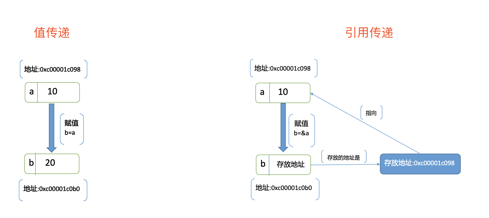
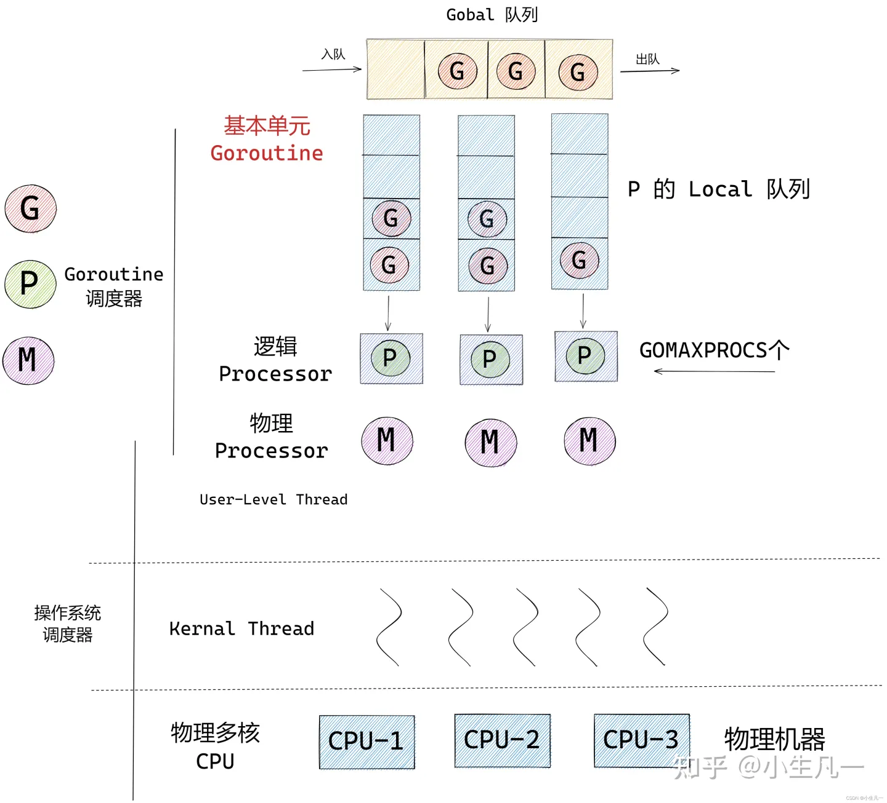

官方网站  
[https://go.dev/](https://go.dev/)

基础语法  
[https://www.runoob.com/go/go-tutorial.html](https://www.runoob.com/go/go-tutorial.html)

参考书籍  
[Go 语言设计与实现](https://draveness.me/golang/)

PHP 转 golang 手册
[https://php2golang.com/](https://php2golang.com/)

## 数据类型

1. 布尔型：bool
2. 数字类型：int、uint、int8、int64、float32、float64、complex64、complex128
3. 其他数字类型：byte（int8）、rune（int32）、int（32 或 64 位，取决于系统）、uintptr（无符号整型，用于存放一个指针）
4. 字符串类型：底层通过 byte 数组实现，每个字符占用一个字节，默认编码 utf8
5. 派生类型：指针、数组、切片、结构化（struct）、通道（channel，协程间通信）、函数、接口（interface）、字典（map）

相关：

1. 零值：声明变量（分配内存）未显式初始化时，将自动设置默认初始值，布尔 false、数值 0、字符””、引用类型 nil。
2. rune：rune 类型的变量表示一个 Unicode 字符，使用单引号 ' 进行声明，实际上是使用整数 int32 来存储的，可以进行算术运算。
3. 中文长度：如果想得到字符串真正的长度（一个中文算一位），需要将字符串转换为 rune，再求长度。
4. 切片：底层实现是一个结构体，包含了指向底层数组的指针、切片的长度和容量等信息。
5. 指针和引用：指针是一个实体，它存储一个内存地址，而引用是原变量的别名。

### 值类型与引用类型

基本类型 int 整数、float 浮点数、bool 布尔值、string 字符、array 数组 以及 struct 结构体，都属于值类型，变量直接存储值，内存通常在栈中分配。slice 切片、map 字典、chan 通道、interface 接口 和 func 函数 等，属于引用类型，变量存储的是指向数据的引用（地址），实际的数据存储在堆上。

值类型在赋值、函数传参时，都是复制。修改不会影响原变量。

引用类型在赋值、函数传参时，都是复制，但是复制的是指针，而不是指针指向的值。修改会影响原变量，一般分配在堆上。

值类型


引用类型


go 语言没有引用传递，都是值传递。



## 特性

1. iota：特殊常量，可以认为是一个可以被编译器修改的常量，每新增一行常量声明将使 iota 计数一次。
2. select 语句：类似于 switch 语句，但是每个 case 必须是一个通道操作，要么发送要么接收。如果没有 case 可运行，它将阻塞，直到有 case 可运行。如果多个通道都准备好，会随机选择一个通道执行。添加 fallthrough 关键字会继续执行紧跟的下一个 case。
3. break：在多重循环中，可以用标号 label 标出想 break 的循环。
4. map：底层使用 hash 表实现，无序键值对。
5. defer：语句在函数返回前执行，循序 LIFO（后进先出），和栈一样。执行顺序 return、defer、返回值，返回值确定后不被 defer 修改，除非是有名返回值、指针。
6. 平行赋值：等号左边和右边含有多个表达式 `i,j = j, i` for 循环不支持以逗号为间隔的多个赋值语句，必须使用平行赋值。
7. 协程：关键字 go 并非执行并发任务，而是创建一个并发任务单元。
8. init 函数：一个包中可以包含多个 init 函数，编译时先执行导入包的 init 函数，再执行本包内的 init 函数。
9. 单例：可以使用 sync.Once、init 函数创建单例。

## 命令

### 模块

Go modules 是现代化的依赖管理工具，用来替代 GOPATH。

```shell
# 初始化模块，新建项目
go mod init xxx
# 整理并下载依赖
go mod tidy
# 复制依赖到vendor目录（非必需）
go mod vendor
# 替换依赖
go mod edit -replace [old package]@[version]=[new package]@[version]

# 清理缓存
go clean -modcache
# 查看依赖
go list -m all
# 升级所有依赖包到最新版本
go get -u ./...
```

### 环境

```shell
# 查看环境配置
go env
# 开启modules功能，设置为off只查找vendor目录或者GOPATH
go env -w GO111MODULE=on
# 代理
go env -w GOPROXY="https://mirrors.aliyun.com/goproxy/,direct"
# 私有库
go env -w GOPRIVATE="code.xxx.com,git.xxx.com"
# 支持http
go env -w GOINSECURE="code.xxx.com/*,git.xxx.com/*"

# 还可以通过环境变量文件设置
# Linux vi ~/.bashrc
# Mac vi ~/.zshrc
export GO111MODULE=on
export GOPRIVATE="git.xxx.com"
export GOINSECURE="git.xxx.com/*"
```

### 执行

```shell
# 运行
go run main.go
# 执行测试
go test
# 编译
go build main.go
# 编译到目标系统，darwin(mac), linux, windows
# 使用vendor依赖
CGO_ENABLED=0 GOOS=darwin GOARCH=amd64 go build -mod=vendor -o ./$out/main -tags v1 -v main.go
```

### 工作区

```shell
# 新建工作区
go work init ./one
# 切换工作区
go work use ./two
```

## 运行时

由以下部分组成：

1. 编译器：将源代码编译成机器码。
2. 链接器：将编译后的目标文件链接成可执行文件。
3. 运行时库：包含一些标准的库函数和内部实现，例如标准输入输出、文件系统、网络等。
4. 垃圾回收器（garbage collector）：自动管理不再使用的对象内存回收。
5. 内存分配器：用于在运行时动态分配内存。
6. 协程调度器：用于调度协程的执行。
7. 通道机制：提供了一种方便的线程间通信的方式。

```go
// 使用协程数量
runtime.NumGoroutine()
// 使用CPU数量
runtime.NumCPU()
// CGO调用数
runtime.NumCgoCall()
// 获取内存状态
runtime.ReadMemStats()
```

注意：runtime.NumGoroutine() 函数返回当前程序的 goroutine 数量。这个数量包括了所有的 goroutine，不仅仅是你的程序直接创建的，还包括运行时系统创建的，例如垃圾回收、调度等系统级别的 goroutine。这些系统 goroutine 是在后台运行的，你的程序无法直接控制它们。如果你想要检查你的程序中的所有 goroutine 是否都已经退出，你需要使用其他方法，例如使用 sync.WaitGroup 来等待所有的 goroutine 完成。

### 获取文件路径

```go
// 通用方法
_, file, _, _ := runtime.Caller(0)
path := path.Dir(file)
println(file, path)

// 工作目录，必须进入工作目录执行才正确
path, _ = os.Getwd()
println(path)

// 会获取到编译时的目录
ex, err := os.Executable()
if err != nil {
	panic(err)
}
path, err = filepath.EvalSymlinks(ex)
if err != nil {
	panic(err)
}
println(path)
```

## 内存分配

### 堆栈

栈（Stack）是一种自动分配和释放内存的数据结构，用于存储函数的局部变量和调用上下文。

堆（Heap）是用于动态分配内存的区域，存储引用类型的数据，可以通过  make  函数或  new  关键字分配，适合不可预知大小的内存分配。

变量的存储位置是由内存分配器自动决定。一般来说，大变量会分配到堆上，而小变量、特别是局部变量，会分配到栈上。栈有大小限制，通常在几 MB 到几十 MB 之间。栈的大小限制主要是为了保护系统不受无限递归或者大量局部变量消耗过多内存的影响。如果需要更大的栈空间，可以使用 `runtime.GOMAXPROCS` 函数来设置。

Go 使用 tcmalloc 内存分配模型，把内存 page 按照固定大小划分成小块。这种方式解决了外部碎片，但是小块内部还是有碎片的，内部碎片率整体预期控制在 12.5% 左右。

### make、new

new 函数用于分配值类型的内存，并返回指向新分配内存的指针。make 函数用于分配引用类型的内存，并进行初始化操作。new 不常用，因为涉及指针这种麻烦的操作。

### 垃圾回收

垃圾回收器主要基于标记和清除算法，通过三色标记（php、python 是引用计数）来识别不再使用的对象，并将这些对象标记为垃圾。然后，在适当的时候清除这些垃圾，释放内存。

特点包括：

1. 自动管理内存：垃圾回收器会自动管理内存，程序员不需要手动分配和释放内存。
2. 高效：垃圾回收器使用了许多优化技术，例如并发标记、增量标记等，使得垃圾回收的开销降到最低。
3. 可控性：垃圾回收器可以通过一些参数进行调优和控制，例如设置垃圾回收的最小、最大时间间隔等。

### 内存优化

针对垃圾回收器的性能问题，可以采取一些优化策略。

例如：

1. 避免频繁的小内存分配，可以使用对象池（sync.Pool）来重用对象；
2. 尽量使用栈上分配的值类型，而不是堆上分配的引用类型；
3. 合理使用切片的预分配和复用等。

### 逃逸分析

指针逃逸指的是在编译时，由于某些原因，一个局部变量的指针被分配到堆上。这可能发生在变量逃逸到函数外部，或者在多个协程之间共享变量时。指针逃逸会导致内存分配器在堆上分配内存，并对垃圾回收产生影响。

Go 语言的编译器在编译阶段会进行逃逸分析，以确定一个变量是分配在栈上还是堆上。逃逸分析可以帮助开发者更好地理解和控制内存的分配情况，从而优化程序的性能。

## For Range

array、slice，循环前复制数据、统计，循环过程中增删元素不影响。

```go
// 数组、切片
for_temp := range
len_temp := len(for_temp)
for index_temp = 0; index_temp < len_temp; index_temp++ {
	value_temp = for_temp[index_temp]
	index = index_temp
	value = value_temp
	original body
}
```

map，没有指定循环次数，使用指针，但是 map 底层是 hash，循环过程中增删元素位置随机，无法确定影响。

```go
// map
var hiter map_iteration_struct
for mapiterinit(type, range, &hiter); hiter.key != nil; mapiternext(&hiter) {
	index_temp = *hiter.key
	value_temp = *hiter.val
	index = index_temp
	value = value_temp
	original body
}
```

channel，一直循环，如果有数据则取出，没有则阻塞，如果 channel 被关闭则退出循环。

```go
// channel
for {
	index_temp, ok_temp = <-range
	if !ok_temp {
		break
	}
	index = index_temp
	original body
}
```

使用 index，value 接收 range 返回值会产生一次数据拷贝，视情况考虑不接收，以提高性能。

## Panic 捕获

runtime.throw() 会直接终止进程，无法被 recover 捕获。

举例：

1. sync.Mutex 当使用一个初始化的锁，并未加锁就在代码中解锁，会发生 throw 奔溃；
2. map 并发下没有添加读写锁，会抛出 throw；

## 协程调度

Golang 协程是协作式调度，协程执行完成后，再将资源释放出来供其他协程使用。但是由于协程寄生在线程内，操作系统基于时间片对线程的抢占式调度同样会影响协程。

为了提高效率，调度器会在以下情况切换协程：

1. 阻塞：IO 等待、通道阻塞、等待锁、网络连接 等。
2. 内存分配：进行大量内存分配时，可能会被切换出去。
3. 主动让出：调用 time.Sleep、runtime.Gosched 等。
4. 栈超限：当协程的栈大小超过预设限制时，一般是 2K。
5. 超时：执行时间过长，切换让其它协程获得执行机会。

### GMP

G：goroutine，有独立的栈空间、定时器，可复用。初始化的栈空间在 2k 左右，空间会随着需求增长。  
M：machine，系统内核线程，记录线程栈信息，当 goroutine 调度到线程时，使用该 goroutine 自己的栈信息。  
P：processor，虚拟处理器，小于等于 cpu 核心数，最大作用是拥有 G 本地队列、链表、一些 cache 和状态。



问：一个协程占用多少内存？  
答：20 万个协程占用了 500M 内存，50 万 KB，平均一个协程占用 2.5KB。

问：CPU 负载出现短时间尖刺，如何解决？  
答：可能是挂起协程太多，协程频繁切换轮询 io，缩短协程超时时间可解决。

## 协程超时

实现一：time.After+select

```go
func TestContext12(t *testing.T) {
   ch := make(chan struct{}, 1)
   go func() {
       fmt.Println("running...")
       time.Sleep(3 * time.Second)
       ch <- struct{}{}
   }()
   select {
       case <-ch:
       fmt.Println("done")
       case <-time.After(2 * time.Second):
       fmt.Println("timeout")
   }
}
```

实现二：time.NewTimer

```go
func TestContext5(t *testing.T) {
   timer := time.NewTimer(time.Duration(time.Millisecond * 900))
   ch := make(chan struct{}, 1)
   go func() {
      fmt.Println("running...")
      time.Sleep(3 * time.Second)
      ch <- struct{}{}
   }()
   select {
   case <-ch:
      fmt.Println("done")
   case <-timer.C:
      fmt.Println("timeout")
   }
}
```

实现三：context+select

```go
func TestContext6(t *testing.T) {
   ch := make(chan string)
   timeout, cancel := context.WithTimeout(context.Background(), 2*time.Second)
   defer cancel()
   go func() {
      time.Sleep(time.Second * 3)
      ch <- "done"
   }()
   select {
   case res := <-ch:
      fmt.Println(res)
   case <-timeout.Done():
      fmt.Println("timout", timeout.Err())
   }
}
```

## Channel

### 报错

读已经关闭的 channel 无影响  
往已关闭的 channel 写入会 panic，send on closed channel  
关闭已经关闭的 channel 会 panic，panic: close of closed channel

### 死锁

1. 多个协程互相等待。
2. 当一个 channel 中没有数据，直接读取时会发生死锁，需要使用 select 读取。
3. 当 channel 数据满了，再尝试写入数据会造成死锁，需要使用 select 写入。
4. 当协程给一个信道发送数据时，照理说会有其他协程来接收数据。如果没有的话，程序就会在运行时触发 panic，形成死锁。

### 判断关闭

判断 channel 是否关闭，可以通过读 channel 实现。

```go
func isChanClose(ch chan int) bool {
    select {
    case _, received := <- ch:
        return !received
    default:
    }
    return false
}
```

case 的代码必须是  `_, received := <- ch`  的形式，如果仅仅是  `<- ch`  来判断，是错的逻辑，因为我们关注的是  `received`  的值；  
select 必须要有 default 分支，否则会阻塞函数，这个函数要保证一定能正常返回。

### 时序

上面实现的  `isChanClose` 函数可能还是会出现 panic，因为判断有时间窗口。

要避免出现 panic，本质上是保证事件的时序，官方推荐通过  `context`  来配合使用。我们可以通过一个 ctx 变量来指明 close 事件，而不是直接去判断 channel 的一个状态。

```go
select {
case <-ctx.Done():
    // ... exit
    return
case v, ok := <-c:
    // do something....
default:
    // do default ....
}
```

`ctx.Done()`  事件发生之后，我们就明确不去读 channel 的数据。

### 缓冲区顺序

可以通过 context 控制。

## Context

方法有 Deadline、Done、Err、Value。

1. 控制并发任务的顺序、停止、超时。
2. 传递 KV。

## 线程安全

切片、map 在多线程下不安全，并发写入时，切片会覆盖，map 会报错 `fatal error: concurrent map writes`。

sync.atomic：原子操作，要么全部执行成功，要么全部不执行。  
sync.Map：使用读写锁和原子操作实现的并发安全 Map 结构。  
sync.Once：仅第一次调用执行，即使参数不同，可用于创建单例。  
sync.Mutex：互斥锁，任何时候只能有一个 goroutine 持有锁。  
sync.RWMutex：读写互斥锁，允许多个 goroutine 同时读取共享资源，而只有一个 goroutine 可以写共享资源。  
sync.Cond：同步原语，通常与 Mutex 一起使用，调用 Signal 或 Broadcast 方法来通知其他线程。  
sync.WaitGroup：等待组，内含计数器，减值设计。Add 设置数值，Done 每次减一，Wait 阻塞直到计数为 0。  
sync.Pool：复用池。

## CGO 问题

### 线程增加

C/C++ 语言代码阻塞或长时间运行可能无法被 Go 的调度器感知，从而导致 Go 协程被阻塞，调度器会创建额外的系统线程来确保所有的 Go 协程都能得到执行。

这种情况下，使用 CGO 调用长时间运行的 C/C++ 代码，特别是涉及到阻塞操作的情况，可能会导致系统线程的增加，进而影响系统资源的使用效率。

为了避免这个问题，可以考虑在 Go 中尽量避免在 C/C++ 代码中进行阻塞操作，或者使用 Go 的并发原语来控制调用 C/C++ 代码的并发数量，从而更好地利用调度器的特性。在某些情况下，可能需要对 C/C++ 代码进行修改，以允许在 Go 协程中调用，从而更好地与 Go 的调度器协作，避免不必要的线程增加。

### 内存管理

在 Go 和 C/C++ 之间传递数据时，需要注意内存的分配和释放。Go 使用垃圾回收来管理内存，而 C/C++ 需要手动管理内存。确保在传递数据时不会导致内存泄漏或悬挂指针。

### 数据结构不匹配

Go 和 C/C++ 有不同的数据结构和类型系统。确保在传递数据时进行适当的类型转换和数据结构匹配，以避免不同语言之间的类型不匹配问题。

### 错误处理

在 Go 中，错误是显式的返回值，而在 C/C++ 中通常使用错误码或异常来处理错误。在交互时需要注意如何传递和处理错误。

### 多线程安全性

如果涉及多线程操作，需要特别注意数据竞争和并发访问问题。Go 和 C/C++ 的多线程模型有所不同，需要确保线程安全。

### 运行时调用

在 C/C++ 中调用 Go 函数时，Go 的运行时可能会不太友好地处理。需要考虑运行时调用所带来的性能和稳定性问题。

### 版本兼容性

Go 和 C/C++ 的版本升级可能会引入不兼容的变化。确保库和代码在不同版本间的兼容性。

### 性能

CGO 调用涉及跨越语言边界，可能会带来一定的性能开销。需要评估性能需求并进行优化。

### 构建和依赖

使用 CGO 可能会涉及到在不同语言之间进行编译和链接。需要确保正确配置构建流程和依赖。
