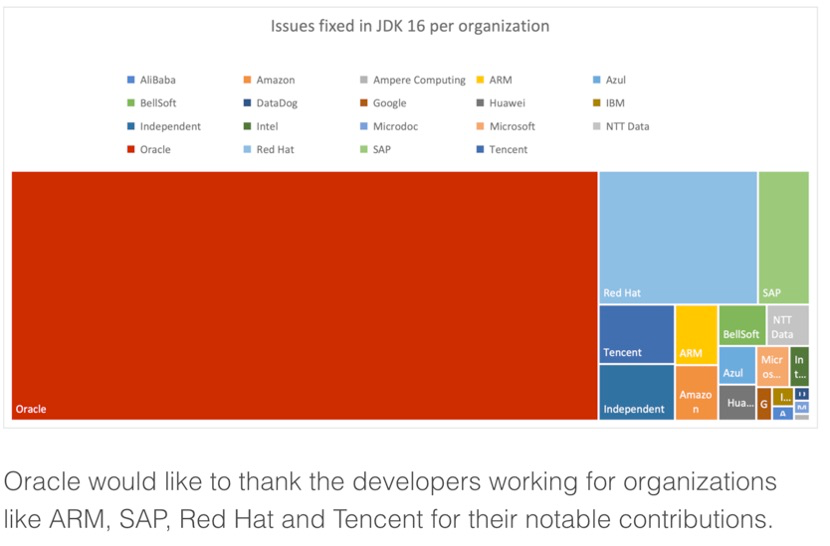
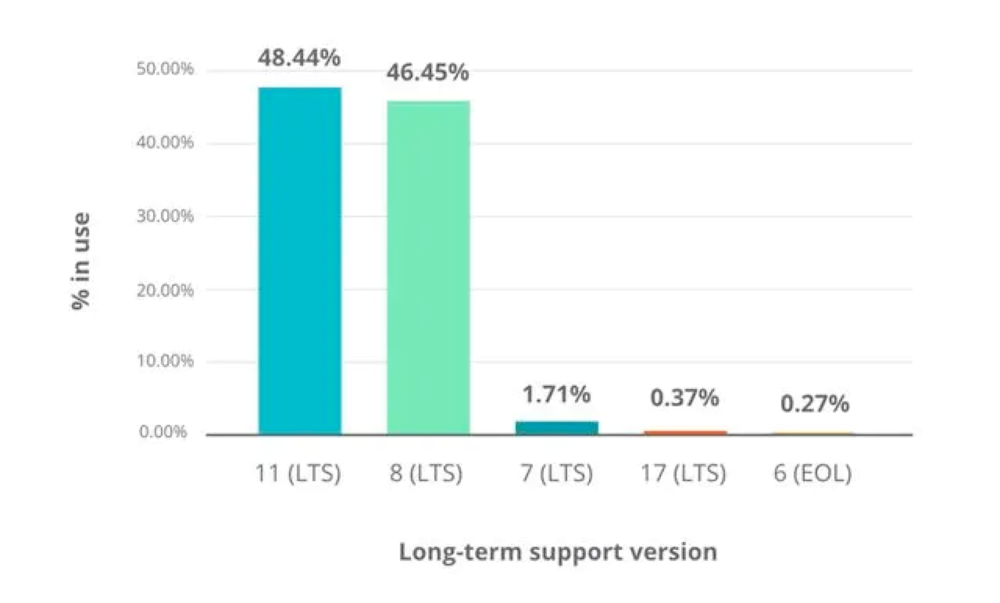
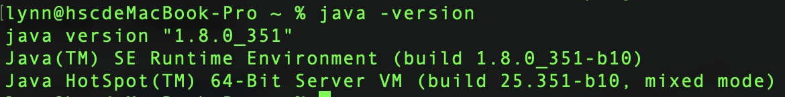
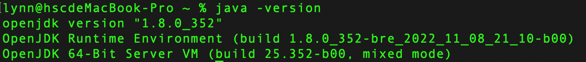
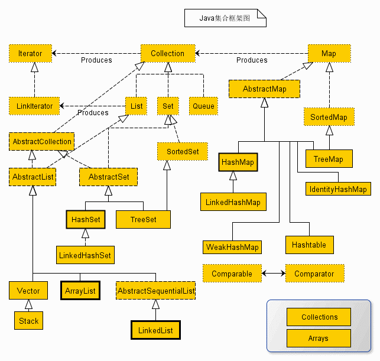
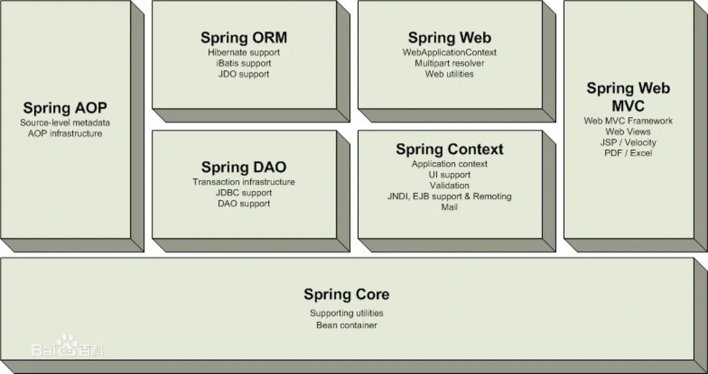
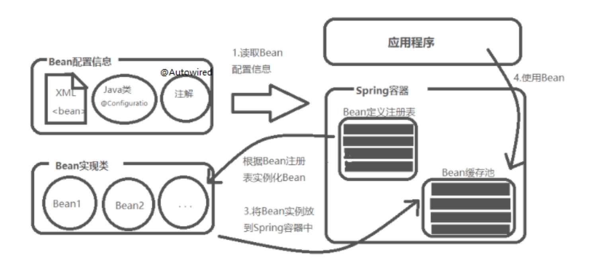
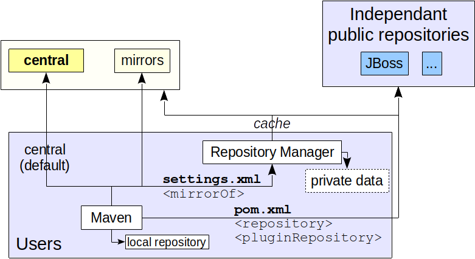
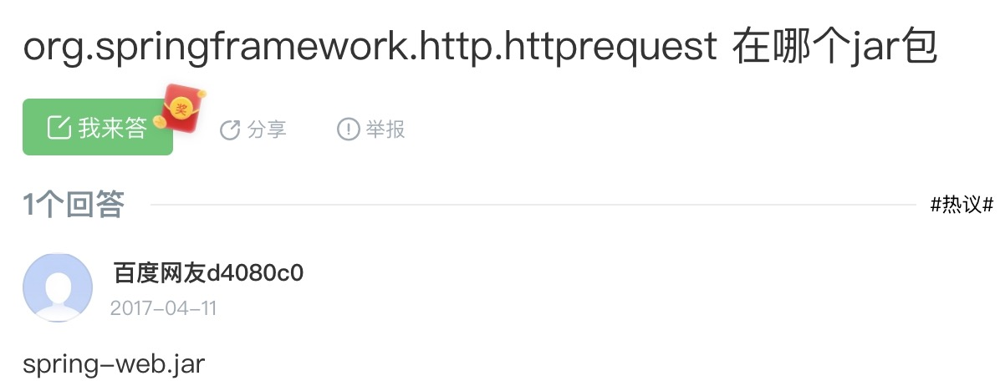

Official Website
[https://www.java.com/](https://www.java.com/)

Basic Syntax
[https://www.runoob.com/java/java-tutorial.html](https://www.runoob.com/java/java-tutorial.html)

## OpenJDK

OpenJDK is completely open source and free, doesn't allow use of Java trademarks, maintained by open source organizations like Oracle, RedHat. OracleJDK is just a distribution of OpenJDK, like the relationship between native Android system and phone manufacturer custom operating systems.

Other OpenJDK distributions include AWS's Amazon Corretto, Alibaba's Alibaba Dragonwell, Huawei's BiSheng SDK, Tencent's Kona, Microsoft's Microsoft Build of OpenJDK, etc.

RedHat took over from Oracle to maintain JDK long-term support versions, such as OpenJDK 8 and OpenJDK 11. OpenJDK and OracleJDK are roughly the same but may have detail inconsistencies, possibly causing same code to run with different results, such as encryption/decryption algorithms.

### JDK 16 Contribution Rankings



Contributing vendors almost all have their own OpenJDK distributions and promote their own JDK in respective fields, causing Java camp fragmentation.

### JDK Version Usage



### Version Selection

OracleJDK charges, OpenJDK castrated, latest version Java19
Java1.8 = Java8
Java8 stops updating in 2030
Java8, Java11 most popular, both LTS long-term support versions

Java8 wasn't split into OracleJDK yet, can be used for free, can avoid compatibility issues by not using OpenJDK, and supported until 2030, currently (2023) still best choice.

Java8



Java8 OpenJDK


JRE download address [https://www.java.com/zh-CN/download/](https://www.java.com/zh-CN/download/)
JDK download address [https://www.oracle.com/java/technologies/downloads/#java8-mac](https://www.oracle.com/java/technologies/downloads/#java8-mac)

## Data Structures

Basic data types

1. byte: Equivalent to int8
2. short: int16
3. int: int32
4. long: int64
5. float: float32
6. double: float64
7. boolean
8. char: Single 16-bit Unicode character
9. Array: Used to store fixed-size elements of same type

Advanced data structures

String: Created based on String class, belongs to objects
Enumeration
BitSet
Vector
Stack
Dictionary
Hashtable
Properties
ArrayList: Dynamically modifiable array
LinkedList
HashMap: Key-value hash table
HashSet: Collection based on HashMap implementation that doesn't allow duplicate elements
Iterator: Methods for accessing collections, can be used to iterate ArrayList and HashSet collections.
Generics: Combination of multiple types.

Java Collections Framework



## Historical Frameworks

SSH (14 years ago): Struts(MVC), Spring and Hibernate(DB)
SSM (after 14 years): SpringMVC, Spring and MyBatis(DB)
SpringBoot: Based on Spring 4.0 design, SSM scaffolding, complete functionality, ready to use

"Step by Step Teaching You to Build SSM Framework with IntelliJ IDEA"
[http://t.zoukankan.com/greenteaone-p-11078108.html](http://t.zoukankan.com/greenteaone-p-11078108.html)

"Spring MVC 4.2.4.RELEASE Chinese Documentation"
[https://www.w3cschool.cn/spring_mvc_documentation_linesh_translation/](https://www.w3cschool.cn/spring_mvc_documentation_linesh_translation/)

## Spring Architecture



Note: org.springframework is new organization name, springframework is historical version from 16 years ago.

## Spring Container and Bean

IoC (Inversion of Control) container is an instance pool, factory pattern, automatically instantiates through reflection and other methods. JavaBean is a reusable component. For containers to automatically instantiate it, JavaBean needs to define parameterless constructor.



## Maven

Maven is a project management tool that can build and manage dependencies for Java projects. Which version of JDK Maven uses depends on which version the JAVA_HOME environment variable points to. Maven cannot handle multi-level dependencies, many complex projects use gradle.

Tutorial
[https://www.runoob.com/maven/maven-tutorial.html](https://www.runoob.com/maven/maven-tutorial.html)

### Basic Usage

Create Maven project

```shell
mvn archetype:generate -DgroupId=com.lynn -DartifactId=command -Dpackaging=com.lynn.command -Dversion=1.0-SNAPSHOT
```

Enter project package directory, package or compile

```shell
mvn clean package
mvn clean compile
```

Enter compiled target/classes directory, execute main method

```shell
java com.lynn.RSA
java -jar command-1.0-SNAPSHOT.jar
```

### Repository

Open source packages can be automatically pulled from Maven central repository, also supports privately deployed remote repositories, but private local packages need manual import, ultimately all use local repository. Local repository is in .m2/repository/ directory under user directory.



#### Query Central Repository

[https://search.maven.org/#browse](https://search.maven.org/#browse) or [https://central.sonatype.com/](https://central.sonatype.com/)

Note: Must search by organization name, package name, complete class name almost impossible to find

#### Install Local Package

```shell
mvn install:install-file -DgroupId=com.mg.master -DartifactId=spring -Dversion=1.0-SNAPSHOT -Dpackaging=jar -Dfile=lib/spring-1.0-SNAPSHOT.jar
mvn install:install-file -DgroupId=com.mg.master -DartifactId=utils-core -Dversion=1.0-SNAPSHOT -Dpackaging=jar -Dfile=lib/utils-core-1.0-SNAPSHOT.jar
```

#### Remove Package

```shell
mvn dependency:purge-local-repository -DmanualInclude="com.mg.master:spring"
mvn dependency:purge-local-repository -DmanualInclude="com.mg.master:utils-core"
```

#### IDEA Project Install Dependencies

```shell
mvn install
mvn idea:idea
```

Note: Maven dependencies too difficult to use, don't know which package dependent classes are in, even if you know don't know which version to use, need to try.



## Environment Distinction

Runtime VM parameters -Dspring.profiles.active=dev
Package with specified environment mvn clean package -P test -Dmaven.test.skip=true

## IDEA

File--Project Structure set JDK version, not recommended to manually set Maven packages (local packages can be installed with commands), recommend adding pom dependencies.

## Tomcat

Java8 needs to pair with Tomcat 9

## Scheduled Tasks

Original method: Thread waiting, create threads, sleep loop execution;
Ancient method: JDK timer package, single thread, long execution time or errors affect other tasks, unstable;
ScheduledExecutorService: Java1.5 addition, solves timer package problems through thread pool;
Spring Scheduled annotation: Lightweight, easy to use;
Quartz: Open source framework, very powerful;
