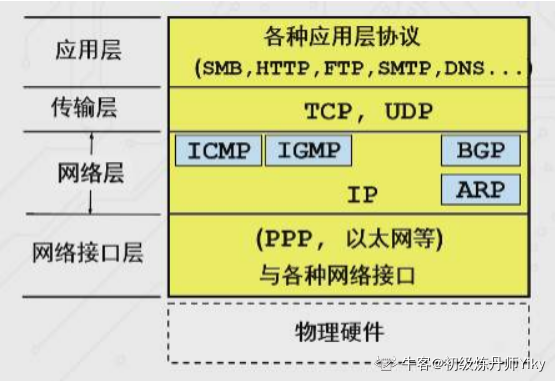
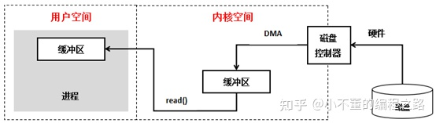
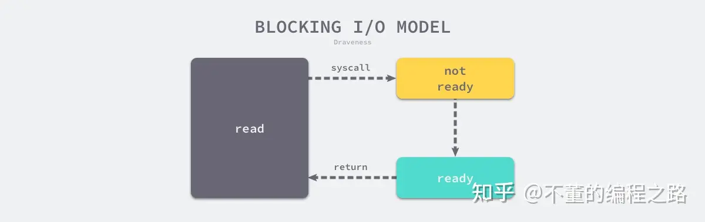
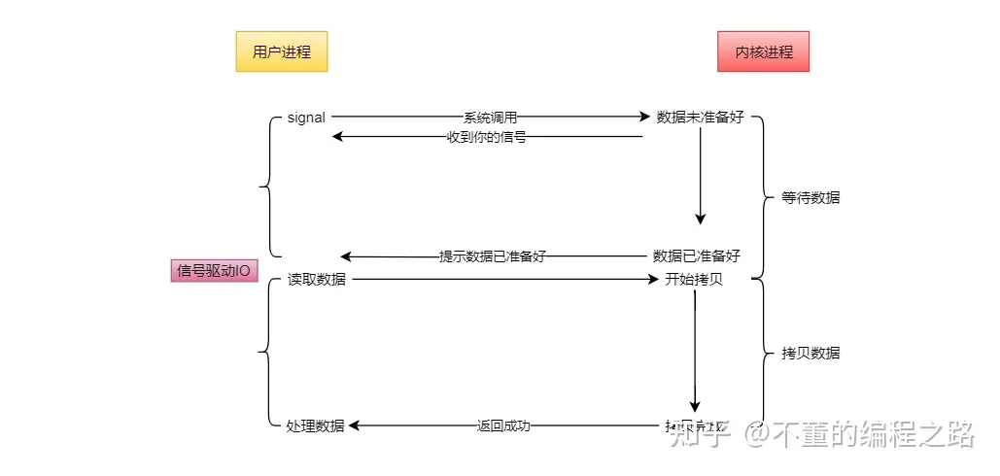
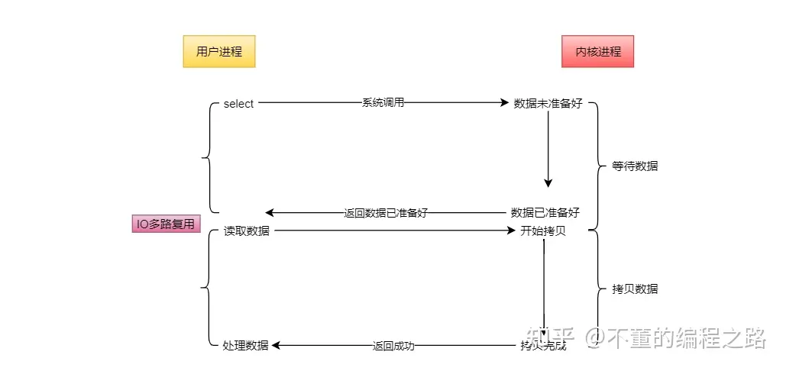
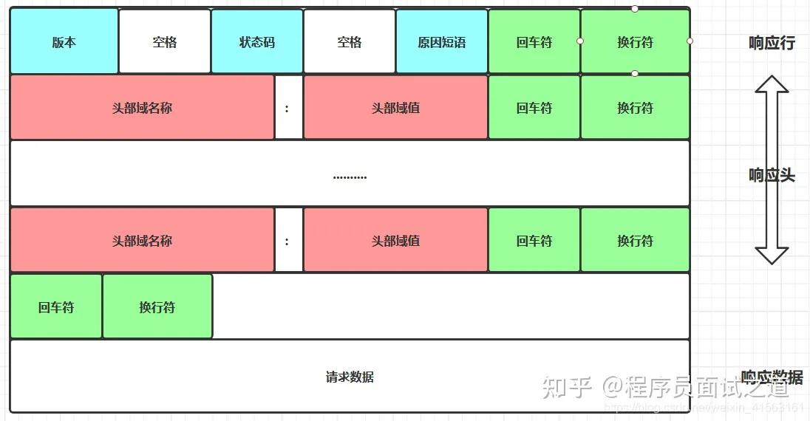

## IP Address

IPv4 address consists of 4 bytes, each byte is 8-bit binary number, totaling 32 bits, each byte corresponds to decimal 0 to 255. For example, binary representation of 192.168.0.1 is: 11000000 10101000 00000000 00000101.

Class A: 10.0.0.0-10.255.255.255 (10.0.0.0/8)
Class B: 172.16.0.0-172.31.255.255 (172.16.0.0/12)
Class C: 192.168.0.0-192.168.255.255 (192.168.0.0/16)

192.168.0.0/16 equivalent to 192.168.0.0-192.168.255.255, where 16 represents network mask length, first 16 bits are network address, last 16 bits are host address, can provide 65536 IPs.

192.168.0.0/24 equivalent to 192.168.0.0-192.168.0.255, where 24 represents network mask length, first 24 bits are network address, last 8 bits are host address, can provide 256 IPs.

192.168.0.1/32 equivalent to 192.168.0.1, where 32 represents network mask length, all 32 bits are network address, represents specific host address.

## Layered Model

TCP/IP Model

ISO/OSI Model

## TCP Three-Way Handshake, Four-Way Handshake

TCP three-way handshake is the process of establishing TCP connection, ensuring reliability and synchronization between communicating parties. Here are the steps of TCP three-way handshake:

1. First Handshake (SYN): Client sends SYN (synchronize) segment to server. This segment contains Initial Sequence Number (ISN) and SYN flag bit set, indicating client requests connection establishment.
2. Second Handshake (SYN + ACK): After server receives client's SYN segment, confirms sequence number and sends segment with both SYN and ACK (acknowledgment) flag bits as response. Server also generates random ISN for its own initial sequence number.
3. Third Handshake (ACK): After client receives server's SYN + ACK segment, confirms sequence number and sends segment with ACK flag bit to server. This segment's sequence number is server's SYN segment confirmation sequence number plus 1, indicating client has received server's confirmation and informing server connection is established.

After completing three-way handshake, TCP connection is established, both parties can start data transmission, finally releasing TCP connection through four-way handshake.

Three-way handshake process ensures both client and server agree to establish connection and both know each other's sequence numbers for **reliable sequential transmission and data confirmation** during data transmission. If either party doesn't receive confirmation during handshake or doesn't receive reply after timeout, it triggers resending handshake segments until connection established successfully or reaching certain retry attempts.

## TIME_WAIT

Problem: When large number of connections in time_wait state, occupying ports without releasing, new TCP connections will error: address already in use : connect

Cause: In HTTP requests, when connection header set to close, basically server initiates active connection close. The party initiating active connection close enters time_wait state. In TCP four-way handshake connection closing mechanism, to ensure ACK retransmission and discard delayed data, time_wait set to 2 times MSL (Maximum Segment Lifetime, MSL is 2 minutes).

Solutions:

1. Client HTTP request header, set connection to keep-alive, maintaining alive for period of time. Current browsers generally default to this setting.
2. Server allows time_wait state sockets to be reused.
3. Server reduces time_wait time, set to 1 MSL.

## Sequential Transmission, Delayed ACK

After connection established, sender cuts data and assigns sequence numbers in headers. Receiving order of receiver's data packets may be chaotic, needs sorting by sequence numbers, so receiver doesn't immediately reply ACK but has timer check every 200ms whether ACK needs sending.

Delay can also save network traffic, receiving multiple identical packets consecutively only needs one reply. If receiver has data to send, can also carry ACK.

## Flow Control

If sender sends data too fast, receiver may not be able to receive in time, causing data loss. Flow control makes sender's sending rate not too fast, allowing receiver to receive in time.

Using sliding window mechanism can conveniently implement sender flow control on TCP connections. Through window field in receiver's confirmation message, sender can accurately control bytes sent.

## Congestion Control

Computer networks exist in shared environment, network congestion may occur causing delays and packet loss. TCP will then retransmit data, but retransmission increases network burden, aggravating delay and packet loss problems.

Congestion control avoids sender's data filling entire network. To regulate data amount sender wants to send, defines concept called congestion window. Congestion window cwnd is state variable maintained by sender that varies dynamically based on network congestion degree.

Congestion Control Algorithms

1. Slow Start: Gradually increase number of data packets sent. Rule: For each ACK sender receives, congestion window cwnd size increases by 1.
2. Congestion Avoidance: When congestion window cwnd exceeds slow start threshold ssthresh, enters congestion avoidance algorithm. Rule: For each ACK received, cwnd increases by 1/cwnd.
3. Fast Retransmit: When receiver finds missing intermediate packet, sends three ACKs of previous packet, so sender quickly retransmits without waiting for timeout.
4. Fast Recovery: Fast retransmit and fast recovery generally used together. Fast recovery algorithm believes that still receiving 3 duplicate ACKs means network isn't that bad, so no need to be as drastic as RTO timeout. Before entering fast recovery, cwnd and ssthresh already updated: cwnd = cwnd/2, setting to half original, ssthresh = cwnd.

## Five I/O Models

Applications cannot directly operate underlying hardware, must interact with system kernel to send/receive network data from buffers.

1. Blocking I/O
2. Non-blocking I/O  
3. Signal-driven I/O
4. Asynchronous I/O
5. I/O Multiplexing

### Blocking I/O

### Non-blocking I/O

### Signal-driven I/O

### Asynchronous I/O

### I/O Multiplexing

Explanation:

1. Blocking I/O, Non-blocking I/O: Process directly interacts with kernel, high overhead, low concurrency.
2. Signal-driven I/O: Based on signal callbacks, not suitable for high concurrency processing.
3. Asynchronous I/O, I/O Multiplexing: Need system underlying support, Linux kernel version 2.5+, suitable for high concurrency.

I/O multiplexing system calls include select, poll, epoll. Greatest advantage is small system overhead, system doesn't need to create processes/threads or maintain them, greatly reducing system overhead.

Asynchronous I/O implementation copies data from kernel to user space. I/O multiplexing is essentially synchronous I/O, needs to handle reading/writing after read/write events ready.

### select

 
<video width="640" height="360" controls>
  <source src="select.mp4" type="video/mp4">
  Your browser doesn't support video playback.
</video>

### epoll

 
<video width="640" height="360" controls>
  <source src="epoll.mp4" type="video/mp4">
  Your browser doesn't support video playback.
</video>

Two trigger modes of epoll

Level Triggered (LT): When event triggered, epoll immediately notifies application and returns after event processed. If application doesn't handle event timely, epoll continues notifying application until event processed.

Edge Triggered (ET): When event triggered, epoll only notifies application once and returns after event processed. If application doesn't handle event timely, epoll won't notify application again.

Note that choice between level triggered and edge triggered is specified when creating epoll instance, can be specified through flags parameter in epoll_create function. If trigger mode not specified, defaults to level triggered mode.

|                | select                                                                          | poll                                                                            | epoll                                                       |
| -------------- | ------------------------------------------------------------------------------- | ------------------------------------------------------------------------------- | ----------------------------------------------------------- |
| Performance    | Performance drops drastically as connections increase, very poor with thousands | Performance drops drastically as connections increase, very poor with thousands | Performance basically unchanged as connections increase     |
| Connections    | Generally 1024                                                                  | Unlimited                                                                       | Unlimited                                                   |
| Memory Copy    | Copy on each select call                                                        | Copy on each poll call                                                          | fd copied on first epoll_ctl call, no copy on epoll_wait   |
| Data Structure | bitmap                                                                          | array                                                                           | red-black tree                                              |
| Processing     | Linear polling                                                                  | Linear polling                                                                  | FD hangs on red-black tree, through event callback         |
| Time Complexity| O(n)                                                                            | O(n)                                                                            | O(1)                                                        |

## HTTP

Q: How to know HTTP processing is complete?
A: Through Content-Length package size

## HTTPS

SSL/TLS

HTTPS certificate is digital signature certificate containing issuer's digital signature, issuer identifier information, certificate validity period, subject's public key value, subject identifier information, etc. Public key is part of HTTPS certificate, used to ensure security during communication process.
