## IP 地址

IPv4 地址由 4 个字节组成的，每个字节是 8 位二进制数，总计 32 位，每个字节对应十进制的 0 到 255。例如，192.168.0.1 的二进制表示形式是：11000000 10101000 00000000 00000101。

A 类，10.0.0.0-10.255.255.255（10.0.0.0/8）  
B 类，172.16.0.0-172.31.255.255（172.16.0.0/12）  
C 类，192.168.0.0-192.168.255.255（192.168.0.0/16）

192.168.0.0/16 等同于 192.168.0.0-192.168.255.255，其中 16 表示网络掩码的长度，前 16 位是网络地址，后面的 16 位是主机地址，可提供 65536 个 IP。

192.168.0.0/24 等同于 192.168.0.0-192.168.0.255，其中 24 表示网络掩码的长度，前 24 位是网络地址，后面的 8 位是主机地址，可提供 256 个 IP。

192.168.0.1/32 等同于 192.168.0.1，其中 32 表示网络掩码的长度，32 位全部是网络地址，表示具体的主机地址。

## 分层模型

TCP/IP 模型

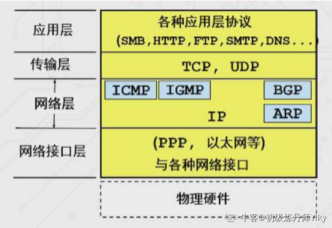

ISO/OSI 模型

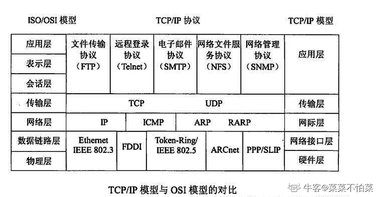

## TCP 三次握手、四次挥手

TCP 三次握手是建立 TCP 连接的过程，确保通信双方之间的可靠性和同步性。下面是 TCP 三次握手的步骤：

1. 第一次握手（SYN）：客户端向服务器发送一个 SYN（同步）报文段。这个报文段中包含了初始序列号（ISN）和设置 SYN 标志位，表示客户端请求建立连接。
2. 第二次握手（SYN + ACK）：服务器收到客户端的 SYN 报文段后，确认序列号，并发送一个带有 SYN 和 ACK（确认）标志位的报文段作为响应。服务器端也会为自己的初始序列号生成一个随机的 ISN。
3. 第三次握手（ACK）：客户端收到服务器的 SYN + ACK 报文段后，确认序列号并发送一个带有 ACK 标志位的报文段给服务器。这个报文段的序列号是服务器发送的 SYN 报文段的确认序列号加 1，表示客户端已经接受到了服务器的确认，并告知服务器连接已建立。

完成三次握手后，TCP 连接就建立起来了，双方可以开始进行数据的传输，最终通过四次挥手释放 TCP 连接。

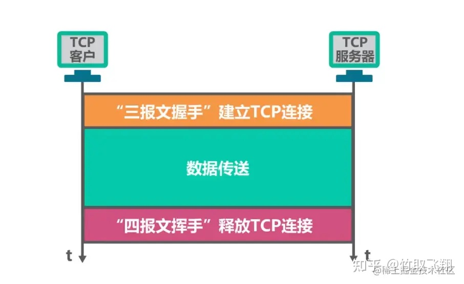

三次握手的过程是为了确保客户端和服务器都同意建立连接，并且双方都知道对方的序列号，以便在数据传输过程中通过序列号进行**可靠的顺序传送和数据确认**。如果在握手过程中任何一方没有收到确认，或者超时没有收到回复，就会触发重新发送握手报文的过程，直到建立连接成功或达到一定的重试次数。

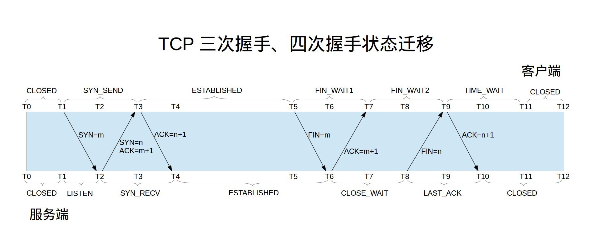

## TIME_WAIT

问题：当大量的连接处于 time_wait 时，占用端口不释放，新建立 TCP 连接会出错，address already in use : connect

原因：HTTP 请求中，如果 connection 头部被设置为 close 时，基本都由 服务端 发起主动关闭连接。发起主动关闭连接 的一端，会进入 time_wait 状态。TCP 四次挥手关闭连接机制中，为了保证 ACK 重发和丢弃延迟数据，设置 time_wait 为 2 倍的 MSL（报文最大存活时间，MSL 为 2 分钟）。

解决：

1. 客户端 HTTP 请求的头部，connection 设置为 keep-alive，保持存活一段时间。现在的浏览器，一般默认这么设置。
2. 服务器端 允许 time_wait 状态的 socket 被重用。
3. 服务器端 缩减 time_wait 时间，设置为 1 MSL。

## 顺序传输、延迟 ACK

连接建立后，发送方将数据切割，并且在头部分配了序列号。接收方收到的数据包顺序可能乱，需要根据序列号排序，因此接收方并不会立即回复 ACK，而是由定时器每隔 200ms 检查是否需要发送。

延迟同时还可以节省网络流量，连续收到多个相同包只需回复一次。如果接收方有数据发送，还可以带上 ACK。

## 流量控制

如果发送方数据发送过快，接收方就可能来不及接收，造成数据丢失。流量控制（flow control）就是让发送方的发送速率不要太快，要让接收方来得及接收。

利用滑动窗口机制可以很方便地在 TCP 连接上实现发送方流量控制。通过接收方的确认报文中的窗口字段，发送方能够准确地控制发送字节数。

## 拥塞控制

计算机网络处在一个共享的环境中，可能会发生网络拥堵，导致延迟、丢包，这时 TCP 就会重传数据，但是重传会导致网络的负担更重，会加剧延迟、丢包问题。

拥塞控制是避免发送方的数据填满整个网络。为了在发送方调节所要发送数据的数据量，定义了⼀个叫做 拥塞窗口 的概念。拥塞窗口 cwnd 是发送方维护的⼀个的状态变量，它会根据网络的拥塞程度动态变化。

拥塞控制算法

1. 慢启动：⼀点⼀点的提高发送数据包的数量。规则：发送方每收到⼀个 ACK，拥塞窗⼝ cwnd 的大小就会加 1。
2. 拥塞避免：当拥塞窗口 cwnd 超过慢启动门限 ssthresh 就会进⼊拥塞避免算法。规则：每收到⼀个 ACK 时，cwnd 增加 1/cwnd。
3. 快重传：当接收方发现丢了⼀个中间包的时候，发送三次前⼀个包的 ACK，于是发送端就会快速地重传，不必等待超时再重传。
4. 快恢复：快重传和快恢复⼀般同时使用，快速恢复算法认为，还能收到 3 个重复的 ACK 说明网络也不那么糟糕，所以没有必要像 RTO 超时那么强烈。进⼊快速恢复之前， cwnd 和 ssthresh 已被更新了：cwnd = cwnd/2 ，也就是设置为原来的⼀半，ssthresh = cwnd 。

## 五种 IO 模型

应用程序不能直接操作底层硬件，必须和系统内核交互，从缓冲区收发网络数据。

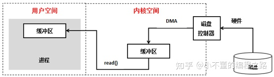

1. blockingIO - 阻塞 IO
2. nonblockingIO - 非阻塞 IO
3. signaldrivenIO - 信号驱动 IO
4. asynchronousIO - 异步 IO
5. IOmultiplexing - IO 多路复用

### 阻塞 IO

### 非阻塞 IO

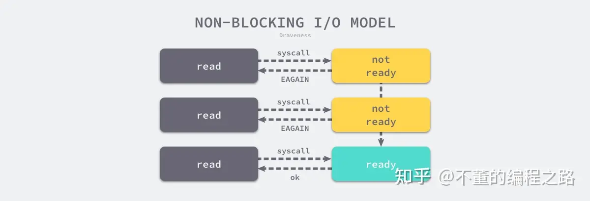

### 信号驱动 IO

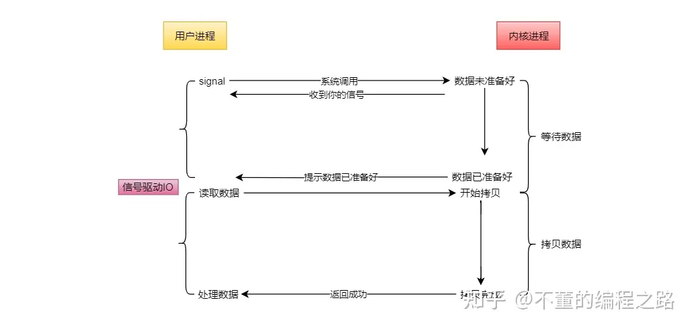

### 异步 IO

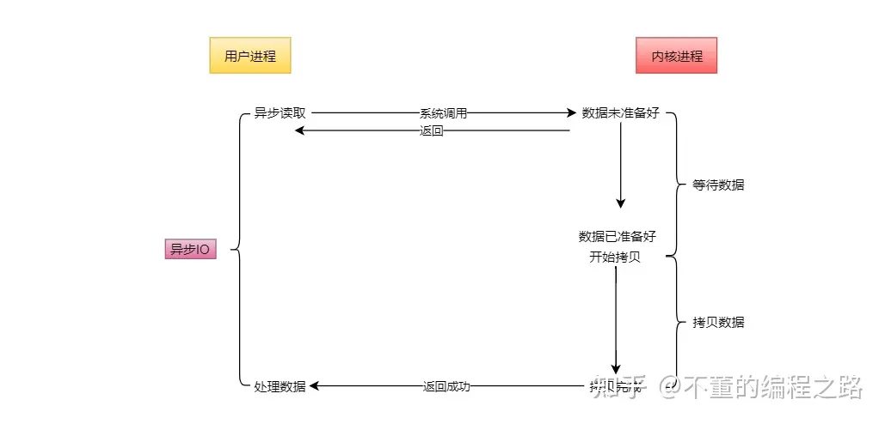

### IO 多路复用

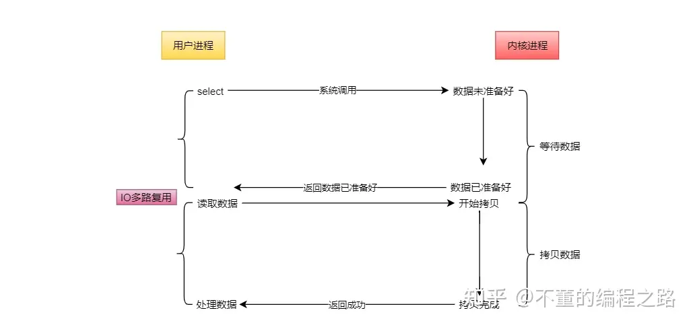

说明：

1. 阻塞 IO、非阻塞 IO：由进程直接与内核交互，开销大，并发低。
2. 信号驱动 IO：基于信号回调，不适合处理高并发。
3. 异步 IO、IO 多路复用：需要系统底层支持，linux 内核版本 2.5 以上，适合高并发。

IO 多路复用的系统调用有 select、poll、epoll，最大优势是系统开销小，系统不必创建进程/线程，也不必维护这些进程/线程，从而大大减小了系统的开销。

异步 IO 的实现会把数据从内核拷贝到用户空间，IO 多路复用本质上是同步 IO，需要在读写事件就绪后自己负责进行读写。

### select

 
<video width="640" height="360" controls>
  <source src="select.mp4" type="video/mp4">
  您的浏览器不支持视频播放。
</video>

### epoll

 
<video width="640" height="360" controls>
  <source src="epoll.mp4" type="video/mp4">
  您的浏览器不支持视频播放。
</video>

epoll 的两种触发方式

水平触发（LT，Level Triggered）：当事件被触发时，epoll 会立即通知应用程序，并在事件被处理完后返回。如果应用程序没有及时处理事件，epoll 会持续通知应用程序，直到事件被处理完毕。

边沿触发（ET，Edge Triggered）：当事件被触发时，epoll 只通知应用程序一次，并在事件被处理完后返回。如果应用程序没有及时处理事件，epoll 不会再次通知应用程序。

需要注意的是，水平触发和边沿触发的选择是在创建 epoll 实例时指定的，可以通过 epoll_create 函数的中的 flags 参数来指定触发方式。如果未指定触发方式参数，则默认使用水平触发方式。

|            | select                                                               | poll                                                                 | epoll                                                  |
| ---------- | -------------------------------------------------------------------- | -------------------------------------------------------------------- | ------------------------------------------------------ |
| 性能       | 随着连接数的增加，性能急剧下降，处理成千上万的并发连接数时，性能很差 | 随着连接数的增加，性能急剧下降，处理成千上万的并发连接数时，性能很差 | 随着连接数的增加，性能基本没有变化                     |
| 连接数     | 一般 1024                                                            | 无限制                                                               | 无限制                                                 |
| 内存拷贝   | 每次调用 select 拷贝                                                 | 每次调用 poll 拷贝                                                   | fd 首次调用 epoll_ctl 拷贝，每次调用 epoll_wait 不拷贝 |
| 数据结构   | bitmap                                                               | 数组                                                                 | 红黑树                                                 |
| 处理机制   | 线性轮询                                                             | 线性轮询                                                             | FD 挂在红黑树，通过事件回调 callback                   |
| 时间复杂度 | O(n)                                                                 | O(n)                                                                 | O(1)                                                   |

## HTTP

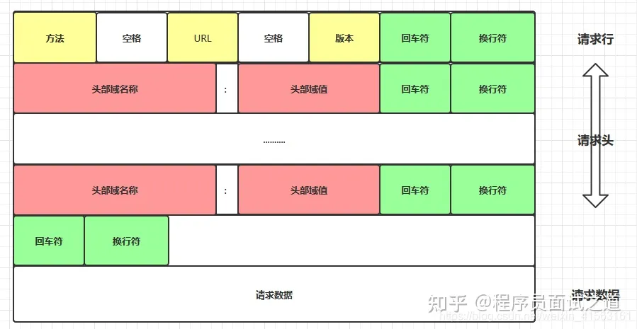

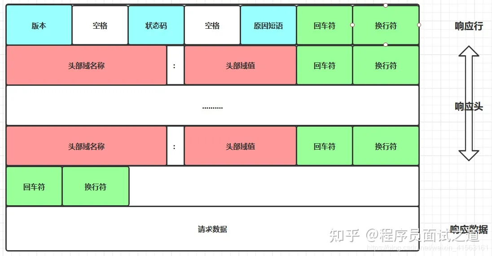

问：怎么知道 http 处理完了？  
答：通过 Content-Length 包大小

## HTTPS

SSL/TLS

HTTPS 证书是一种数字签名证书，包含颁发者的数字签名、颁发者标识符信息、证书的有效期、主题的公钥值、主题的标识符信息等。公钥是 HTTPS 证书的一部分，用于确保通信过程中的安全性。
