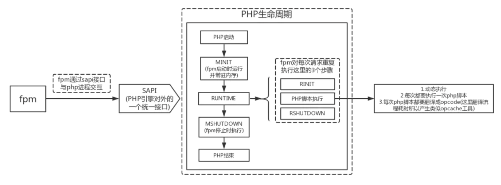

官方网站  
[https://www.php.net/](https://www.php.net/)

基础语法  
[https://www.runoob.com/php/php-tutorial.html](https://www.runoob.com/php/php-tutorial.html)

## 生命周期



PHP 生命周期中关键的四个调用：MINT（模块初始化） -> RINT（请求初始化） -> RSHUTDOWN（请求关闭） -> MSHOTDOWN（模块关闭）

SAPI（Server Application Programming Interface，即服务器应用编程接口）是应用层（比如 Apache、Nginx、CLI 等）交互入口。CGI、FastCGI、CLI 等都可以称为 SAPI。

## PHP协程

PHP是单线程语言，不直接提供真正的异步编程能力，通过yield实现的是伪协程，但是可以使用Swoole扩展实现异步编程。

### yield与生成器

yield 通常与函数一起使用，用于创建生成器函数（Generator）。生成器是一种特殊的迭代器，它允许在需要时逐个生成值，而不必一次性生成所有值并将它们存储在内存中。这对于处理大量数据或需要延迟加载的情况非常有用。

生成器函数包含一个或多个 yield 语句，每个 yield 语句都会产生一个值，并在后续调用中保持函数的状态，以便能够从上次停止的地方继续执行。

```php
function asyncTask() {
    yield "Step 1";
    yield "Step 2";
    yield "Step 3";
}

$task = asyncTask();

foreach ($task as $step) {
    echo $step . PHP_EOL;
}
```

在上面的示例中，asyncTask 是一个生成器函数（伪协程），通过yield产生了三个步骤。通过foreach循环，依次执行这些步骤，但在每次yield之后都会挂起协程的执行，直到下一个迭代。

### Coroutine

最常用的PHP协程库是Swoole，它提供了完整的协程支持，包括协程创建、管理和调度。

```php
Coroutine::create(function () {
    // 协程任务代码
});
```

## FPM调优

## php7比5快的原因

本质上是对 zend 引擎的优化，减少内存分配次数，多使用栈内存，缓存数组hash值，字符串解析成参数改为宏展开，使用大块连续内存代替小块碎片内存等。

1. 存储变量的结构体变小，尽量使结构体成员共用内存空间，减少引用，内存占用降低，变量的操作速度得到提升。
2. 字符串结构体的改变，字符串信息和数据本身原来是分成两个独立内存块存放，php7尽量将它们存入同一块内存，提升了cpu缓存命中率。 
3. 数组结构的改变，数组元素和hash映射表在php5中会存入多个内存块，php7尽量将它们分配在同一块内存，降低了内存占用、提升了cpu缓存命中率。 
4. 改进了函数的调用机制，通过对参数传递环节的优化，减少一些指令操作，提高了执行效率。 
5. opCode字节码缓存。

## 性能分析

轻量级性能分析工具 xhprof  
[pecl 链接](http://pecl.php.net/package/xhprof)
