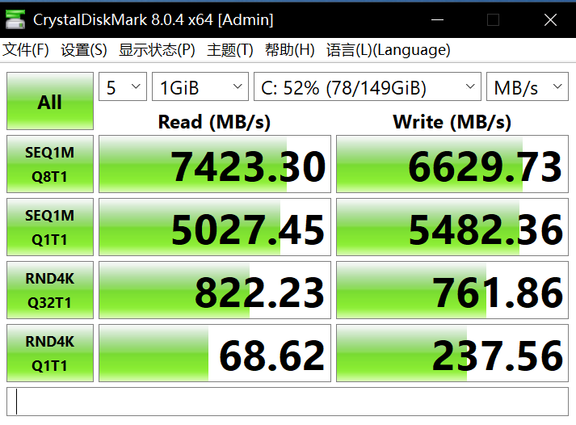

## MacBook Pro 2019 13 英寸

1.4 GHz 四核 Intel Core i5  
8 GB 2133 MHz LPDDR3  
250.69 GB SSD  
Intel Iris Plus Graphics 645 1536 MB  
MacOS 14.0

```text
sysbench cpu --threads=8 run
sysbench 1.0.20 (using system LuaJIT 2.1.0-beta3)

Running the test with following options:
Number of threads: 8
Initializing random number generator from current time


Prime numbers limit: 10000

Initializing worker threads...

Threads started!

CPU speed:
    events per second: 22878757.01

General statistics:
    total time:                          10.0001s
    total number of events:              228821179

Latency (ms):
         min:                                    0.00
         avg:                                    0.00
         max:                                    9.54
         95th percentile:                        0.00
         sum:                                14468.53

Threads fairness:
    events (avg/stddev):           28602647.3750/164786.01
    execution time (avg/stddev):   1.8086/0.08
```

```text
sysbench memory --threads=8 run
sysbench 1.0.20 (using system LuaJIT 2.1.0-beta3)

Running the test with following options:
Number of threads: 8
Initializing random number generator from current time


Running memory speed test with the following options:
  block size: 1KiB
  total size: 102400MiB
  operation: write
  scope: global

Initializing worker threads...

Threads started!

Total operations: 104857600 (12536141.16 per second)

102400.00 MiB transferred (12242.33 MiB/sec)


General statistics:
    total time:                          8.3632s
    total number of events:              104857600

Latency (ms):
         min:                                    0.00
         avg:                                    0.00
         max:                                    7.43
         95th percentile:                        0.00
         sum:                                41067.49

Threads fairness:
    events (avg/stddev):           13107200.0000/0.00
    execution time (avg/stddev):   5.1334/0.01
```

```text
sysbench fileio --threads=8 --file-test-mode=seqrewr run
sysbench 1.0.20 (using system LuaJIT 2.1.0-beta3)

Running the test with following options:
Number of threads: 8
Initializing random number generator from current time


Extra file open flags: (none)
128 files, 16MiB each
2GiB total file size
Block size 16KiB
Periodic FSYNC enabled, calling fsync() each 100 requests.
Calling fsync() at the end of test, Enabled.
Using synchronous I/O mode
Doing sequential rewrite test
Initializing worker threads...

Threads started!


File operations:
    reads/s:                      0.00
    writes/s:                     68869.01
    fsyncs/s:                     88252.89

Throughput:
    read, MiB/s:                  0.00
    written, MiB/s:               1076.08

General statistics:
    total time:                          10.0035s
    total number of events:              1570934

Latency (ms):
         min:                                    0.00
         avg:                                    0.05
         max:                                  294.46
         95th percentile:                        0.10
         sum:                                76610.04

Threads fairness:
    events (avg/stddev):           196366.7500/2956.36
    execution time (avg/stddev):   9.5763/0.00
```

## AMD 7900 台式机

AMD 7900 12 核  
宏基掠夺者 16GB\*2 DDR5 6000MHz EXPO C30  
梵想 S790 1TB PCIe4 TLC 7450MB/s  
Windows 10 企业版 LTSC 21H2

```text
sysbench cpu --threads=24 run
sysbench 1.0.20 (using system LuaJIT 2.1.0-beta3)

Running the test with following options:
Number of threads: 24
Initializing random number generator from current time


Prime numbers limit: 10000

Initializing worker threads...

Threads started!

CPU speed:
    events per second: 79302.59

General statistics:
    total time:                          10.0003s
    total number of events:              793080

Latency (ms):
         min:                                    0.16
         avg:                                    0.30
         max:                                    6.68
         95th percentile:                        0.32
         sum:                               239870.91

Threads fairness:
    events (avg/stddev):           33045.0000/187.14
    execution time (avg/stddev):   9.9946/0.00
```

```text
sysbench memory --threads=24 run
sysbench 1.0.20 (using system LuaJIT 2.1.0-beta3)

Running the test with following options:
Number of threads: 24
Initializing random number generator from current time


Running memory speed test with the following options:
  block size: 1KiB
  total size: 102400MiB
  operation: write
  scope: global

Initializing worker threads...

Threads started!

Total operations: 104857584 (12493380.85 per second)

102399.98 MiB transferred (12200.57 MiB/sec)


General statistics:
    total time:                          8.3927s
    total number of events:              104857584

Latency (ms):
         min:                                    0.00
         avg:                                    0.00
         max:                                    6.82
         95th percentile:                        0.00
         sum:                               185249.97

Threads fairness:
    events (avg/stddev):           4369066.0000/0.00
    execution time (avg/stddev):   7.7187/0.01
```

```text
sysbench fileio --threads=24 --file-test-mode=seqrewr run
sysbench 1.0.20 (using system LuaJIT 2.1.0-beta3)

Running the test with following options:
Number of threads: 24
Initializing random number generator from current time


Extra file open flags: (none)
128 files, 16MiB each
2GiB total file size
Block size 16KiB
Periodic FSYNC enabled, calling fsync() each 100 requests.
Calling fsync() at the end of test, Enabled.
Using synchronous I/O mode
Doing sequential rewrite test
Initializing worker threads...

Threads started!


File operations:
    reads/s:                      0.00
    writes/s:                     975.69
    fsyncs/s:                     1501.56

Throughput:
    read, MiB/s:                  0.00
    written, MiB/s:               15.25

General statistics:
    total time:                          11.8887s
    total number of events:              26380

Latency (ms):
         min:                                    0.00
         avg:                                    9.11
         max:                                   48.32
         95th percentile:                       24.83
         sum:                               240198.45

Threads fairness:
    events (avg/stddev):           1099.1667/314.30
    execution time (avg/stddev):   10.0083/0.01
```

```text
sysbench fileio --threads=2 --file-test-mode=seqrewr run
sysbench 1.0.20 (using system LuaJIT 2.1.0-beta3)

Running the test with following options:
Number of threads: 2
Initializing random number generator from current time


Extra file open flags: (none)
128 files, 16MiB each
2GiB total file size
Block size 16KiB
Periodic FSYNC enabled, calling fsync() each 100 requests.
Calling fsync() at the end of test, Enabled.
Using synchronous I/O mode
Doing sequential rewrite test
Initializing worker threads...

Threads started!


File operations:
    reads/s:                      0.00
    writes/s:                     1041.35
    fsyncs/s:                     1349.63

Throughput:
    read, MiB/s:                  0.00
    written, MiB/s:               16.27

General statistics:
    total time:                          10.1788s
    total number of events:              24082

Latency (ms):
         min:                                    0.00
         avg:                                    0.83
         max:                                   18.81
         95th percentile:                        1.39
         sum:                                19996.38

Threads fairness:
    events (avg/stddev):           12041.0000/445.00
    execution time (avg/stddev):   9.9982/0.00
```

## 阿里云 ECS t5.small

ecs.t5-lc1m2.small  
1 vCPU 2GB  
20GB 高效云盘  
Alibaba Cloud Linux 3.2104 LTS 等保 2.0 三级版

```text
sysbench cpu --threads=1 run
sysbench 1.0.20 (using system LuaJIT 2.1.0-beta3)

Running the test with following options:
Number of threads: 1
Initializing random number generator from current time


Prime numbers limit: 10000

Initializing worker threads...

Threads started!

CPU speed:
    events per second:   889.77

General statistics:
    total time:                          10.0017s
    total number of events:              8901

Latency (ms):
         min:                                    1.08
         avg:                                    1.12
         max:                                    9.90
         95th percentile:                        1.25
         sum:                                 9993.91

Threads fairness:
    events (avg/stddev):           8901.0000/0.00
    execution time (avg/stddev):   9.9939/0.00
```

```text
sysbench cpu --threads=2 run
sysbench 1.0.20 (using system LuaJIT 2.1.0-beta3)

Running the test with following options:
Number of threads: 2
Initializing random number generator from current time


Prime numbers limit: 10000

Initializing worker threads...

Threads started!

CPU speed:
    events per second:   883.35

General statistics:
    total time:                          10.0013s
    total number of events:              8836

Latency (ms):
         min:                                    1.08
         avg:                                    2.26
         max:                                 1040.54
         95th percentile:                        1.39
         sum:                                19979.56

Threads fairness:
    events (avg/stddev):           4418.0000/3.00
    execution time (avg/stddev):   9.9898/0.01
```

```text
sysbench memory --threads=2 run
sysbench 1.0.20 (using system LuaJIT 2.1.0-beta3)

Running the test with following options:
Number of threads: 2
Initializing random number generator from current time


Running memory speed test with the following options:
  block size: 1KiB
  total size: 102400MiB
  operation: write
  scope: global

Initializing worker threads...

Threads started!

Total operations: 40132426 (4012449.34 per second)

39191.82 MiB transferred (3918.41 MiB/sec)


General statistics:
    total time:                          10.0003s
    total number of events:              40132426

Latency (ms):
         min:                                    0.00
         avg:                                    0.00
         max:                                   49.05
         95th percentile:                        0.00
         sum:                                 8899.84

Threads fairness:
    events (avg/stddev):           20066213.0000/39339.00
    execution time (avg/stddev):   4.4499/0.24
```

```text
sysbench fileio --threads=2 --file-test-mode=seqrewr run
sysbench 1.0.20 (using system LuaJIT 2.1.0-beta3)

Running the test with following options:
Number of threads: 2
Initializing random number generator from current time


Extra file open flags: (none)
128 files, 16MiB each
2GiB total file size
Block size 16KiB
Periodic FSYNC enabled, calling fsync() each 100 requests.
Calling fsync() at the end of test, Enabled.
Using synchronous I/O mode
Doing sequential rewrite test
Initializing worker threads...

Threads started!


File operations:
    reads/s:                      0.00
    writes/s:                     5722.37
    fsyncs/s:                     7343.10

Throughput:
    read, MiB/s:                  0.00
    written, MiB/s:               89.41

General statistics:
    total time:                          10.0117s
    total number of events:              130573

Latency (ms):
         min:                                    0.01
         avg:                                    0.15
         max:                                   32.98
         95th percentile:                        0.15
         sum:                                19946.66

Threads fairness:
    events (avg/stddev):           65286.5000/582.50
    execution time (avg/stddev):   9.9733/0.00
```

## 总结

对比测试数据可以看出，即使是老款 Mac 表现依然出色，苹果的产品稳定、可靠、耐用。

入门级云服务器 阿里云 ECS t5.small 性能羸弱不出所料，但是搭载 AMD 最新旗舰处理器 R9 7900 与 PCIe4.0 7450MB/s 固态硬盘 的台式机，硬盘性能竟然远远不如入门级 ECS 的非固态硬盘，怎么也说不过去吧？其各项数据可能都受到这块硬盘的拖累。



使用 CrystalDiskMark 对台式机测试，结果竟然非常优秀，与 sysbench 截然相反，但是日常使用经常卡顿，文件管理器都打不开，读写速度几百 KB，让人无法质疑 sysbench 的测试结果。

这奇怪的差异到底是怎么造成的呢？无论如何，梵想的硬盘卡到不能做系统盘，只能等双十一看看有没有优惠，入手致态 TiPlus 7100 再测试一遍。
