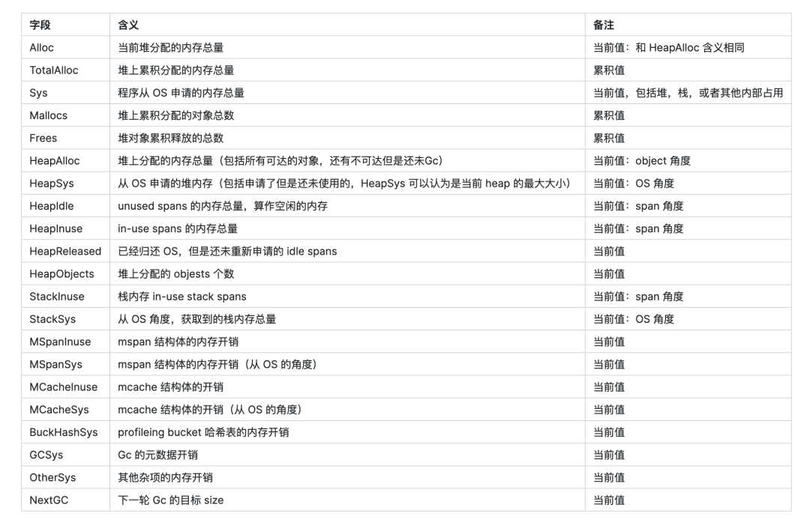

参考文档  
[https://blog.csdn.net/EDDYCJY/article/details/124811555](https://blog.csdn.net/EDDYCJY/article/details/124811555)

## 原理

pprof 实现原理很简单，在内存分配释放的地方打点，并且把路径记录下来。go 会在 mallocgc 每次分配释放内存时，判断是否要采样。

## web 服务

gin 框架可以直接使用封装好的包，但是碰到问题还是需要了解 pprof 原理。

```go
import "github.com/gin-contrib/pprof"

engine := gin.Default()
pprof.Register(engine)
```

访问 http://localhost:port/debug/pprof/ 查看画像信息。

## 脚本服务

### CPU

```go
import "runtime/pprof"

f, err := os.Create("./cpu.pprof")
if err != nil {
	fmt.Println(err)
	return
}
defer f.Close()

pprof.StartCPUProfile(f)
defer pprof.StopCPUProfile()
```

StartCPUProfile、StopCPUProfile 函数可以在一段时间内持续采样并生成分析数据。

### 内存

```go
import "runtime/pprof"

f, err := os.Create("mem.pprof")
if err != nil {
	fmt.Println(err)
    return
}
defer f.Close()

// 开始内存分析
pprof.WriteHeapProfile(f)
```

WriteHeapProfile 函数用于将当前堆内存分配的剖析数据写入到指定的文件中。它并不会持续采样或更新分析结果。

## 结果分析

### 进入分析

执行 go tool pprof 进入分析

```shell
# 从本地文件分析
go tool pprof cpu.pprof
go tool pprof mem.pprof
# 从远程地址分析CPU
go tool pprof http://localhost:port/debug/pprof/profile
# 从远程地址分析内存
go tool pprof http://localhost:port/debug/pprof/heap
```

### 分析命令

进入分析后，分析命令

```shell
# 查看帮助
help
# 查看资源排名
top -n 20
# 分析函数代码
list 函数名
```

top 结果字段讲解：

flat 函数资源消耗（运行时间或者占用内存）  
flat% 函数资源占比  
sum% 上面的行累加占比  
cum 函数以及子函数资源消耗，大于等于 flat  
cum% 函数以及子函数资源占比，大于等于 flat%

### 可视化分析（推荐）

无需使用命令，直观展示分析结果。

需要安装 [graphviz](https://graphviz.org/download/)

```shell
# 安装
# Ubuntu/Debian
sudo apt install graphviz
# CentOS
sudo yum install graphviz

# 启动可视化分析
go tool pprof -http=:8000 cpu.pprof
```

## 内存总是偏小？

原因可能有三种：

### 采样周期

采样有性能消耗，mallocgc 默认每分配满 512 kb 采样一次。Go 进程加载的时候，可以通过 GODEBUG 设置 MemProfileRate 覆盖默认值。

```go
for p := gogetenv("GODEBUG"); p != ""; {
    if key == "memprofilerate" {
        if n, ok := atoi(value); ok {
            MemProfileRate = n
        }
    } else {
        // ...
    }
}
```

MemProfileRate=1 每次分配都采样，采样全面但是非常消耗性能。

### 内存管理

内存管理方式存在多种差异原因：

1. 内存碎片：Go 使用 tcmalloc 内存分配模型，块碎片率整体预期控制在 12.5% 左右。
2. 分配但是未使用的内存：heap 上 Idle span。
3. stack 内存占用。
4. OS 分配但是 reserved。
5. runtime 的 GC 元数据，mcache，mspan 等管理内存。

可以通过 runtime.ReadMemStats 获取详细信息。



### CGO 分配的内存

这个很好理解，CGO 调用 c/c++，go 无法统计。
