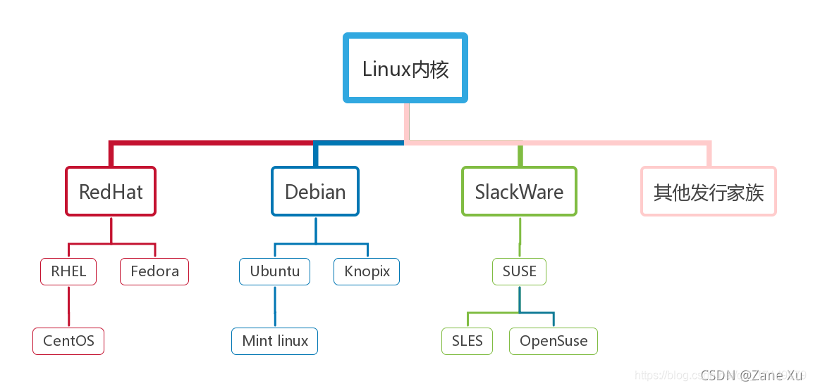

## Distribution Versions




## System Information

```shell
# Display system information including distribution name, version number, description and release date.
lsb_release -a

# Display text file containing system version information, including distribution name, version number etc.
cat /etc/os-release

# Display information about system kernel, including system version number and architecture.
uname -a
```

```shell
# Display current time including timezone information.
date

# Display current time including richer information.
timedatectl

# View all environment variables
printenv

# Get user id and group id, defaults to current user if no user specified
id root
# Only get user id
id -u root
# Only get group id
id -g root
```

## Set Limits

```shell
# Display resource limits
ulimit -a
# Turn off core file limit
ulimit -c 0
# Set number of open files
ulimit -n 1024000
# Modify file for permanent effect
vi /etc/security/limits.conf
```

Parameters:

-a Display current resource limit settings.
-c <core file limit> Set core file maximum value, unit is blocks.
-d <data segment size> Maximum value of program data segment, unit is KB.
-f <file size> Maximum file shell can create, unit is blocks.
-m <memory size> Specify memory usage limit, unit is KB.
-n <file count> Specify maximum number of files that can be opened simultaneously.
-p <buffer size> Specify pipe buffer size, unit 512 bytes.
-s <stack size> Specify stack limit, unit is KB.
-t <CPU time> Specify CPU usage time limit, unit is seconds.
-u <program count> Maximum number of programs user can open.
-v <virtual memory size> Specify virtual memory usage limit, unit is KB.

## Resource Status

You can use following commands to get information about processes, CPU, memory, disk and network resources:

### View Processes

```shell
# BSD style display
ps aux
# Filter
ps aux | grep firefox
# View top 10 memory consuming processes
ps aux --sort=-%mem | head -n 10
# View top 10 CPU consuming processes
ps aux --sort=-%cpu | head -n 10

# Complete information
ps -ef
# View process start time
ps -p <process_ID> -o lstart
```

### Kill Processes

```shell
# Find process by name then kill
ps aux | grep "x" | grep -v grep | awk '{print $2}' | xargs --no-run-if-empty kill -9
```

### View CPU, Memory

```shell
top

# View specific process
top -p pid
# Match specified process name
top -p $(pgrep -d ',' -f 'process_name')
```

Display process-level CPU and memory utilization information.

Parameters:

-c Display detailed process names
-d Refresh interval, seconds, default 5 seconds
-n Number of refreshes, used with -b
-p Observe specified pid

Can also input commands like vi/vim:

? Display supported commands
P Sort by CPU
M Sort by memory
N Sort by pid
T Sort by cumulative time
k Kill process by pid (-9)
r Modify priority
q Quit (equals ctrl+c)
c Display full process name

```shell
lscpu

cat /proc/cpuinfo
```

### View Memory

```shell
# This will display total memory, used memory, available memory etc.
free -h

# Memory total
ps -C php-fpm -o rss= | awk '{sum+=$1} END {printf "Total: %.2f MB\n", sum/1024}'
```

### View Network

```shell
netstat -tuln
netstat -tulnp | grep 9099

iftop

# Port
ss -tnlp | grep 179
nc -vz -w 2 192.168.0.107 8080
telnet 192.168.0.107 8080
nmap -p 8080 192.168.0.107
```

These commands will display information about network connections and traffic.

### View Disk

```shell
df -h

# View size of various files and subdirectories in current directory
du -ah

# Display current directory and its direct subdirectory sizes
du -h --max-depth=1 ./

# View current directory and file sizes
du -sh ./* | sort -rh

# View I/O status
iostat -d -m 1 10

#-d option displays disk statistics.
#-m option displays in MB units.
#1 means update every 1 second.
#10 means display 10 updates.

# Very powerful Linux performance monitoring tool developed by Nigel Griffiths, can collect and display Linux system performance data including CPU, memory, disk I/O, network, filesystem and process information
apt install nmon
yum install nmon

# Enhanced version of top command
brew install htop
```

This will display disk partition usage including total capacity, used space and available space information.

### View Files

```shell
# View last few lines of file tail
tail -n 20 filename
# Monitor file tail content changes
tail -f filename
```

## Swap Memory

```shell
# View memory
free -h

# Create file
dd if=/dev/zero of=/swap bs=1M count=2048
# Format swap file
mkswap /swap
chmod 0600 /swap

# Auto-start at boot
vi /etc/fstab
# Content
/swap swap swap defaults 0 0

# Activate
swapon -a
# Deactivate
swapoff -a
```

## Port Scanning

```shell
nmap 192.168.0.1 80
nmap -p 1-65535 10.0.0.1
```

nmap GUI software [https://nmap.org/download.html](https://nmap.org/download.html)

## Signals

SIGHUP Hangup, sent by kernel to process when terminal closes or connected session ends
SIGINT Interrupt, usually generated when user presses Ctrl+C, process should immediately stop current work upon receiving signal
SIGQUIT Quit, usually generated when user presses Ctrl+\, process should immediately exit and clean up occupied resources upon receiving signal
SIGTERM Terminate, this is generic signal usually used to request process to terminate normally
SIGFPE Sent when fatal arithmetic error occurs, such as division by zero, data overflow
SIGKILL Immediately terminate program execution
SIGALRM Clock timer signal
SIGBUS SIGSEGV Process accesses illegal address

## time

time is simple tool for measuring command execution time. It can display command's total execution time, user CPU time and system CPU time, helping developers optimize performance.

```shell
# -o option outputs to specified file
# -a option for appending rather than overwriting
time -a -o output.txt ls -l
# Output
real    0m0.005s
user    0m0.003s
sys     0m0.002s
```

real: Actual time (wall clock time), total time for command execution.
user: User mode CPU time, time CPU consumed in user mode for this command.
sys: Kernel mode CPU time, time CPU consumed in kernel mode for this command.

## strace

strace is powerful Linux debugging tool used to trace system calls and signals between user space programs and kernel interactions.

```shell
# Trace program execution
strace ./your_program
# Trace existing process
strace -p <pid>
# Statistical system calls
strace -c ./your_program
strace -c -p <pid>
# Display time spent on each system call
strace -T ./your_program

# Only trace specific system calls
strace -e trace=all,open,read,write,network,file ./your_program
# Exclude specific system calls
strace -e '!open,read' ./your_program
# Trace signals
strace -e signal=all,SIGTERM ./your_program
# Analyze dynamic link libraries
strace -e trace=process ./your_program
# Single record
strace -p 24878 -e connect -s 256 -o strace.log

# Output to file
strace -o strace.log ./your_program
# Default string output length is 32, adjustable
strace -s 512 ./your_program
# Display relative time
strace -r ./your_program
# Display detailed information
strace -v ./your_program

# Trace child processes
strace -f ./your_program
# Only trace main process
strace -ff -p <pid>
# Trace specific thread
strace -p <tid>
# Only display calls related to specified file path
strace -P /path/to/file ./your_program
# Trace execution path
strace -y ./your_program

# Output process details to file
sudo strace -f -T -o output.txt -p 15527
```

strace only traces system calls, doesn't trace user-mode tasks.

Tasks requiring system calls

1. File I/O: such as open, read, write.
2. Network communication: such as socket, connect, send, recv.
3. Memory allocation: Dynamic allocation of large memory blocks may call mmap or brk.
4. Process management: Creating, destroying or synchronizing processes uses fork, execve or waitpid.
5. Device access: Operations on peripherals like disks, printers, cameras.

Tasks not requiring system calls

1. Pure computation: such as mathematical operations, logical judgments, data processing.
2. Memory operations: User mode programs directly accessing allocated memory (like memory blocks returned by malloc) doesn't require system calls.
3. Local caching: For example, most applications cache data to reduce disk or network access.
4. String processing: Operations like strcpy, strlen execute entirely in user mode.

## perf

perf can be used for performance analysis, performance tuning, code analysis. It can view CPU performance counters, trace system calls, kernel function execution, context switches, etc.

```shell
# View version
perf version
# List all supported events
perf list

# View process performance
perf top -p <pid>
# View thread performance
perf top -t <tid>
# View specified thread performance
perf top -p <pid> -t <tid>

# Analyze CPU performance
perf stat <command>
# Analyze multi-core performance
perf stat -a <command>
# Monitor specific events
perf stat -e cycles,instructions,cache-misses <command>
# View KVM virtualization environment performance
perf kvm stat <command>

# Trace system calls
perf trace
# Trace specific system calls
perf trace -e 'syscalls:sys_enter_read'
# Trace user-level applications through BPF
perf trace -e 'bpf:perf_event' <command>

# Record performance data, generates perf.data file by default
perf record <command>
# Generate stack calls
perf record -g <command>
# Specify time window analysis, -F sets sampling frequency, -a means system-wide sampling
perf record -F 99 -a
# Generate Flame Graph
perf record -g -p <pid>
perf script > out.perf
./flamegraph.pl out.perf > flamegraph.svg
# View recorded data
perf report
# View call graph
perf report --call-graph
# View specified file
perf report -i perf.data
# View file stack information
perf script
```
