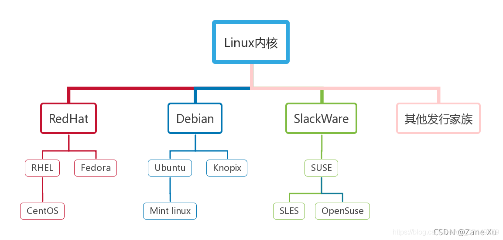
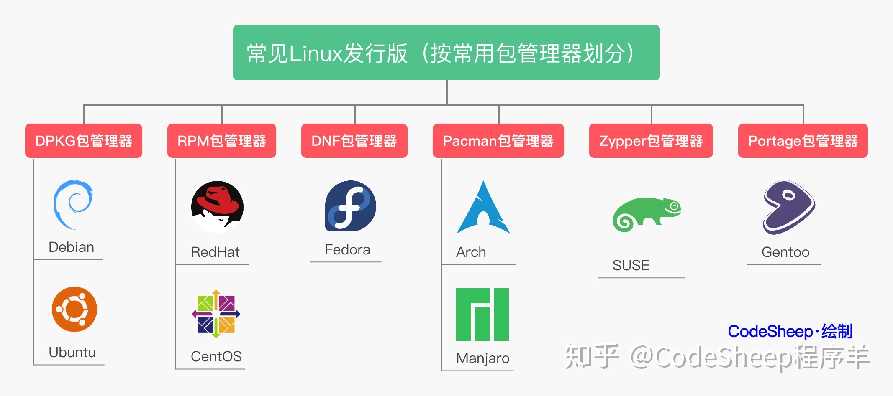

## 常用命令

```shell
# 查看文件尾部最后几行内容
tail -n 20 filename
# 监视文件尾部内容变化
tail -f filename
```

## 发行版本





## 系统信息

```shell
# 显示包括发行版名称、版本号、描述和发行日期在内的系统信息。
lsb_release -a

# 显示包含系统版本信息的文本文件，包括发行版名称、版本号等。
cat /etc/os-release

# 显示有关系统内核的信息，包括系统版本号和架构。
uname -a
```

```shell
# 显示当前时间，包括时区信息。
date

# 显示当前时间，包括更丰富的信息。
timedatectl

# 查看所有环境变量
printenv

# 获取用户id与组id，不指定用户默认当前用户
id root
# 只取用户id
id -u root
# 只取组id
id -g root
```

## 设置限制

```shell
# 显示资源限制
ulimit -a
# 关闭core文件上限
ulimit -c 0
# 设置打开文件数
ulimit -n 1024000
# 修改文件，永久生效
vi /etc/security/limits.conf
```

参数：

-a 　显示目前资源限制的设定。  
-c <core 文件上限>　设定 core 文件的最大值，单位为区块。  
-d <数据节区大小>　程序数据节区的最大值，单位为 KB。  
-f <文件大小>　 shell 所能建立的最大文件，单位为区块。  
-m <内存大小>　指定可使用内存的上限，单位为 KB。  
-n <文件数目>　指定同一时间最多可开启的文件数。  
-p <缓冲区大小>　指定管道缓冲区的大小，单位 512 字节。  
-s <堆叠大小>　指定堆叠的上限，单位为 KB。  
-t <CPU 时间>　指定 CPU 使用时间的上限，单位为秒。  
-u <程序数目>　用户最多可开启的程序数目。  
-v <虚拟内存大小>　指定可使用的虚拟内存上限，单位为 KB。

## 资源情况

你可以使用以下命令来获取有关进程、CPU、内存、磁盘和网络等资源的信息：

### 查看进程

```shell
# BSD风格的展示方式
ps aux
# 过滤
ps aux | grep firefox
# 查看内存排名前10的进程
ps aux --sort=-%mem | head -n 10

# 完整信息
ps -ef
# 查看进程启动时间
ps -p <进程ID> -o lstart
```

### 杀死进程

```shell
# 按名称查找进程再杀死
ps aux | grep "x" | grep -v grep | awk '{print $2}' | xargs --no-run-if-empty kill -9
```

### 查看 CPU、内存

```shell
top

# 查看特定进程
top -p pid
# 匹配指定进程名
top -p $(pgrep -d ',' -f 'process_name')
```

显示进程维度的 CPU、内存利用率信息。

参数：

-c 显示进程详细名称
-d 刷新间隔，秒，默认 5 秒  
-n 刷新几次，与-b 配合使用  
-p 观察指定 pid

还可以类似 vi/vim，输入命令：

? 显示支持的命令
P 按 CPU 排序
M 按内存排序
N 按 pid 排序
T 累计时间排序
k 按 pid 杀死进程(-9)
r 修改优先级
q 退出（等于 ctrl+c）
c 显示进程全名

```shell
lscpu

cat /proc/cpuinfo
```

### 查看内存

```shell
free -h
```

这将显示总内存、已使用内存、可用内存等信息。

### 查看硬盘

```shell
df -h

# 查看当前目录中各个文件和子目录的大小
du -ah

# 显示当前目录及其直接子目录的大小
du -h --max-depth=1 ./

# 查看io状态
iostat -d -m 1 10

#-d 选项表示显示磁盘统计信息。
#-m 选项表示以 MB 为单位显示。
#1 表示每隔 1 秒更新一次。
#10 表示显示 10 次更新。

# 非常强大的Linux性能监控工具，由Nigel Griffiths开发，可以用来收集和显示Linux系统的性能数据，包括CPU、内存、磁盘I/O、网络、文件系统以及进程信息等
apt install nmon
yum install nmon

# top命令的一个增强版
brew install htop
```

这将显示磁盘分区的使用情况，包括总容量、已用空间和可用空间等信息。

### 查看网络

```shell
netstat -tuln

iftop

# 端口
nc -vz -w 2 192.168.0.107 8080
telnet 192.168.0.107 8080
nmap -p 8080 192.168.0.107
```

这些命令将显示有关网络连接和流量的信息。

## 交换内存 swap

```shell
# 查看内存
free -h

# 创建文件
dd if=/dev/zero of=/swap bs=1M count=2048
# 格式化交换文件
mkswap /swap
chmod 0600 /swap

# 开机自启
vi /etc/fstab
# 内容
/swap swap swap defaults 0 0

# 激活
swapon -a
# 关闭
swapoff -a
```

## 端口扫描

```shell
nmap 192.168.0.1 80
nmap -p 1-65535 10.0.0.1
```

nmap 图形界面软件 [https://nmap.org/download.html](https://nmap.org/download.html)

## 信号

SIGHUP 挂起（hangup），当终端关闭或者连接的会话结束时，由内核发送给进程  
SIGINT 中断（interrupt），通常由用户按下 Ctrl+C 产生，进程接收到信号后应立即停止当前的工作  
SIGQUIT 退出（quit），通常由用户按下 Ctrl+\ 产生，进程接收到信号后应立即退出，并清理自己占用的资源  
SIGTERM 终止（terminate），这是一个通用信号，通常用于要求进程正常终止  
SIGFPE 在发生致命的算术运算错误时发出，如除零操作、数据溢出等  
SIGKILL 立即结束程序的运行  
SIGALRM 时钟定时信号  
SIGBUS SIGSEGV 进程访问非法地址
