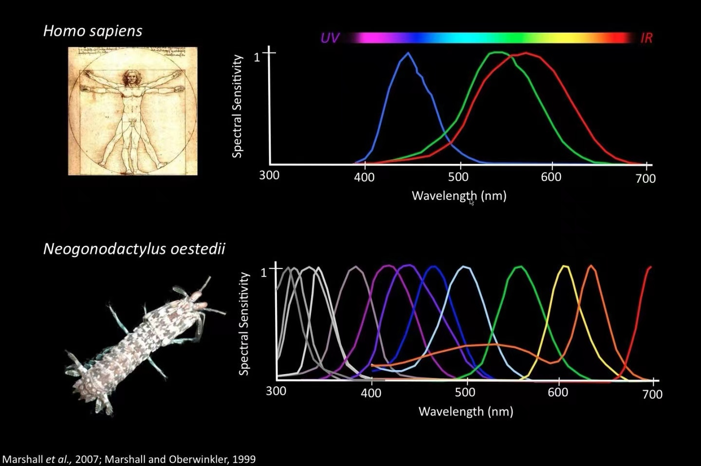

## Human Vision

What is color?

When humans answer this question based on their own perception, they need to add a qualifier: What is the color that humans see?

The answer to this question is often: The three primary colors of light - red, green, and blue.

However, the world in our eyes is not real. Everything we see is captured by retinal cells as light signals, then transmitted to the brain for processing, finally presenting the visual effects we see.

Light signals, like electrical signals, can be interfered with. Some components in hallucinogenic mushrooms can interfere with the brain's nervous system signal transmission, affecting human vision and producing fantastic visual effects.

Yunnan people who love eating mushrooms suffer greatly from this. The warm and humid subtropical rainforest is rich in mushrooms with diverse species, including the white-stemmed, red-capped fly agaric.

In the retina, cone cells are responsible for perceiving light intensity (bright light) and color, while rod cells can only perceive light intensity, not color, but their sensitivity to light is ten thousand times that of cone cells.

## Color Competition

Human visual systems have only three types of cone cells, sensing red, green, and blue respectively - this is the theoretical basis for the three primary colors. In the brilliant and colorful world, even facing blooming flowers, we might be like colorblind people.

Dogs have only two types of cone cells, sensitive to blue and yellow. Humans can consider them as "red-green colorblind."

Birds have stronger vision than humans, with four types of cone cells: red, green, blue, and ultraviolet. Additionally, eagle eyes can zoom, easily spotting a rabbit thousands of meters away. Flies, being insects, have compound eyes like an array of surrounding cameras with nearly 360-degree visual range.

Mantis shrimp have sixteen types of cone cells - truly exceptional!

The varying abilities of different animals are all results of environmental adaptation. Dogs have stronger sense of smell and don't need such strong vision, while birds need strong visual ability for high-speed flight.

Not only do visual differences exist between species, but also between humans, though most human differences are small and within a range where perceptual consensus can be formed.

Modern society changes rapidly, and species evolution speed can no longer keep up with human industrial economic development. When birds frequently crash into glass, when chemicals pollute land, when marine life mistakenly swallows plastic waste, we should seriously reflect on the rationality of those toxic economies that harm both others and ourselves!

## Object Colors

Light is an electromagnetic wave when propagating. Color comes from light frequency - different frequencies correspond to different colors, with high and low frequency ranges invisible to humans.

Sunlight, lamplight, firelight, firefly tail light, etc. are direct light sources whose colors follow the three primary colors. However, most objects we see don't emit light themselves but reflect light into our eyes. Object color depends on what frequency of light it reflects.

If an object appears green under white light illumination, it means it absorbs other colors of light and only reflects green light.

If it absorbs all colors of light, it appears black.

If it reflects all colors of light, it appears white.

If it can transmit all colors of light, it appears transparent.

On Earth, during daytime due to atmospheric scattering of sunlight, the entire sky is blue. At night, scattering and reflection greatly weaken, allowing us to see the universe's true appearance - the empty universe dotted with countless stars.

If there are clouds in the sky, reflected light from the ground will repeatedly scatter between ground and clouds, forming white clouds. If thick cumulonimbus clouds cover the sky without enough sunlight reaching the ground, clouds become dark and heavy.

Daily-use mirrors are often a layer of transparent glass with metal coating evenly spread on the bottom, reflecting incident light as-is.
