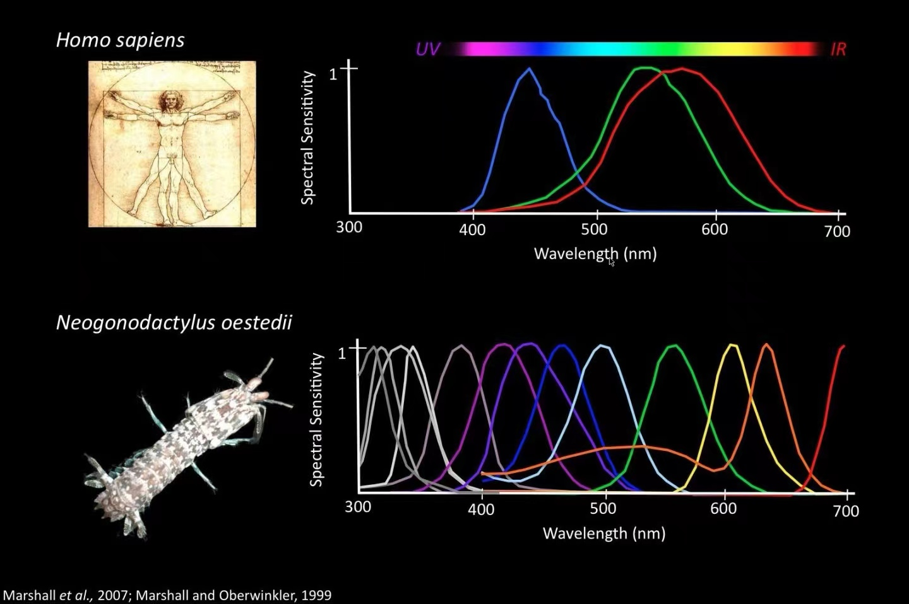

## 人类视觉

颜色是什么？

人类基于自身感受来回答这个问题的时候，需要加上一句限定语：人类看到的颜色是什么？

这个问题的答案往往是：光学三原色，红、绿、蓝。

但是，我们眼中的世界并不真实。我们看到的一切，都是由视网膜细胞捕获光信号，再传输给大脑处理，最终呈现出我们看到的视觉效果。

光信号和电信号一样能被干扰，致幻蘑菇中的一些成分能干扰大脑神经系统的信号传递，影响人的视觉，因此会产生一些奇幻的视觉效果。

热爱吃菇的云南人深受其害，温暖潮湿的亚热带雨林盛产蘑菇，并且种类丰富，包括外形白杆杆、红伞伞的毒蝇伞。

在视网膜上，视锥细胞负责感知光度（较强光）和色彩，视杆细胞仅能感知光度，不能感知颜色，但其对光的敏感度是视锥细胞的一万倍。

## 比“色”大会

人类视觉系统只有三种视锥细胞，分别感知红色、绿色和蓝色，这就是三原色的理论依据。在灿烂缤纷的世界中，即使面对似锦的繁花，我们也可能犹如色盲。

狗只有两种视锥细胞，对蓝色和黄色敏感，人类可以认为它们是“红绿色盲”。

鸟类的视力比人类强，有四种视锥细胞，红、绿、蓝和紫外线。此外，鹰的眼睛可以变焦，能轻松发现数千米外的一只兔子；属于昆虫的苍蝇，它的复眼就像一组环绕的摄像头，拥有接近 360 度的视觉范围。

皮皮虾拥有十六种视锥细胞，堪称一绝！

各个动物拥有的能力强弱，都是适应环境的结果。狗拥有更强的嗅觉，也就不需要那么强的视觉，而鸟类为了高速飞行，需要较强的视觉能力。

不仅物种间的视觉存在差异，人与人之间也存在差异，只是大部分人的差异不大，在一个能形成感知共识的范围内。

现代社会的变化日新月异，物种进化速度已经跟不上人类工业经济的发展速度。当鸟类频繁撞上玻璃，当化学制品污染土地，当海洋生物误吞塑料垃圾，我们该认真反思那些害人害己的有毒经济的合理性！

## 物体的颜色

光在传播时是一种电磁波，颜色来源于光的频率，不同频率对应不同的颜色，高频和低频段对人类不可见。

太阳光、灯光、火光、萤火虫尾光等等是直射光源，颜色遵从三原色。但是，我们看见的大部分物体本身不发光，是反射光入眼，物体的颜色取决于它反射什么频率的光。

如果在白光照射下，物体呈现绿色，说明它吸收了其它颜色的光，只反射绿光。

如果吸收所有颜色的光，就表现为黑色。

如果反射所有颜色的光，表现为白色。

如果可以透过所有颜色的光，则表现为透明。

在地球上，白天由于大气层对太阳光的散射，整个天空都是蓝色的；到了晚上，散射与反射大大减弱，我们才能看到宇宙的本来面貌，空洞的宇宙中点缀着漫天的繁星。

如果天空有云，地面的反射光会在地面与云层之间反复漫反射，形成一朵朵白云。如果厚厚的积雨云覆盖天空，没有足够的太阳光射到地面，云会变成黑压压的一片。

日常用的镜子，往往是一层透明玻璃，底部均匀铺满金属镀层，将入射光原样反射。
